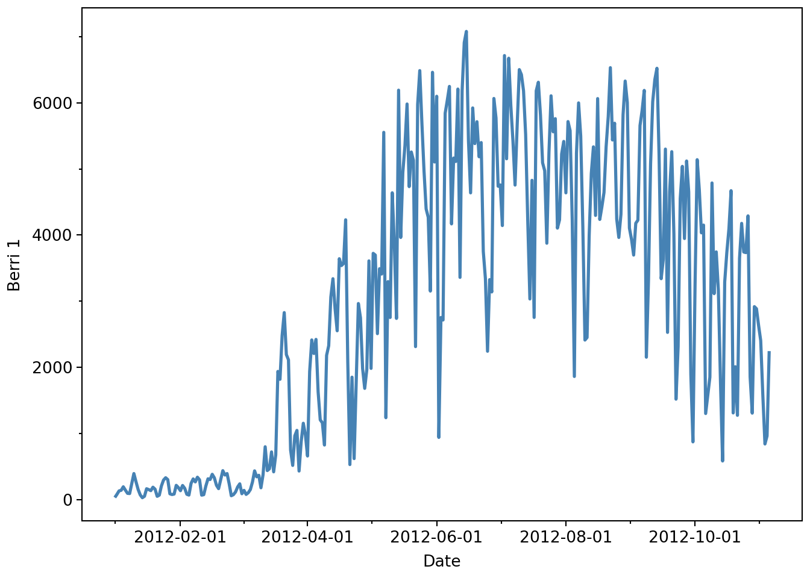
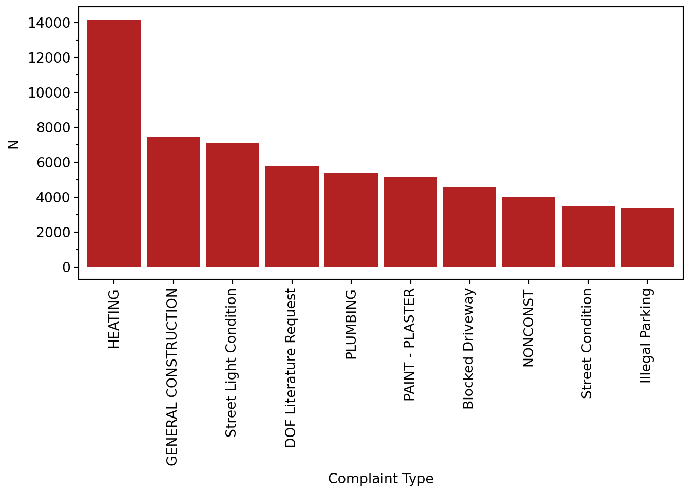
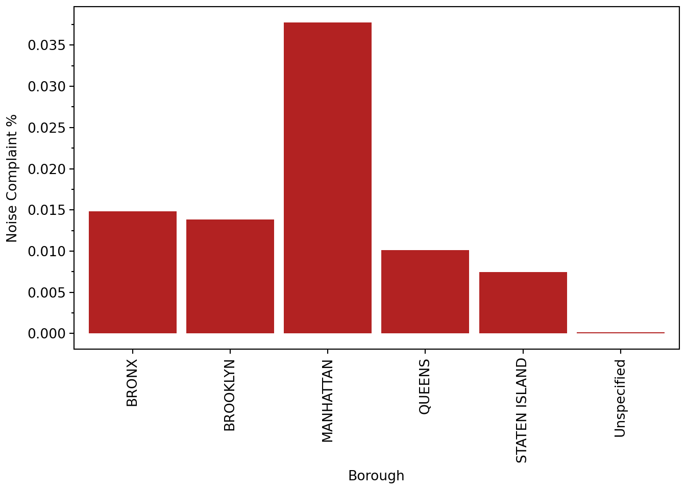
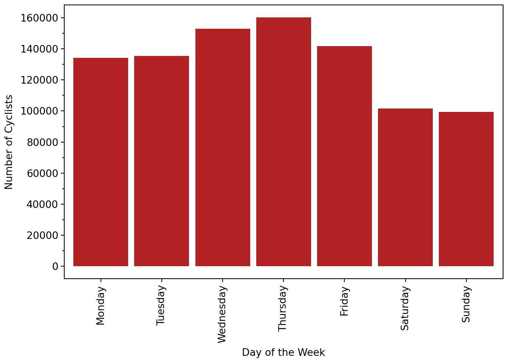
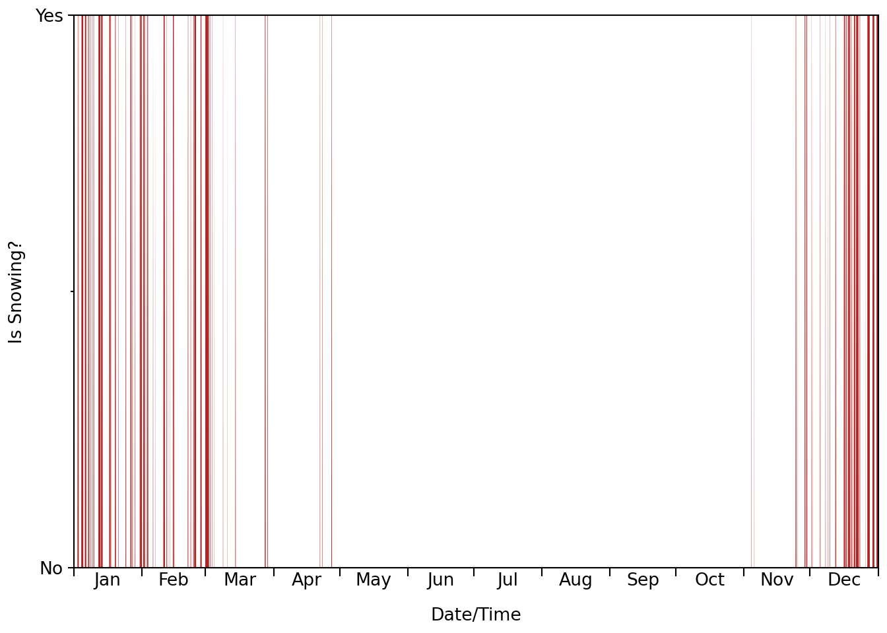
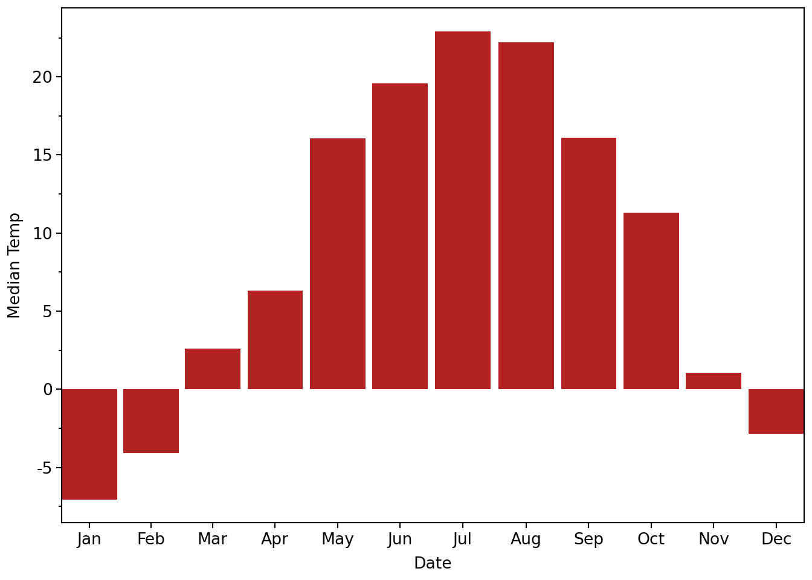
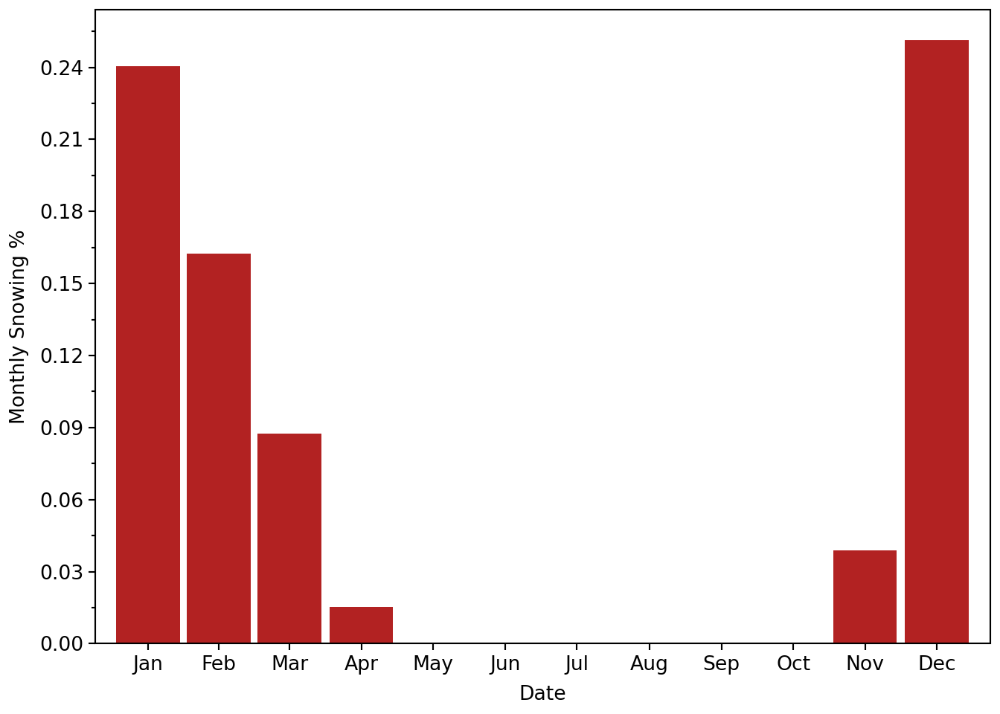
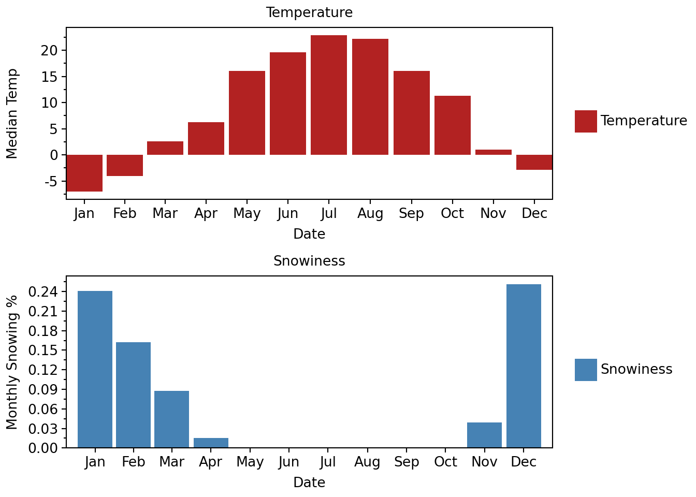

# My Level 1 Heading

::: {#a6ecf9ab .cell execution_count=1}
``` {.python .cell-code}
import ibis
from ibis import _
ibis.options.interactive = True
con = ibis.duckdb.connect(':memory:')
```
:::


::: {#fc0d4a1d .cell execution_count=2}
``` {.python .cell-code}
# Ibis doesn't attempt to provide plot methods on dataframes like Pandas does, so I've chosen to use plotnine for plotting, but you could use any plotting library you like.
import plotnine as p9
from matplotlib.ticker import MaxNLocator
import shutil
```
:::


Note: When I copied the required CSV files from the tutorial into this repo, I compressed them with zstd: i.e. zstd -19 311-service-requests.csv -o 311-service-requests.csv.zst

## Chapter 1: Reading from a CSV

The CSV dataset (bikes.csv) that the tutorial reads in is about cyclists in Montréal. The original data is available [here](https://donnees.montreal.ca/ville-de-montreal/cyclistes-sur-les-pistes-cyclables). The dataset is a list of how many people were on 7 different bike paths in Montreal, each day.

::: {#8e58a568 .cell execution_count=3}
``` {.python .cell-code}
bikes = con.read_csv('./data/bikes.csv.zst', delim=';', encoding='latin-1', null_padding=True, auto_detect=True, strict_mode=False, )
bikes.head(3)

# Original Pandas Tutorial Code:
# df = pd.read_csv('./data/bikes.csv', sep=';', encoding='latin1', parse_dates=['Date'], dayfirst=True, index_col='Date')
# df[:3]
```

::: {.cell-output .cell-output-display execution_count=3}
```{=html}
<pre style="white-space:pre;overflow-x:auto;line-height:normal;font-family:Menlo,'DejaVu Sans Mono',consolas,'Courier New',monospace">┏━━━━━━━━━━━━┳━━━━━━━━━┳━━━━━━━━━━━━━━━━━━━━━━━━━━━━━━━━━━━┳━━━━━━━━━━━━━━━━━━━━━━━┳━━━━━━━━━━━━━━━┳━━━━━━━━━━━━━━━┳━━━━━━━━━┳━━━━━━━━━━━━━━┳━━━━━━━━━┳━━━━━━━━━━━━━━━━━━━━━━━━━━━━━━━━━━━━━┓
┃<span style="font-weight: bold"> Date       </span>┃<span style="font-weight: bold"> Berri 1 </span>┃<span style="font-weight: bold"> Brébeuf (données non disponibles) </span>┃<span style="font-weight: bold"> Côte-Sainte-Catherine </span>┃<span style="font-weight: bold"> Maisonneuve 1 </span>┃<span style="font-weight: bold"> Maisonneuve 2 </span>┃<span style="font-weight: bold"> du Parc </span>┃<span style="font-weight: bold"> Pierre-Dupuy </span>┃<span style="font-weight: bold"> Rachel1 </span>┃<span style="font-weight: bold"> St-Urbain (données non disponibles) </span>┃
┡━━━━━━━━━━━━╇━━━━━━━━━╇━━━━━━━━━━━━━━━━━━━━━━━━━━━━━━━━━━━╇━━━━━━━━━━━━━━━━━━━━━━━╇━━━━━━━━━━━━━━━╇━━━━━━━━━━━━━━━╇━━━━━━━━━╇━━━━━━━━━━━━━━╇━━━━━━━━━╇━━━━━━━━━━━━━━━━━━━━━━━━━━━━━━━━━━━━━┩
│ <span style="color: #7f7f7f; text-decoration-color: #7f7f7f">date</span>       │ <span style="color: #7f7f7f; text-decoration-color: #7f7f7f">int64</span>   │ <span style="color: #7f7f7f; text-decoration-color: #7f7f7f">string</span>                            │ <span style="color: #7f7f7f; text-decoration-color: #7f7f7f">int64</span>                 │ <span style="color: #7f7f7f; text-decoration-color: #7f7f7f">int64</span>         │ <span style="color: #7f7f7f; text-decoration-color: #7f7f7f">int64</span>         │ <span style="color: #7f7f7f; text-decoration-color: #7f7f7f">int64</span>   │ <span style="color: #7f7f7f; text-decoration-color: #7f7f7f">int64</span>        │ <span style="color: #7f7f7f; text-decoration-color: #7f7f7f">int64</span>   │ <span style="color: #7f7f7f; text-decoration-color: #7f7f7f">string</span>                              │
├────────────┼─────────┼───────────────────────────────────┼───────────────────────┼───────────────┼───────────────┼─────────┼──────────────┼─────────┼─────────────────────────────────────┤
│ <span style="color: #800080; text-decoration-color: #800080">2012-01-01</span> │      <span style="color: #008080; text-decoration-color: #008080; font-weight: bold">35</span> │ <span style="color: #7f7f7f; text-decoration-color: #7f7f7f">NULL</span>                              │                     <span style="color: #008080; text-decoration-color: #008080; font-weight: bold">0</span> │            <span style="color: #008080; text-decoration-color: #008080; font-weight: bold">38</span> │            <span style="color: #008080; text-decoration-color: #008080; font-weight: bold">51</span> │      <span style="color: #008080; text-decoration-color: #008080; font-weight: bold">26</span> │           <span style="color: #008080; text-decoration-color: #008080; font-weight: bold">10</span> │      <span style="color: #008080; text-decoration-color: #008080; font-weight: bold">16</span> │ <span style="color: #7f7f7f; text-decoration-color: #7f7f7f">NULL</span>                                │
│ <span style="color: #800080; text-decoration-color: #800080">2012-01-02</span> │      <span style="color: #008080; text-decoration-color: #008080; font-weight: bold">83</span> │ <span style="color: #7f7f7f; text-decoration-color: #7f7f7f">NULL</span>                              │                     <span style="color: #008080; text-decoration-color: #008080; font-weight: bold">1</span> │            <span style="color: #008080; text-decoration-color: #008080; font-weight: bold">68</span> │           <span style="color: #008080; text-decoration-color: #008080; font-weight: bold">153</span> │      <span style="color: #008080; text-decoration-color: #008080; font-weight: bold">53</span> │            <span style="color: #008080; text-decoration-color: #008080; font-weight: bold">6</span> │      <span style="color: #008080; text-decoration-color: #008080; font-weight: bold">43</span> │ <span style="color: #7f7f7f; text-decoration-color: #7f7f7f">NULL</span>                                │
│ <span style="color: #800080; text-decoration-color: #800080">2012-01-03</span> │     <span style="color: #008080; text-decoration-color: #008080; font-weight: bold">135</span> │ <span style="color: #7f7f7f; text-decoration-color: #7f7f7f">NULL</span>                              │                     <span style="color: #008080; text-decoration-color: #008080; font-weight: bold">2</span> │           <span style="color: #008080; text-decoration-color: #008080; font-weight: bold">104</span> │           <span style="color: #008080; text-decoration-color: #008080; font-weight: bold">248</span> │      <span style="color: #008080; text-decoration-color: #008080; font-weight: bold">89</span> │            <span style="color: #008080; text-decoration-color: #008080; font-weight: bold">3</span> │      <span style="color: #008080; text-decoration-color: #008080; font-weight: bold">58</span> │ <span style="color: #7f7f7f; text-decoration-color: #7f7f7f">NULL</span>                                │
└────────────┴─────────┴───────────────────────────────────┴───────────────────────┴───────────────┴───────────────┴─────────┴──────────────┴─────────┴─────────────────────────────────────┘
</pre>
```
:::
:::


The tutorial also demonstrates how to select a single column from the dataframe.

::: {#a0d4af2c .cell execution_count=4}
``` {.python .cell-code}
bikes.select('Berri 1')

# Original Pandas Tutorial Code:
# df['Berri 1']
```

::: {.cell-output .cell-output-display execution_count=4}
```{=html}
<pre style="white-space:pre;overflow-x:auto;line-height:normal;font-family:Menlo,'DejaVu Sans Mono',consolas,'Courier New',monospace">┏━━━━━━━━━┓
┃<span style="font-weight: bold"> Berri 1 </span>┃
┡━━━━━━━━━┩
│ <span style="color: #7f7f7f; text-decoration-color: #7f7f7f">int64</span>   │
├─────────┤
│      <span style="color: #008080; text-decoration-color: #008080; font-weight: bold">35</span> │
│      <span style="color: #008080; text-decoration-color: #008080; font-weight: bold">83</span> │
│     <span style="color: #008080; text-decoration-color: #008080; font-weight: bold">135</span> │
│     <span style="color: #008080; text-decoration-color: #008080; font-weight: bold">144</span> │
│     <span style="color: #008080; text-decoration-color: #008080; font-weight: bold">197</span> │
│     <span style="color: #008080; text-decoration-color: #008080; font-weight: bold">146</span> │
│      <span style="color: #008080; text-decoration-color: #008080; font-weight: bold">98</span> │
│      <span style="color: #008080; text-decoration-color: #008080; font-weight: bold">95</span> │
│     <span style="color: #008080; text-decoration-color: #008080; font-weight: bold">244</span> │
│     <span style="color: #008080; text-decoration-color: #008080; font-weight: bold">397</span> │
│       <span style="color: #7f7f7f; text-decoration-color: #7f7f7f">…</span> │
└─────────┘
</pre>
```
:::
:::


Then plot that column:

::: {#4c7e6a44 .cell execution_count=5}
``` {.python .cell-code}
p9.ggplot(bikes.select('Date', 'Berri 1'), p9.aes("Date", "Berri 1")) + \
    p9.geom_line(color='steelblue', size=1.1) + \
    p9.theme_matplotlib()

# Original Pandas Tutorial Code:
# df['Berri 1'].plot()
```

::: {.cell-output .cell-output-display}
{width=672 height=480}
:::

::: {.cell-output .cell-output-display execution_count=5}
{width=672 height=480}
:::
:::


## Chapter 2: Selecting data & finding the most common complaint type

This section of the tutorial uses a new dataset, which is a subset of the 311 service requests from [NYC Open Data](https://nycopendata.socrata.com/Social-Services/311-Service-Requests-from-2010-to-Present/erm2-nwe9).

::: {#827233da .cell execution_count=6}
``` {.python .cell-code}
complaints = con.read_csv('./data/311-service-requests.csv.zst')
# For tidyness, let's get rid of the spaces in column names:
# rename_dict = {col: col.replace(" ", "_") for col in complaints.columns if " " in col}
rename_dict = {col.replace(" ", "_"): col for col in complaints.columns if " " in col}
complaints = complaints.rename(rename_dict)

complaints

# Original Pandas Tutorial Code:
# complaints = pd.read_csv('./data/311-service-requests.csv', dtype='unicode')
```

::: {.cell-output .cell-output-display execution_count=6}
```{=html}
<pre style="white-space:pre;overflow-x:auto;line-height:normal;font-family:Menlo,'DejaVu Sans Mono',consolas,'Courier New',monospace">┏━━━━━━━━━━━━┳━━━━━━━━━━━━━━━━━━━━━┳━━━━━━━━━━━━━━━━━━━━━┳━━━━━━━━┳━━━━━━━━━━━━━━━━━━━━━━━━━━━━━━━━━━━━━━━━━┳━━━━━━━━━━━━━━━━━━━━━━━━━┳━━━━━━━━━━━━━━━━━━━━━━━━━━━━━━┳━━━━━━━━━━━━━━━━━━━━━┳━━━━━━━━━━━━━━┳━━━━━━━━━━━━━━━━━━━━━━━━━━━┳━━━━━━━━━━━━━━━━━━━━┳━━━━━━━━━━━━━━━━━┳━━━━━━━━━━━━━━━━━━━━━━━━━━━━━━━━━━┳━━━━━━━━━━━━━━━━━━━━━━━┳━━━━━━━━━━━━━━━━━━━━━━━┳━━━━━━━━━━━━━━┳━━━━━━━━━━━━━━━━━━━━━┳━━━━━━━━━━┳━━━━━━━━━━━━━━━┳━━━━━━━━━━┳━━━━━━━━━━━━━━━━━━━━━┳━━━━━━━━━━━━━━━━━━━━━━━━━━━━━━━━┳━━━━━━━━━━━━━━━━━┳━━━━━━━━━━━┳━━━━━━━━━━━━━━━━━━━━━━━━━━━━┳━━━━━━━━━━━━━━━━━━━━━━━━━━━━┳━━━━━━━━━━━━━━━━━━━━┳━━━━━━━━━━━━━━┳━━━━━━━━━━━━━┳━━━━━━━━━━━━━━━┳━━━━━━━━━━━━━━━┳━━━━━━━━━━━━━┳━━━━━━━━━━━━━━━━━━━━━┳━━━━━━━━━━━━━━━━┳━━━━━━━━━━━━━┳━━━━━━━━━━━━━━┳━━━━━━━━━━━━━┳━━━━━━━━━━━━━━━━━━┳━━━━━━━━━━━━━━━━━━━━━━━━━━━━━━┳━━━━━━━━━━━━━━┳━━━━━━━━━━━━━━━━━━━━━━┳━━━━━━━━━━━━━━━━━━━━━━━┳━━━━━━━━━━━━━━━━━━━━━┳━━━━━━━━━━━━━━━━━━━━━━━━━━┳━━━━━━━━━━━┳━━━━━━━━━━━━━━━━━━━━━━━━┳━━━━━━━━━━━━━━━━━┳━━━━━━━━━━━━━━━━━┳━━━━━━━━━━━━━━━━━━━━━┳━━━━━━━━━━━┳━━━━━━━━━━━━┳━━━━━━━━━━━━━━━━━━━━━━━━━━━━━━━━━━━━━━━━━━┓
┃<span style="font-weight: bold"> Unique_Key </span>┃<span style="font-weight: bold"> Created_Date        </span>┃<span style="font-weight: bold"> Closed_Date         </span>┃<span style="font-weight: bold"> Agency </span>┃<span style="font-weight: bold"> Agency_Name                             </span>┃<span style="font-weight: bold"> Complaint_Type          </span>┃<span style="font-weight: bold"> Descriptor                   </span>┃<span style="font-weight: bold"> Location_Type       </span>┃<span style="font-weight: bold"> Incident_Zip </span>┃<span style="font-weight: bold"> Incident_Address          </span>┃<span style="font-weight: bold"> Street_Name        </span>┃<span style="font-weight: bold"> Cross_Street_1  </span>┃<span style="font-weight: bold"> Cross_Street_2                   </span>┃<span style="font-weight: bold"> Intersection_Street_1 </span>┃<span style="font-weight: bold"> Intersection_Street_2 </span>┃<span style="font-weight: bold"> Address_Type </span>┃<span style="font-weight: bold"> City                </span>┃<span style="font-weight: bold"> Landmark </span>┃<span style="font-weight: bold"> Facility_Type </span>┃<span style="font-weight: bold"> Status   </span>┃<span style="font-weight: bold"> Due_Date            </span>┃<span style="font-weight: bold"> Resolution_Action_Updated_Date </span>┃<span style="font-weight: bold"> Community_Board </span>┃<span style="font-weight: bold"> Borough   </span>┃<span style="font-weight: bold"> X_Coordinate_(State_Plane) </span>┃<span style="font-weight: bold"> Y_Coordinate_(State_Plane) </span>┃<span style="font-weight: bold"> Park_Facility_Name </span>┃<span style="font-weight: bold"> Park_Borough </span>┃<span style="font-weight: bold"> School_Name </span>┃<span style="font-weight: bold"> School_Number </span>┃<span style="font-weight: bold"> School_Region </span>┃<span style="font-weight: bold"> School_Code </span>┃<span style="font-weight: bold"> School_Phone_Number </span>┃<span style="font-weight: bold"> School_Address </span>┃<span style="font-weight: bold"> School_City </span>┃<span style="font-weight: bold"> School_State </span>┃<span style="font-weight: bold"> School_Zip  </span>┃<span style="font-weight: bold"> School_Not_Found </span>┃<span style="font-weight: bold"> School_or_Citywide_Complaint </span>┃<span style="font-weight: bold"> Vehicle_Type </span>┃<span style="font-weight: bold"> Taxi_Company_Borough </span>┃<span style="font-weight: bold"> Taxi_Pick_Up_Location </span>┃<span style="font-weight: bold"> Bridge_Highway_Name </span>┃<span style="font-weight: bold"> Bridge_Highway_Direction </span>┃<span style="font-weight: bold"> Road_Ramp </span>┃<span style="font-weight: bold"> Bridge_Highway_Segment </span>┃<span style="font-weight: bold"> Garage_Lot_Name </span>┃<span style="font-weight: bold"> Ferry_Direction </span>┃<span style="font-weight: bold"> Ferry_Terminal_Name </span>┃<span style="font-weight: bold"> Latitude  </span>┃<span style="font-weight: bold"> Longitude  </span>┃<span style="font-weight: bold"> Location                                 </span>┃
┡━━━━━━━━━━━━╇━━━━━━━━━━━━━━━━━━━━━╇━━━━━━━━━━━━━━━━━━━━━╇━━━━━━━━╇━━━━━━━━━━━━━━━━━━━━━━━━━━━━━━━━━━━━━━━━━╇━━━━━━━━━━━━━━━━━━━━━━━━━╇━━━━━━━━━━━━━━━━━━━━━━━━━━━━━━╇━━━━━━━━━━━━━━━━━━━━━╇━━━━━━━━━━━━━━╇━━━━━━━━━━━━━━━━━━━━━━━━━━━╇━━━━━━━━━━━━━━━━━━━━╇━━━━━━━━━━━━━━━━━╇━━━━━━━━━━━━━━━━━━━━━━━━━━━━━━━━━━╇━━━━━━━━━━━━━━━━━━━━━━━╇━━━━━━━━━━━━━━━━━━━━━━━╇━━━━━━━━━━━━━━╇━━━━━━━━━━━━━━━━━━━━━╇━━━━━━━━━━╇━━━━━━━━━━━━━━━╇━━━━━━━━━━╇━━━━━━━━━━━━━━━━━━━━━╇━━━━━━━━━━━━━━━━━━━━━━━━━━━━━━━━╇━━━━━━━━━━━━━━━━━╇━━━━━━━━━━━╇━━━━━━━━━━━━━━━━━━━━━━━━━━━━╇━━━━━━━━━━━━━━━━━━━━━━━━━━━━╇━━━━━━━━━━━━━━━━━━━━╇━━━━━━━━━━━━━━╇━━━━━━━━━━━━━╇━━━━━━━━━━━━━━━╇━━━━━━━━━━━━━━━╇━━━━━━━━━━━━━╇━━━━━━━━━━━━━━━━━━━━━╇━━━━━━━━━━━━━━━━╇━━━━━━━━━━━━━╇━━━━━━━━━━━━━━╇━━━━━━━━━━━━━╇━━━━━━━━━━━━━━━━━━╇━━━━━━━━━━━━━━━━━━━━━━━━━━━━━━╇━━━━━━━━━━━━━━╇━━━━━━━━━━━━━━━━━━━━━━╇━━━━━━━━━━━━━━━━━━━━━━━╇━━━━━━━━━━━━━━━━━━━━━╇━━━━━━━━━━━━━━━━━━━━━━━━━━╇━━━━━━━━━━━╇━━━━━━━━━━━━━━━━━━━━━━━━╇━━━━━━━━━━━━━━━━━╇━━━━━━━━━━━━━━━━━╇━━━━━━━━━━━━━━━━━━━━━╇━━━━━━━━━━━╇━━━━━━━━━━━━╇━━━━━━━━━━━━━━━━━━━━━━━━━━━━━━━━━━━━━━━━━━┩
│ <span style="color: #7f7f7f; text-decoration-color: #7f7f7f">int64</span>      │ <span style="color: #7f7f7f; text-decoration-color: #7f7f7f">timestamp(6)</span>        │ <span style="color: #7f7f7f; text-decoration-color: #7f7f7f">timestamp(6)</span>        │ <span style="color: #7f7f7f; text-decoration-color: #7f7f7f">string</span> │ <span style="color: #7f7f7f; text-decoration-color: #7f7f7f">string</span>                                  │ <span style="color: #7f7f7f; text-decoration-color: #7f7f7f">string</span>                  │ <span style="color: #7f7f7f; text-decoration-color: #7f7f7f">string</span>                       │ <span style="color: #7f7f7f; text-decoration-color: #7f7f7f">string</span>              │ <span style="color: #7f7f7f; text-decoration-color: #7f7f7f">string</span>       │ <span style="color: #7f7f7f; text-decoration-color: #7f7f7f">string</span>                    │ <span style="color: #7f7f7f; text-decoration-color: #7f7f7f">string</span>             │ <span style="color: #7f7f7f; text-decoration-color: #7f7f7f">string</span>          │ <span style="color: #7f7f7f; text-decoration-color: #7f7f7f">string</span>                           │ <span style="color: #7f7f7f; text-decoration-color: #7f7f7f">string</span>                │ <span style="color: #7f7f7f; text-decoration-color: #7f7f7f">string</span>                │ <span style="color: #7f7f7f; text-decoration-color: #7f7f7f">string</span>       │ <span style="color: #7f7f7f; text-decoration-color: #7f7f7f">string</span>              │ <span style="color: #7f7f7f; text-decoration-color: #7f7f7f">string</span>   │ <span style="color: #7f7f7f; text-decoration-color: #7f7f7f">string</span>        │ <span style="color: #7f7f7f; text-decoration-color: #7f7f7f">string</span>   │ <span style="color: #7f7f7f; text-decoration-color: #7f7f7f">timestamp(6)</span>        │ <span style="color: #7f7f7f; text-decoration-color: #7f7f7f">timestamp(6)</span>                   │ <span style="color: #7f7f7f; text-decoration-color: #7f7f7f">string</span>          │ <span style="color: #7f7f7f; text-decoration-color: #7f7f7f">string</span>    │ <span style="color: #7f7f7f; text-decoration-color: #7f7f7f">int64</span>                      │ <span style="color: #7f7f7f; text-decoration-color: #7f7f7f">int64</span>                      │ <span style="color: #7f7f7f; text-decoration-color: #7f7f7f">string</span>             │ <span style="color: #7f7f7f; text-decoration-color: #7f7f7f">string</span>       │ <span style="color: #7f7f7f; text-decoration-color: #7f7f7f">string</span>      │ <span style="color: #7f7f7f; text-decoration-color: #7f7f7f">string</span>        │ <span style="color: #7f7f7f; text-decoration-color: #7f7f7f">string</span>        │ <span style="color: #7f7f7f; text-decoration-color: #7f7f7f">string</span>      │ <span style="color: #7f7f7f; text-decoration-color: #7f7f7f">string</span>              │ <span style="color: #7f7f7f; text-decoration-color: #7f7f7f">string</span>         │ <span style="color: #7f7f7f; text-decoration-color: #7f7f7f">string</span>      │ <span style="color: #7f7f7f; text-decoration-color: #7f7f7f">string</span>       │ <span style="color: #7f7f7f; text-decoration-color: #7f7f7f">string</span>      │ <span style="color: #7f7f7f; text-decoration-color: #7f7f7f">string</span>           │ <span style="color: #7f7f7f; text-decoration-color: #7f7f7f">string</span>                       │ <span style="color: #7f7f7f; text-decoration-color: #7f7f7f">string</span>       │ <span style="color: #7f7f7f; text-decoration-color: #7f7f7f">string</span>               │ <span style="color: #7f7f7f; text-decoration-color: #7f7f7f">string</span>                │ <span style="color: #7f7f7f; text-decoration-color: #7f7f7f">string</span>              │ <span style="color: #7f7f7f; text-decoration-color: #7f7f7f">string</span>                   │ <span style="color: #7f7f7f; text-decoration-color: #7f7f7f">string</span>    │ <span style="color: #7f7f7f; text-decoration-color: #7f7f7f">string</span>                 │ <span style="color: #7f7f7f; text-decoration-color: #7f7f7f">string</span>          │ <span style="color: #7f7f7f; text-decoration-color: #7f7f7f">string</span>          │ <span style="color: #7f7f7f; text-decoration-color: #7f7f7f">string</span>              │ <span style="color: #7f7f7f; text-decoration-color: #7f7f7f">float64</span>   │ <span style="color: #7f7f7f; text-decoration-color: #7f7f7f">float64</span>    │ <span style="color: #7f7f7f; text-decoration-color: #7f7f7f">string</span>                                   │
├────────────┼─────────────────────┼─────────────────────┼────────┼─────────────────────────────────────────┼─────────────────────────┼──────────────────────────────┼─────────────────────┼──────────────┼───────────────────────────┼────────────────────┼─────────────────┼──────────────────────────────────┼───────────────────────┼───────────────────────┼──────────────┼─────────────────────┼──────────┼───────────────┼──────────┼─────────────────────┼────────────────────────────────┼─────────────────┼───────────┼────────────────────────────┼────────────────────────────┼────────────────────┼──────────────┼─────────────┼───────────────┼───────────────┼─────────────┼─────────────────────┼────────────────┼─────────────┼──────────────┼─────────────┼──────────────────┼──────────────────────────────┼──────────────┼──────────────────────┼───────────────────────┼─────────────────────┼──────────────────────────┼───────────┼────────────────────────┼─────────────────┼─────────────────┼─────────────────────┼───────────┼────────────┼──────────────────────────────────────────┤
│   <span style="color: #008080; text-decoration-color: #008080; font-weight: bold">26589651</span> │ <span style="color: #800080; text-decoration-color: #800080">2013-10-31 02:08:41</span> │ <span style="color: #7f7f7f; text-decoration-color: #7f7f7f">NULL</span>                │ <span style="color: #008000; text-decoration-color: #008000">NYPD  </span> │ <span style="color: #008000; text-decoration-color: #008000">New York City Police Department        </span> │ <span style="color: #008000; text-decoration-color: #008000">Noise - Street/Sidewalk</span> │ <span style="color: #008000; text-decoration-color: #008000">Loud Talking                </span> │ <span style="color: #008000; text-decoration-color: #008000">Street/Sidewalk    </span> │ <span style="color: #008000; text-decoration-color: #008000">11432       </span> │ <span style="color: #008000; text-decoration-color: #008000">90-03 169 STREET         </span> │ <span style="color: #008000; text-decoration-color: #008000">169 STREET        </span> │ <span style="color: #008000; text-decoration-color: #008000">90 AVENUE      </span> │ <span style="color: #008000; text-decoration-color: #008000">91 AVENUE                       </span> │ <span style="color: #7f7f7f; text-decoration-color: #7f7f7f">NULL</span>                  │ <span style="color: #7f7f7f; text-decoration-color: #7f7f7f">NULL</span>                  │ <span style="color: #008000; text-decoration-color: #008000">ADDRESS     </span> │ <span style="color: #008000; text-decoration-color: #008000">JAMAICA            </span> │ <span style="color: #7f7f7f; text-decoration-color: #7f7f7f">NULL</span>     │ <span style="color: #008000; text-decoration-color: #008000">Precinct     </span> │ <span style="color: #008000; text-decoration-color: #008000">Assigned</span> │ <span style="color: #800080; text-decoration-color: #800080">2013-10-31 10:08:41</span> │ <span style="color: #800080; text-decoration-color: #800080">2013-10-31 02:35:17</span>            │ <span style="color: #008000; text-decoration-color: #008000">12 QUEENS      </span> │ <span style="color: #008000; text-decoration-color: #008000">QUEENS   </span> │                    <span style="color: #008080; text-decoration-color: #008080; font-weight: bold">1042027</span> │                     <span style="color: #008080; text-decoration-color: #008080; font-weight: bold">197389</span> │ <span style="color: #008000; text-decoration-color: #008000">Unspecified       </span> │ <span style="color: #008000; text-decoration-color: #008000">QUEENS      </span> │ <span style="color: #008000; text-decoration-color: #008000">Unspecified</span> │ <span style="color: #008000; text-decoration-color: #008000">Unspecified  </span> │ <span style="color: #008000; text-decoration-color: #008000">Unspecified  </span> │ <span style="color: #008000; text-decoration-color: #008000">Unspecified</span> │ <span style="color: #008000; text-decoration-color: #008000">Unspecified        </span> │ <span style="color: #008000; text-decoration-color: #008000">Unspecified   </span> │ <span style="color: #008000; text-decoration-color: #008000">Unspecified</span> │ <span style="color: #008000; text-decoration-color: #008000">Unspecified </span> │ <span style="color: #008000; text-decoration-color: #008000">Unspecified</span> │ <span style="color: #008000; text-decoration-color: #008000">N               </span> │ <span style="color: #7f7f7f; text-decoration-color: #7f7f7f">NULL</span>                         │ <span style="color: #7f7f7f; text-decoration-color: #7f7f7f">NULL</span>         │ <span style="color: #7f7f7f; text-decoration-color: #7f7f7f">NULL</span>                 │ <span style="color: #7f7f7f; text-decoration-color: #7f7f7f">NULL</span>                  │ <span style="color: #7f7f7f; text-decoration-color: #7f7f7f">NULL</span>                │ <span style="color: #7f7f7f; text-decoration-color: #7f7f7f">NULL</span>                     │ <span style="color: #7f7f7f; text-decoration-color: #7f7f7f">NULL</span>      │ <span style="color: #7f7f7f; text-decoration-color: #7f7f7f">NULL</span>                   │ <span style="color: #7f7f7f; text-decoration-color: #7f7f7f">NULL</span>            │ <span style="color: #7f7f7f; text-decoration-color: #7f7f7f">NULL</span>            │ <span style="color: #7f7f7f; text-decoration-color: #7f7f7f">NULL</span>                │ <span style="color: #008080; text-decoration-color: #008080; font-weight: bold">40.708275</span> │ <span style="color: #008080; text-decoration-color: #008080; font-weight: bold">-73.791604</span> │ <span style="color: #008000; text-decoration-color: #008000">(40.70827532593202, -73.79160395779721) </span> │
│   <span style="color: #008080; text-decoration-color: #008080; font-weight: bold">26593698</span> │ <span style="color: #800080; text-decoration-color: #800080">2013-10-31 02:01:04</span> │ <span style="color: #7f7f7f; text-decoration-color: #7f7f7f">NULL</span>                │ <span style="color: #008000; text-decoration-color: #008000">NYPD  </span> │ <span style="color: #008000; text-decoration-color: #008000">New York City Police Department        </span> │ <span style="color: #008000; text-decoration-color: #008000">Illegal Parking        </span> │ <span style="color: #008000; text-decoration-color: #008000">Commercial Overnight Parking</span> │ <span style="color: #008000; text-decoration-color: #008000">Street/Sidewalk    </span> │ <span style="color: #008000; text-decoration-color: #008000">11378       </span> │ <span style="color: #008000; text-decoration-color: #008000">58 AVENUE                </span> │ <span style="color: #008000; text-decoration-color: #008000">58 AVENUE         </span> │ <span style="color: #008000; text-decoration-color: #008000">58 PLACE       </span> │ <span style="color: #008000; text-decoration-color: #008000">59 STREET                       </span> │ <span style="color: #7f7f7f; text-decoration-color: #7f7f7f">NULL</span>                  │ <span style="color: #7f7f7f; text-decoration-color: #7f7f7f">NULL</span>                  │ <span style="color: #008000; text-decoration-color: #008000">BLOCKFACE   </span> │ <span style="color: #008000; text-decoration-color: #008000">MASPETH            </span> │ <span style="color: #7f7f7f; text-decoration-color: #7f7f7f">NULL</span>     │ <span style="color: #008000; text-decoration-color: #008000">Precinct     </span> │ <span style="color: #008000; text-decoration-color: #008000">Open    </span> │ <span style="color: #800080; text-decoration-color: #800080">2013-10-31 10:01:04</span> │ <span style="color: #7f7f7f; text-decoration-color: #7f7f7f">NULL</span>                           │ <span style="color: #008000; text-decoration-color: #008000">05 QUEENS      </span> │ <span style="color: #008000; text-decoration-color: #008000">QUEENS   </span> │                    <span style="color: #008080; text-decoration-color: #008080; font-weight: bold">1009349</span> │                     <span style="color: #008080; text-decoration-color: #008080; font-weight: bold">201984</span> │ <span style="color: #008000; text-decoration-color: #008000">Unspecified       </span> │ <span style="color: #008000; text-decoration-color: #008000">QUEENS      </span> │ <span style="color: #008000; text-decoration-color: #008000">Unspecified</span> │ <span style="color: #008000; text-decoration-color: #008000">Unspecified  </span> │ <span style="color: #008000; text-decoration-color: #008000">Unspecified  </span> │ <span style="color: #008000; text-decoration-color: #008000">Unspecified</span> │ <span style="color: #008000; text-decoration-color: #008000">Unspecified        </span> │ <span style="color: #008000; text-decoration-color: #008000">Unspecified   </span> │ <span style="color: #008000; text-decoration-color: #008000">Unspecified</span> │ <span style="color: #008000; text-decoration-color: #008000">Unspecified </span> │ <span style="color: #008000; text-decoration-color: #008000">Unspecified</span> │ <span style="color: #008000; text-decoration-color: #008000">N               </span> │ <span style="color: #7f7f7f; text-decoration-color: #7f7f7f">NULL</span>                         │ <span style="color: #7f7f7f; text-decoration-color: #7f7f7f">NULL</span>         │ <span style="color: #7f7f7f; text-decoration-color: #7f7f7f">NULL</span>                 │ <span style="color: #7f7f7f; text-decoration-color: #7f7f7f">NULL</span>                  │ <span style="color: #7f7f7f; text-decoration-color: #7f7f7f">NULL</span>                │ <span style="color: #7f7f7f; text-decoration-color: #7f7f7f">NULL</span>                     │ <span style="color: #7f7f7f; text-decoration-color: #7f7f7f">NULL</span>      │ <span style="color: #7f7f7f; text-decoration-color: #7f7f7f">NULL</span>                   │ <span style="color: #7f7f7f; text-decoration-color: #7f7f7f">NULL</span>            │ <span style="color: #7f7f7f; text-decoration-color: #7f7f7f">NULL</span>            │ <span style="color: #7f7f7f; text-decoration-color: #7f7f7f">NULL</span>                │ <span style="color: #008080; text-decoration-color: #008080; font-weight: bold">40.721041</span> │ <span style="color: #008080; text-decoration-color: #008080; font-weight: bold">-73.909453</span> │ <span style="color: #008000; text-decoration-color: #008000">(40.721040535628305, -73.90945306791765)</span> │
│   <span style="color: #008080; text-decoration-color: #008080; font-weight: bold">26594139</span> │ <span style="color: #800080; text-decoration-color: #800080">2013-10-31 02:00:24</span> │ <span style="color: #800080; text-decoration-color: #800080">2013-10-31 02:40:32</span> │ <span style="color: #008000; text-decoration-color: #008000">NYPD  </span> │ <span style="color: #008000; text-decoration-color: #008000">New York City Police Department        </span> │ <span style="color: #008000; text-decoration-color: #008000">Noise - Commercial     </span> │ <span style="color: #008000; text-decoration-color: #008000">Loud Music/Party            </span> │ <span style="color: #008000; text-decoration-color: #008000">Club/Bar/Restaurant</span> │ <span style="color: #008000; text-decoration-color: #008000">10032       </span> │ <span style="color: #008000; text-decoration-color: #008000">4060 BROADWAY            </span> │ <span style="color: #008000; text-decoration-color: #008000">BROADWAY          </span> │ <span style="color: #008000; text-decoration-color: #008000">WEST 171 STREET</span> │ <span style="color: #008000; text-decoration-color: #008000">WEST 172 STREET                 </span> │ <span style="color: #7f7f7f; text-decoration-color: #7f7f7f">NULL</span>                  │ <span style="color: #7f7f7f; text-decoration-color: #7f7f7f">NULL</span>                  │ <span style="color: #008000; text-decoration-color: #008000">ADDRESS     </span> │ <span style="color: #008000; text-decoration-color: #008000">NEW YORK           </span> │ <span style="color: #7f7f7f; text-decoration-color: #7f7f7f">NULL</span>     │ <span style="color: #008000; text-decoration-color: #008000">Precinct     </span> │ <span style="color: #008000; text-decoration-color: #008000">Closed  </span> │ <span style="color: #800080; text-decoration-color: #800080">2013-10-31 10:00:24</span> │ <span style="color: #800080; text-decoration-color: #800080">2013-10-31 02:39:42</span>            │ <span style="color: #008000; text-decoration-color: #008000">12 MANHATTAN   </span> │ <span style="color: #008000; text-decoration-color: #008000">MANHATTAN</span> │                    <span style="color: #008080; text-decoration-color: #008080; font-weight: bold">1001088</span> │                     <span style="color: #008080; text-decoration-color: #008080; font-weight: bold">246531</span> │ <span style="color: #008000; text-decoration-color: #008000">Unspecified       </span> │ <span style="color: #008000; text-decoration-color: #008000">MANHATTAN   </span> │ <span style="color: #008000; text-decoration-color: #008000">Unspecified</span> │ <span style="color: #008000; text-decoration-color: #008000">Unspecified  </span> │ <span style="color: #008000; text-decoration-color: #008000">Unspecified  </span> │ <span style="color: #008000; text-decoration-color: #008000">Unspecified</span> │ <span style="color: #008000; text-decoration-color: #008000">Unspecified        </span> │ <span style="color: #008000; text-decoration-color: #008000">Unspecified   </span> │ <span style="color: #008000; text-decoration-color: #008000">Unspecified</span> │ <span style="color: #008000; text-decoration-color: #008000">Unspecified </span> │ <span style="color: #008000; text-decoration-color: #008000">Unspecified</span> │ <span style="color: #008000; text-decoration-color: #008000">N               </span> │ <span style="color: #7f7f7f; text-decoration-color: #7f7f7f">NULL</span>                         │ <span style="color: #7f7f7f; text-decoration-color: #7f7f7f">NULL</span>         │ <span style="color: #7f7f7f; text-decoration-color: #7f7f7f">NULL</span>                 │ <span style="color: #7f7f7f; text-decoration-color: #7f7f7f">NULL</span>                  │ <span style="color: #7f7f7f; text-decoration-color: #7f7f7f">NULL</span>                │ <span style="color: #7f7f7f; text-decoration-color: #7f7f7f">NULL</span>                     │ <span style="color: #7f7f7f; text-decoration-color: #7f7f7f">NULL</span>      │ <span style="color: #7f7f7f; text-decoration-color: #7f7f7f">NULL</span>                   │ <span style="color: #7f7f7f; text-decoration-color: #7f7f7f">NULL</span>            │ <span style="color: #7f7f7f; text-decoration-color: #7f7f7f">NULL</span>            │ <span style="color: #7f7f7f; text-decoration-color: #7f7f7f">NULL</span>                │ <span style="color: #008080; text-decoration-color: #008080; font-weight: bold">40.843330</span> │ <span style="color: #008080; text-decoration-color: #008080; font-weight: bold">-73.939144</span> │ <span style="color: #008000; text-decoration-color: #008000">(40.84332975466513, -73.93914371913482) </span> │
│   <span style="color: #008080; text-decoration-color: #008080; font-weight: bold">26595721</span> │ <span style="color: #800080; text-decoration-color: #800080">2013-10-31 01:56:23</span> │ <span style="color: #800080; text-decoration-color: #800080">2013-10-31 02:21:48</span> │ <span style="color: #008000; text-decoration-color: #008000">NYPD  </span> │ <span style="color: #008000; text-decoration-color: #008000">New York City Police Department        </span> │ <span style="color: #008000; text-decoration-color: #008000">Noise - Vehicle        </span> │ <span style="color: #008000; text-decoration-color: #008000">Car/Truck Horn              </span> │ <span style="color: #008000; text-decoration-color: #008000">Street/Sidewalk    </span> │ <span style="color: #008000; text-decoration-color: #008000">10023       </span> │ <span style="color: #008000; text-decoration-color: #008000">WEST 72 STREET           </span> │ <span style="color: #008000; text-decoration-color: #008000">WEST 72 STREET    </span> │ <span style="color: #008000; text-decoration-color: #008000">COLUMBUS AVENUE</span> │ <span style="color: #008000; text-decoration-color: #008000">AMSTERDAM AVENUE                </span> │ <span style="color: #7f7f7f; text-decoration-color: #7f7f7f">NULL</span>                  │ <span style="color: #7f7f7f; text-decoration-color: #7f7f7f">NULL</span>                  │ <span style="color: #008000; text-decoration-color: #008000">BLOCKFACE   </span> │ <span style="color: #008000; text-decoration-color: #008000">NEW YORK           </span> │ <span style="color: #7f7f7f; text-decoration-color: #7f7f7f">NULL</span>     │ <span style="color: #008000; text-decoration-color: #008000">Precinct     </span> │ <span style="color: #008000; text-decoration-color: #008000">Closed  </span> │ <span style="color: #800080; text-decoration-color: #800080">2013-10-31 09:56:23</span> │ <span style="color: #800080; text-decoration-color: #800080">2013-10-31 02:21:10</span>            │ <span style="color: #008000; text-decoration-color: #008000">07 MANHATTAN   </span> │ <span style="color: #008000; text-decoration-color: #008000">MANHATTAN</span> │                     <span style="color: #008080; text-decoration-color: #008080; font-weight: bold">989730</span> │                     <span style="color: #008080; text-decoration-color: #008080; font-weight: bold">222727</span> │ <span style="color: #008000; text-decoration-color: #008000">Unspecified       </span> │ <span style="color: #008000; text-decoration-color: #008000">MANHATTAN   </span> │ <span style="color: #008000; text-decoration-color: #008000">Unspecified</span> │ <span style="color: #008000; text-decoration-color: #008000">Unspecified  </span> │ <span style="color: #008000; text-decoration-color: #008000">Unspecified  </span> │ <span style="color: #008000; text-decoration-color: #008000">Unspecified</span> │ <span style="color: #008000; text-decoration-color: #008000">Unspecified        </span> │ <span style="color: #008000; text-decoration-color: #008000">Unspecified   </span> │ <span style="color: #008000; text-decoration-color: #008000">Unspecified</span> │ <span style="color: #008000; text-decoration-color: #008000">Unspecified </span> │ <span style="color: #008000; text-decoration-color: #008000">Unspecified</span> │ <span style="color: #008000; text-decoration-color: #008000">N               </span> │ <span style="color: #7f7f7f; text-decoration-color: #7f7f7f">NULL</span>                         │ <span style="color: #7f7f7f; text-decoration-color: #7f7f7f">NULL</span>         │ <span style="color: #7f7f7f; text-decoration-color: #7f7f7f">NULL</span>                 │ <span style="color: #7f7f7f; text-decoration-color: #7f7f7f">NULL</span>                  │ <span style="color: #7f7f7f; text-decoration-color: #7f7f7f">NULL</span>                │ <span style="color: #7f7f7f; text-decoration-color: #7f7f7f">NULL</span>                     │ <span style="color: #7f7f7f; text-decoration-color: #7f7f7f">NULL</span>      │ <span style="color: #7f7f7f; text-decoration-color: #7f7f7f">NULL</span>                   │ <span style="color: #7f7f7f; text-decoration-color: #7f7f7f">NULL</span>            │ <span style="color: #7f7f7f; text-decoration-color: #7f7f7f">NULL</span>            │ <span style="color: #7f7f7f; text-decoration-color: #7f7f7f">NULL</span>                │ <span style="color: #008080; text-decoration-color: #008080; font-weight: bold">40.778009</span> │ <span style="color: #008080; text-decoration-color: #008080; font-weight: bold">-73.980213</span> │ <span style="color: #008000; text-decoration-color: #008000">(40.7780087446372, -73.98021349023975)  </span> │
│   <span style="color: #008080; text-decoration-color: #008080; font-weight: bold">26590930</span> │ <span style="color: #800080; text-decoration-color: #800080">2013-10-31 01:53:44</span> │ <span style="color: #7f7f7f; text-decoration-color: #7f7f7f">NULL</span>                │ <span style="color: #008000; text-decoration-color: #008000">DOHMH </span> │ <span style="color: #008000; text-decoration-color: #008000">Department of Health and Mental Hygiene</span> │ <span style="color: #008000; text-decoration-color: #008000">Rodent                 </span> │ <span style="color: #008000; text-decoration-color: #008000">Condition Attracting Rodents</span> │ <span style="color: #008000; text-decoration-color: #008000">Vacant Lot         </span> │ <span style="color: #008000; text-decoration-color: #008000">10027       </span> │ <span style="color: #008000; text-decoration-color: #008000">WEST 124 STREET          </span> │ <span style="color: #008000; text-decoration-color: #008000">WEST 124 STREET   </span> │ <span style="color: #008000; text-decoration-color: #008000">LENOX AVENUE   </span> │ <span style="color: #008000; text-decoration-color: #008000">ADAM CLAYTON POWELL JR BOULEVARD</span> │ <span style="color: #7f7f7f; text-decoration-color: #7f7f7f">NULL</span>                  │ <span style="color: #7f7f7f; text-decoration-color: #7f7f7f">NULL</span>                  │ <span style="color: #008000; text-decoration-color: #008000">BLOCKFACE   </span> │ <span style="color: #008000; text-decoration-color: #008000">NEW YORK           </span> │ <span style="color: #7f7f7f; text-decoration-color: #7f7f7f">NULL</span>     │ <span style="color: #008000; text-decoration-color: #008000">N/A          </span> │ <span style="color: #008000; text-decoration-color: #008000">Pending </span> │ <span style="color: #800080; text-decoration-color: #800080">2013-11-30 01:53:44</span> │ <span style="color: #800080; text-decoration-color: #800080">2013-10-31 01:59:54</span>            │ <span style="color: #008000; text-decoration-color: #008000">10 MANHATTAN   </span> │ <span style="color: #008000; text-decoration-color: #008000">MANHATTAN</span> │                     <span style="color: #008080; text-decoration-color: #008080; font-weight: bold">998815</span> │                     <span style="color: #008080; text-decoration-color: #008080; font-weight: bold">233545</span> │ <span style="color: #008000; text-decoration-color: #008000">Unspecified       </span> │ <span style="color: #008000; text-decoration-color: #008000">MANHATTAN   </span> │ <span style="color: #008000; text-decoration-color: #008000">Unspecified</span> │ <span style="color: #008000; text-decoration-color: #008000">Unspecified  </span> │ <span style="color: #008000; text-decoration-color: #008000">Unspecified  </span> │ <span style="color: #008000; text-decoration-color: #008000">Unspecified</span> │ <span style="color: #008000; text-decoration-color: #008000">Unspecified        </span> │ <span style="color: #008000; text-decoration-color: #008000">Unspecified   </span> │ <span style="color: #008000; text-decoration-color: #008000">Unspecified</span> │ <span style="color: #008000; text-decoration-color: #008000">Unspecified </span> │ <span style="color: #008000; text-decoration-color: #008000">Unspecified</span> │ <span style="color: #008000; text-decoration-color: #008000">N               </span> │ <span style="color: #7f7f7f; text-decoration-color: #7f7f7f">NULL</span>                         │ <span style="color: #7f7f7f; text-decoration-color: #7f7f7f">NULL</span>         │ <span style="color: #7f7f7f; text-decoration-color: #7f7f7f">NULL</span>                 │ <span style="color: #7f7f7f; text-decoration-color: #7f7f7f">NULL</span>                  │ <span style="color: #7f7f7f; text-decoration-color: #7f7f7f">NULL</span>                │ <span style="color: #7f7f7f; text-decoration-color: #7f7f7f">NULL</span>                     │ <span style="color: #7f7f7f; text-decoration-color: #7f7f7f">NULL</span>      │ <span style="color: #7f7f7f; text-decoration-color: #7f7f7f">NULL</span>                   │ <span style="color: #7f7f7f; text-decoration-color: #7f7f7f">NULL</span>            │ <span style="color: #7f7f7f; text-decoration-color: #7f7f7f">NULL</span>            │ <span style="color: #7f7f7f; text-decoration-color: #7f7f7f">NULL</span>                │ <span style="color: #008080; text-decoration-color: #008080; font-weight: bold">40.807691</span> │ <span style="color: #008080; text-decoration-color: #008080; font-weight: bold">-73.947387</span> │ <span style="color: #008000; text-decoration-color: #008000">(40.80769092704951, -73.94738703491433) </span> │
│   <span style="color: #008080; text-decoration-color: #008080; font-weight: bold">26592370</span> │ <span style="color: #800080; text-decoration-color: #800080">2013-10-31 01:46:52</span> │ <span style="color: #7f7f7f; text-decoration-color: #7f7f7f">NULL</span>                │ <span style="color: #008000; text-decoration-color: #008000">NYPD  </span> │ <span style="color: #008000; text-decoration-color: #008000">New York City Police Department        </span> │ <span style="color: #008000; text-decoration-color: #008000">Noise - Commercial     </span> │ <span style="color: #008000; text-decoration-color: #008000">Banging/Pounding            </span> │ <span style="color: #008000; text-decoration-color: #008000">Club/Bar/Restaurant</span> │ <span style="color: #008000; text-decoration-color: #008000">11372       </span> │ <span style="color: #008000; text-decoration-color: #008000">37 AVENUE                </span> │ <span style="color: #008000; text-decoration-color: #008000">37 AVENUE         </span> │ <span style="color: #008000; text-decoration-color: #008000">84 STREET      </span> │ <span style="color: #008000; text-decoration-color: #008000">85 STREET                       </span> │ <span style="color: #7f7f7f; text-decoration-color: #7f7f7f">NULL</span>                  │ <span style="color: #7f7f7f; text-decoration-color: #7f7f7f">NULL</span>                  │ <span style="color: #008000; text-decoration-color: #008000">BLOCKFACE   </span> │ <span style="color: #008000; text-decoration-color: #008000">JACKSON HEIGHTS    </span> │ <span style="color: #7f7f7f; text-decoration-color: #7f7f7f">NULL</span>     │ <span style="color: #008000; text-decoration-color: #008000">Precinct     </span> │ <span style="color: #008000; text-decoration-color: #008000">Open    </span> │ <span style="color: #800080; text-decoration-color: #800080">2013-10-31 09:46:52</span> │ <span style="color: #7f7f7f; text-decoration-color: #7f7f7f">NULL</span>                           │ <span style="color: #008000; text-decoration-color: #008000">03 QUEENS      </span> │ <span style="color: #008000; text-decoration-color: #008000">QUEENS   </span> │                    <span style="color: #008080; text-decoration-color: #008080; font-weight: bold">1016948</span> │                     <span style="color: #008080; text-decoration-color: #008080; font-weight: bold">212540</span> │ <span style="color: #008000; text-decoration-color: #008000">Unspecified       </span> │ <span style="color: #008000; text-decoration-color: #008000">QUEENS      </span> │ <span style="color: #008000; text-decoration-color: #008000">Unspecified</span> │ <span style="color: #008000; text-decoration-color: #008000">Unspecified  </span> │ <span style="color: #008000; text-decoration-color: #008000">Unspecified  </span> │ <span style="color: #008000; text-decoration-color: #008000">Unspecified</span> │ <span style="color: #008000; text-decoration-color: #008000">Unspecified        </span> │ <span style="color: #008000; text-decoration-color: #008000">Unspecified   </span> │ <span style="color: #008000; text-decoration-color: #008000">Unspecified</span> │ <span style="color: #008000; text-decoration-color: #008000">Unspecified </span> │ <span style="color: #008000; text-decoration-color: #008000">Unspecified</span> │ <span style="color: #008000; text-decoration-color: #008000">N               </span> │ <span style="color: #7f7f7f; text-decoration-color: #7f7f7f">NULL</span>                         │ <span style="color: #7f7f7f; text-decoration-color: #7f7f7f">NULL</span>         │ <span style="color: #7f7f7f; text-decoration-color: #7f7f7f">NULL</span>                 │ <span style="color: #7f7f7f; text-decoration-color: #7f7f7f">NULL</span>                  │ <span style="color: #7f7f7f; text-decoration-color: #7f7f7f">NULL</span>                │ <span style="color: #7f7f7f; text-decoration-color: #7f7f7f">NULL</span>                     │ <span style="color: #7f7f7f; text-decoration-color: #7f7f7f">NULL</span>      │ <span style="color: #7f7f7f; text-decoration-color: #7f7f7f">NULL</span>                   │ <span style="color: #7f7f7f; text-decoration-color: #7f7f7f">NULL</span>            │ <span style="color: #7f7f7f; text-decoration-color: #7f7f7f">NULL</span>            │ <span style="color: #7f7f7f; text-decoration-color: #7f7f7f">NULL</span>                │ <span style="color: #008080; text-decoration-color: #008080; font-weight: bold">40.749989</span> │ <span style="color: #008080; text-decoration-color: #008080; font-weight: bold">-73.881988</span> │ <span style="color: #008000; text-decoration-color: #008000">(40.7499893014072, -73.88198770727831)  </span> │
│   <span style="color: #008080; text-decoration-color: #008080; font-weight: bold">26595682</span> │ <span style="color: #800080; text-decoration-color: #800080">2013-10-31 01:46:40</span> │ <span style="color: #7f7f7f; text-decoration-color: #7f7f7f">NULL</span>                │ <span style="color: #008000; text-decoration-color: #008000">NYPD  </span> │ <span style="color: #008000; text-decoration-color: #008000">New York City Police Department        </span> │ <span style="color: #008000; text-decoration-color: #008000">Blocked Driveway       </span> │ <span style="color: #008000; text-decoration-color: #008000">No Access                   </span> │ <span style="color: #008000; text-decoration-color: #008000">Street/Sidewalk    </span> │ <span style="color: #008000; text-decoration-color: #008000">11419       </span> │ <span style="color: #008000; text-decoration-color: #008000">107-50 109 STREET        </span> │ <span style="color: #008000; text-decoration-color: #008000">109 STREET        </span> │ <span style="color: #008000; text-decoration-color: #008000">107 AVENUE     </span> │ <span style="color: #008000; text-decoration-color: #008000">109 AVENUE                      </span> │ <span style="color: #7f7f7f; text-decoration-color: #7f7f7f">NULL</span>                  │ <span style="color: #7f7f7f; text-decoration-color: #7f7f7f">NULL</span>                  │ <span style="color: #008000; text-decoration-color: #008000">ADDRESS     </span> │ <span style="color: #008000; text-decoration-color: #008000">SOUTH RICHMOND HILL</span> │ <span style="color: #7f7f7f; text-decoration-color: #7f7f7f">NULL</span>     │ <span style="color: #008000; text-decoration-color: #008000">Precinct     </span> │ <span style="color: #008000; text-decoration-color: #008000">Assigned</span> │ <span style="color: #800080; text-decoration-color: #800080">2013-10-31 09:46:40</span> │ <span style="color: #800080; text-decoration-color: #800080">2013-10-31 01:59:51</span>            │ <span style="color: #008000; text-decoration-color: #008000">10 QUEENS      </span> │ <span style="color: #008000; text-decoration-color: #008000">QUEENS   </span> │                    <span style="color: #008080; text-decoration-color: #008080; font-weight: bold">1030919</span> │                     <span style="color: #008080; text-decoration-color: #008080; font-weight: bold">187622</span> │ <span style="color: #008000; text-decoration-color: #008000">Unspecified       </span> │ <span style="color: #008000; text-decoration-color: #008000">QUEENS      </span> │ <span style="color: #008000; text-decoration-color: #008000">Unspecified</span> │ <span style="color: #008000; text-decoration-color: #008000">Unspecified  </span> │ <span style="color: #008000; text-decoration-color: #008000">Unspecified  </span> │ <span style="color: #008000; text-decoration-color: #008000">Unspecified</span> │ <span style="color: #008000; text-decoration-color: #008000">Unspecified        </span> │ <span style="color: #008000; text-decoration-color: #008000">Unspecified   </span> │ <span style="color: #008000; text-decoration-color: #008000">Unspecified</span> │ <span style="color: #008000; text-decoration-color: #008000">Unspecified </span> │ <span style="color: #008000; text-decoration-color: #008000">Unspecified</span> │ <span style="color: #008000; text-decoration-color: #008000">N               </span> │ <span style="color: #7f7f7f; text-decoration-color: #7f7f7f">NULL</span>                         │ <span style="color: #7f7f7f; text-decoration-color: #7f7f7f">NULL</span>         │ <span style="color: #7f7f7f; text-decoration-color: #7f7f7f">NULL</span>                 │ <span style="color: #7f7f7f; text-decoration-color: #7f7f7f">NULL</span>                  │ <span style="color: #7f7f7f; text-decoration-color: #7f7f7f">NULL</span>                │ <span style="color: #7f7f7f; text-decoration-color: #7f7f7f">NULL</span>                     │ <span style="color: #7f7f7f; text-decoration-color: #7f7f7f">NULL</span>      │ <span style="color: #7f7f7f; text-decoration-color: #7f7f7f">NULL</span>                   │ <span style="color: #7f7f7f; text-decoration-color: #7f7f7f">NULL</span>            │ <span style="color: #7f7f7f; text-decoration-color: #7f7f7f">NULL</span>            │ <span style="color: #7f7f7f; text-decoration-color: #7f7f7f">NULL</span>                │ <span style="color: #008080; text-decoration-color: #008080; font-weight: bold">40.681533</span> │ <span style="color: #008080; text-decoration-color: #008080; font-weight: bold">-73.831737</span> │ <span style="color: #008000; text-decoration-color: #008000">(40.68153278675525, -73.83173699701601) </span> │
│   <span style="color: #008080; text-decoration-color: #008080; font-weight: bold">26595195</span> │ <span style="color: #800080; text-decoration-color: #800080">2013-10-31 01:44:19</span> │ <span style="color: #800080; text-decoration-color: #800080">2013-10-31 01:58:49</span> │ <span style="color: #008000; text-decoration-color: #008000">NYPD  </span> │ <span style="color: #008000; text-decoration-color: #008000">New York City Police Department        </span> │ <span style="color: #008000; text-decoration-color: #008000">Noise - Commercial     </span> │ <span style="color: #008000; text-decoration-color: #008000">Loud Music/Party            </span> │ <span style="color: #008000; text-decoration-color: #008000">Club/Bar/Restaurant</span> │ <span style="color: #008000; text-decoration-color: #008000">11417       </span> │ <span style="color: #008000; text-decoration-color: #008000">137-09 CROSSBAY BOULEVARD</span> │ <span style="color: #008000; text-decoration-color: #008000">CROSSBAY BOULEVARD</span> │ <span style="color: #008000; text-decoration-color: #008000">PITKIN AVENUE  </span> │ <span style="color: #008000; text-decoration-color: #008000">VAN WICKLEN ROAD                </span> │ <span style="color: #7f7f7f; text-decoration-color: #7f7f7f">NULL</span>                  │ <span style="color: #7f7f7f; text-decoration-color: #7f7f7f">NULL</span>                  │ <span style="color: #008000; text-decoration-color: #008000">ADDRESS     </span> │ <span style="color: #008000; text-decoration-color: #008000">OZONE PARK         </span> │ <span style="color: #7f7f7f; text-decoration-color: #7f7f7f">NULL</span>     │ <span style="color: #008000; text-decoration-color: #008000">Precinct     </span> │ <span style="color: #008000; text-decoration-color: #008000">Closed  </span> │ <span style="color: #800080; text-decoration-color: #800080">2013-10-31 09:44:19</span> │ <span style="color: #800080; text-decoration-color: #800080">2013-10-31 01:58:49</span>            │ <span style="color: #008000; text-decoration-color: #008000">10 QUEENS      </span> │ <span style="color: #008000; text-decoration-color: #008000">QUEENS   </span> │                    <span style="color: #008080; text-decoration-color: #008080; font-weight: bold">1027776</span> │                     <span style="color: #008080; text-decoration-color: #008080; font-weight: bold">184076</span> │ <span style="color: #008000; text-decoration-color: #008000">Unspecified       </span> │ <span style="color: #008000; text-decoration-color: #008000">QUEENS      </span> │ <span style="color: #008000; text-decoration-color: #008000">Unspecified</span> │ <span style="color: #008000; text-decoration-color: #008000">Unspecified  </span> │ <span style="color: #008000; text-decoration-color: #008000">Unspecified  </span> │ <span style="color: #008000; text-decoration-color: #008000">Unspecified</span> │ <span style="color: #008000; text-decoration-color: #008000">Unspecified        </span> │ <span style="color: #008000; text-decoration-color: #008000">Unspecified   </span> │ <span style="color: #008000; text-decoration-color: #008000">Unspecified</span> │ <span style="color: #008000; text-decoration-color: #008000">Unspecified </span> │ <span style="color: #008000; text-decoration-color: #008000">Unspecified</span> │ <span style="color: #008000; text-decoration-color: #008000">N               </span> │ <span style="color: #7f7f7f; text-decoration-color: #7f7f7f">NULL</span>                         │ <span style="color: #7f7f7f; text-decoration-color: #7f7f7f">NULL</span>         │ <span style="color: #7f7f7f; text-decoration-color: #7f7f7f">NULL</span>                 │ <span style="color: #7f7f7f; text-decoration-color: #7f7f7f">NULL</span>                  │ <span style="color: #7f7f7f; text-decoration-color: #7f7f7f">NULL</span>                │ <span style="color: #7f7f7f; text-decoration-color: #7f7f7f">NULL</span>                     │ <span style="color: #7f7f7f; text-decoration-color: #7f7f7f">NULL</span>      │ <span style="color: #7f7f7f; text-decoration-color: #7f7f7f">NULL</span>                   │ <span style="color: #7f7f7f; text-decoration-color: #7f7f7f">NULL</span>            │ <span style="color: #7f7f7f; text-decoration-color: #7f7f7f">NULL</span>            │ <span style="color: #7f7f7f; text-decoration-color: #7f7f7f">NULL</span>                │ <span style="color: #008080; text-decoration-color: #008080; font-weight: bold">40.671816</span> │ <span style="color: #008080; text-decoration-color: #008080; font-weight: bold">-73.843092</span> │ <span style="color: #008000; text-decoration-color: #008000">(40.67181584567338, -73.84309181950769) </span> │
│   <span style="color: #008080; text-decoration-color: #008080; font-weight: bold">26590540</span> │ <span style="color: #800080; text-decoration-color: #800080">2013-10-31 01:44:14</span> │ <span style="color: #800080; text-decoration-color: #800080">2013-10-31 02:28:04</span> │ <span style="color: #008000; text-decoration-color: #008000">NYPD  </span> │ <span style="color: #008000; text-decoration-color: #008000">New York City Police Department        </span> │ <span style="color: #008000; text-decoration-color: #008000">Noise - Commercial     </span> │ <span style="color: #008000; text-decoration-color: #008000">Loud Talking                </span> │ <span style="color: #008000; text-decoration-color: #008000">Club/Bar/Restaurant</span> │ <span style="color: #008000; text-decoration-color: #008000">10011       </span> │ <span style="color: #008000; text-decoration-color: #008000">258 WEST 15 STREET       </span> │ <span style="color: #008000; text-decoration-color: #008000">WEST 15 STREET    </span> │ <span style="color: #008000; text-decoration-color: #008000">7 AVENUE       </span> │ <span style="color: #008000; text-decoration-color: #008000">8 AVENUE                        </span> │ <span style="color: #7f7f7f; text-decoration-color: #7f7f7f">NULL</span>                  │ <span style="color: #7f7f7f; text-decoration-color: #7f7f7f">NULL</span>                  │ <span style="color: #008000; text-decoration-color: #008000">ADDRESS     </span> │ <span style="color: #008000; text-decoration-color: #008000">NEW YORK           </span> │ <span style="color: #7f7f7f; text-decoration-color: #7f7f7f">NULL</span>     │ <span style="color: #008000; text-decoration-color: #008000">Precinct     </span> │ <span style="color: #008000; text-decoration-color: #008000">Closed  </span> │ <span style="color: #800080; text-decoration-color: #800080">2013-10-31 09:44:14</span> │ <span style="color: #800080; text-decoration-color: #800080">2013-10-31 02:00:56</span>            │ <span style="color: #008000; text-decoration-color: #008000">04 MANHATTAN   </span> │ <span style="color: #008000; text-decoration-color: #008000">MANHATTAN</span> │                     <span style="color: #008080; text-decoration-color: #008080; font-weight: bold">984031</span> │                     <span style="color: #008080; text-decoration-color: #008080; font-weight: bold">208847</span> │ <span style="color: #008000; text-decoration-color: #008000">Unspecified       </span> │ <span style="color: #008000; text-decoration-color: #008000">MANHATTAN   </span> │ <span style="color: #008000; text-decoration-color: #008000">Unspecified</span> │ <span style="color: #008000; text-decoration-color: #008000">Unspecified  </span> │ <span style="color: #008000; text-decoration-color: #008000">Unspecified  </span> │ <span style="color: #008000; text-decoration-color: #008000">Unspecified</span> │ <span style="color: #008000; text-decoration-color: #008000">Unspecified        </span> │ <span style="color: #008000; text-decoration-color: #008000">Unspecified   </span> │ <span style="color: #008000; text-decoration-color: #008000">Unspecified</span> │ <span style="color: #008000; text-decoration-color: #008000">Unspecified </span> │ <span style="color: #008000; text-decoration-color: #008000">Unspecified</span> │ <span style="color: #008000; text-decoration-color: #008000">N               </span> │ <span style="color: #7f7f7f; text-decoration-color: #7f7f7f">NULL</span>                         │ <span style="color: #7f7f7f; text-decoration-color: #7f7f7f">NULL</span>         │ <span style="color: #7f7f7f; text-decoration-color: #7f7f7f">NULL</span>                 │ <span style="color: #7f7f7f; text-decoration-color: #7f7f7f">NULL</span>                  │ <span style="color: #7f7f7f; text-decoration-color: #7f7f7f">NULL</span>                │ <span style="color: #7f7f7f; text-decoration-color: #7f7f7f">NULL</span>                     │ <span style="color: #7f7f7f; text-decoration-color: #7f7f7f">NULL</span>      │ <span style="color: #7f7f7f; text-decoration-color: #7f7f7f">NULL</span>                   │ <span style="color: #7f7f7f; text-decoration-color: #7f7f7f">NULL</span>            │ <span style="color: #7f7f7f; text-decoration-color: #7f7f7f">NULL</span>            │ <span style="color: #7f7f7f; text-decoration-color: #7f7f7f">NULL</span>                │ <span style="color: #008080; text-decoration-color: #008080; font-weight: bold">40.739913</span> │ <span style="color: #008080; text-decoration-color: #008080; font-weight: bold">-74.000790</span> │ <span style="color: #008000; text-decoration-color: #008000">(40.73991339303542, -74.00079028612932) </span> │
│   <span style="color: #008080; text-decoration-color: #008080; font-weight: bold">26594392</span> │ <span style="color: #800080; text-decoration-color: #800080">2013-10-31 01:34:41</span> │ <span style="color: #800080; text-decoration-color: #800080">2013-10-31 02:23:51</span> │ <span style="color: #008000; text-decoration-color: #008000">NYPD  </span> │ <span style="color: #008000; text-decoration-color: #008000">New York City Police Department        </span> │ <span style="color: #008000; text-decoration-color: #008000">Noise - Commercial     </span> │ <span style="color: #008000; text-decoration-color: #008000">Loud Music/Party            </span> │ <span style="color: #008000; text-decoration-color: #008000">Club/Bar/Restaurant</span> │ <span style="color: #008000; text-decoration-color: #008000">11225       </span> │ <span style="color: #008000; text-decoration-color: #008000">835 NOSTRAND AVENUE      </span> │ <span style="color: #008000; text-decoration-color: #008000">NOSTRAND AVENUE   </span> │ <span style="color: #008000; text-decoration-color: #008000">UNION STREET   </span> │ <span style="color: #008000; text-decoration-color: #008000">PRESIDENT STREET                </span> │ <span style="color: #7f7f7f; text-decoration-color: #7f7f7f">NULL</span>                  │ <span style="color: #7f7f7f; text-decoration-color: #7f7f7f">NULL</span>                  │ <span style="color: #008000; text-decoration-color: #008000">ADDRESS     </span> │ <span style="color: #008000; text-decoration-color: #008000">BROOKLYN           </span> │ <span style="color: #7f7f7f; text-decoration-color: #7f7f7f">NULL</span>     │ <span style="color: #008000; text-decoration-color: #008000">Precinct     </span> │ <span style="color: #008000; text-decoration-color: #008000">Closed  </span> │ <span style="color: #800080; text-decoration-color: #800080">2013-10-31 09:34:41</span> │ <span style="color: #800080; text-decoration-color: #800080">2013-10-31 01:48:26</span>            │ <span style="color: #008000; text-decoration-color: #008000">09 BROOKLYN    </span> │ <span style="color: #008000; text-decoration-color: #008000">BROOKLYN </span> │                     <span style="color: #008080; text-decoration-color: #008080; font-weight: bold">997941</span> │                     <span style="color: #008080; text-decoration-color: #008080; font-weight: bold">182725</span> │ <span style="color: #008000; text-decoration-color: #008000">Unspecified       </span> │ <span style="color: #008000; text-decoration-color: #008000">BROOKLYN    </span> │ <span style="color: #008000; text-decoration-color: #008000">Unspecified</span> │ <span style="color: #008000; text-decoration-color: #008000">Unspecified  </span> │ <span style="color: #008000; text-decoration-color: #008000">Unspecified  </span> │ <span style="color: #008000; text-decoration-color: #008000">Unspecified</span> │ <span style="color: #008000; text-decoration-color: #008000">Unspecified        </span> │ <span style="color: #008000; text-decoration-color: #008000">Unspecified   </span> │ <span style="color: #008000; text-decoration-color: #008000">Unspecified</span> │ <span style="color: #008000; text-decoration-color: #008000">Unspecified </span> │ <span style="color: #008000; text-decoration-color: #008000">Unspecified</span> │ <span style="color: #008000; text-decoration-color: #008000">N               </span> │ <span style="color: #7f7f7f; text-decoration-color: #7f7f7f">NULL</span>                         │ <span style="color: #7f7f7f; text-decoration-color: #7f7f7f">NULL</span>         │ <span style="color: #7f7f7f; text-decoration-color: #7f7f7f">NULL</span>                 │ <span style="color: #7f7f7f; text-decoration-color: #7f7f7f">NULL</span>                  │ <span style="color: #7f7f7f; text-decoration-color: #7f7f7f">NULL</span>                │ <span style="color: #7f7f7f; text-decoration-color: #7f7f7f">NULL</span>                     │ <span style="color: #7f7f7f; text-decoration-color: #7f7f7f">NULL</span>      │ <span style="color: #7f7f7f; text-decoration-color: #7f7f7f">NULL</span>                   │ <span style="color: #7f7f7f; text-decoration-color: #7f7f7f">NULL</span>            │ <span style="color: #7f7f7f; text-decoration-color: #7f7f7f">NULL</span>            │ <span style="color: #7f7f7f; text-decoration-color: #7f7f7f">NULL</span>                │ <span style="color: #008080; text-decoration-color: #008080; font-weight: bold">40.668204</span> │ <span style="color: #008080; text-decoration-color: #008080; font-weight: bold">-73.950648</span> │ <span style="color: #008000; text-decoration-color: #008000">(40.66820406598287, -73.95064760056546) </span> │
│          <span style="color: #7f7f7f; text-decoration-color: #7f7f7f">…</span> │ <span style="color: #7f7f7f; text-decoration-color: #7f7f7f">…</span>                   │ <span style="color: #7f7f7f; text-decoration-color: #7f7f7f">…</span>                   │ <span style="color: #7f7f7f; text-decoration-color: #7f7f7f">…</span>      │ <span style="color: #7f7f7f; text-decoration-color: #7f7f7f">…</span>                                       │ <span style="color: #7f7f7f; text-decoration-color: #7f7f7f">…</span>                       │ <span style="color: #7f7f7f; text-decoration-color: #7f7f7f">…</span>                            │ <span style="color: #7f7f7f; text-decoration-color: #7f7f7f">…</span>                   │ <span style="color: #7f7f7f; text-decoration-color: #7f7f7f">…</span>            │ <span style="color: #7f7f7f; text-decoration-color: #7f7f7f">…</span>                         │ <span style="color: #7f7f7f; text-decoration-color: #7f7f7f">…</span>                  │ <span style="color: #7f7f7f; text-decoration-color: #7f7f7f">…</span>               │ <span style="color: #7f7f7f; text-decoration-color: #7f7f7f">…</span>                                │ <span style="color: #7f7f7f; text-decoration-color: #7f7f7f">…</span>                     │ <span style="color: #7f7f7f; text-decoration-color: #7f7f7f">…</span>                     │ <span style="color: #7f7f7f; text-decoration-color: #7f7f7f">…</span>            │ <span style="color: #7f7f7f; text-decoration-color: #7f7f7f">…</span>                   │ <span style="color: #7f7f7f; text-decoration-color: #7f7f7f">…</span>        │ <span style="color: #7f7f7f; text-decoration-color: #7f7f7f">…</span>             │ <span style="color: #7f7f7f; text-decoration-color: #7f7f7f">…</span>        │ <span style="color: #7f7f7f; text-decoration-color: #7f7f7f">…</span>                   │ <span style="color: #7f7f7f; text-decoration-color: #7f7f7f">…</span>                              │ <span style="color: #7f7f7f; text-decoration-color: #7f7f7f">…</span>               │ <span style="color: #7f7f7f; text-decoration-color: #7f7f7f">…</span>         │                          <span style="color: #7f7f7f; text-decoration-color: #7f7f7f">…</span> │                          <span style="color: #7f7f7f; text-decoration-color: #7f7f7f">…</span> │ <span style="color: #7f7f7f; text-decoration-color: #7f7f7f">…</span>                  │ <span style="color: #7f7f7f; text-decoration-color: #7f7f7f">…</span>            │ <span style="color: #7f7f7f; text-decoration-color: #7f7f7f">…</span>           │ <span style="color: #7f7f7f; text-decoration-color: #7f7f7f">…</span>             │ <span style="color: #7f7f7f; text-decoration-color: #7f7f7f">…</span>             │ <span style="color: #7f7f7f; text-decoration-color: #7f7f7f">…</span>           │ <span style="color: #7f7f7f; text-decoration-color: #7f7f7f">…</span>                   │ <span style="color: #7f7f7f; text-decoration-color: #7f7f7f">…</span>              │ <span style="color: #7f7f7f; text-decoration-color: #7f7f7f">…</span>           │ <span style="color: #7f7f7f; text-decoration-color: #7f7f7f">…</span>            │ <span style="color: #7f7f7f; text-decoration-color: #7f7f7f">…</span>           │ <span style="color: #7f7f7f; text-decoration-color: #7f7f7f">…</span>                │ <span style="color: #7f7f7f; text-decoration-color: #7f7f7f">…</span>                            │ <span style="color: #7f7f7f; text-decoration-color: #7f7f7f">…</span>            │ <span style="color: #7f7f7f; text-decoration-color: #7f7f7f">…</span>                    │ <span style="color: #7f7f7f; text-decoration-color: #7f7f7f">…</span>                     │ <span style="color: #7f7f7f; text-decoration-color: #7f7f7f">…</span>                   │ <span style="color: #7f7f7f; text-decoration-color: #7f7f7f">…</span>                        │ <span style="color: #7f7f7f; text-decoration-color: #7f7f7f">…</span>         │ <span style="color: #7f7f7f; text-decoration-color: #7f7f7f">…</span>                      │ <span style="color: #7f7f7f; text-decoration-color: #7f7f7f">…</span>               │ <span style="color: #7f7f7f; text-decoration-color: #7f7f7f">…</span>               │ <span style="color: #7f7f7f; text-decoration-color: #7f7f7f">…</span>                   │         <span style="color: #7f7f7f; text-decoration-color: #7f7f7f">…</span> │          <span style="color: #7f7f7f; text-decoration-color: #7f7f7f">…</span> │ <span style="color: #7f7f7f; text-decoration-color: #7f7f7f">…</span>                                        │
└────────────┴─────────────────────┴─────────────────────┴────────┴─────────────────────────────────────────┴─────────────────────────┴──────────────────────────────┴─────────────────────┴──────────────┴───────────────────────────┴────────────────────┴─────────────────┴──────────────────────────────────┴───────────────────────┴───────────────────────┴──────────────┴─────────────────────┴──────────┴───────────────┴──────────┴─────────────────────┴────────────────────────────────┴─────────────────┴───────────┴────────────────────────────┴────────────────────────────┴────────────────────┴──────────────┴─────────────┴───────────────┴───────────────┴─────────────┴─────────────────────┴────────────────┴─────────────┴──────────────┴─────────────┴──────────────────┴──────────────────────────────┴──────────────┴──────────────────────┴───────────────────────┴─────────────────────┴──────────────────────────┴───────────┴────────────────────────┴─────────────────┴─────────────────┴─────────────────────┴───────────┴────────────┴──────────────────────────────────────────┘
</pre>
```
:::
:::


Selecting this first 5 rows of the 'Complaint Type' column:

::: {#4a23ef0d .cell execution_count=7}
``` {.python .cell-code}
complaints.select('Complaint_Type').head(5)

# Original Pandas Tutorial Code:
# complaints['Complaint Type'][:5]
```

::: {.cell-output .cell-output-display execution_count=7}
```{=html}
<pre style="white-space:pre;overflow-x:auto;line-height:normal;font-family:Menlo,'DejaVu Sans Mono',consolas,'Courier New',monospace">┏━━━━━━━━━━━━━━━━━━━━━━━━━┓
┃<span style="font-weight: bold"> Complaint_Type          </span>┃
┡━━━━━━━━━━━━━━━━━━━━━━━━━┩
│ <span style="color: #7f7f7f; text-decoration-color: #7f7f7f">string</span>                  │
├─────────────────────────┤
│ <span style="color: #008000; text-decoration-color: #008000">Noise - Street/Sidewalk</span> │
│ <span style="color: #008000; text-decoration-color: #008000">Illegal Parking        </span> │
│ <span style="color: #008000; text-decoration-color: #008000">Noise - Commercial     </span> │
│ <span style="color: #008000; text-decoration-color: #008000">Noise - Vehicle        </span> │
│ <span style="color: #008000; text-decoration-color: #008000">Rodent                 </span> │
└─────────────────────────┘
</pre>
```
:::
:::


Selecting the first 10 rows of two columns:

::: {#e185ac76 .cell execution_count=8}
``` {.python .cell-code}
complaints.select('Complaint_Type', 'Borough').head(10)

# Original Pandas Tutorial Code:
# complaints[['Complaint Type', 'Borough']][:10]
```

::: {.cell-output .cell-output-display execution_count=8}
```{=html}
<pre style="white-space:pre;overflow-x:auto;line-height:normal;font-family:Menlo,'DejaVu Sans Mono',consolas,'Courier New',monospace">┏━━━━━━━━━━━━━━━━━━━━━━━━━┳━━━━━━━━━━━┓
┃<span style="font-weight: bold"> Complaint_Type          </span>┃<span style="font-weight: bold"> Borough   </span>┃
┡━━━━━━━━━━━━━━━━━━━━━━━━━╇━━━━━━━━━━━┩
│ <span style="color: #7f7f7f; text-decoration-color: #7f7f7f">string</span>                  │ <span style="color: #7f7f7f; text-decoration-color: #7f7f7f">string</span>    │
├─────────────────────────┼───────────┤
│ <span style="color: #008000; text-decoration-color: #008000">Noise - Street/Sidewalk</span> │ <span style="color: #008000; text-decoration-color: #008000">QUEENS   </span> │
│ <span style="color: #008000; text-decoration-color: #008000">Illegal Parking        </span> │ <span style="color: #008000; text-decoration-color: #008000">QUEENS   </span> │
│ <span style="color: #008000; text-decoration-color: #008000">Noise - Commercial     </span> │ <span style="color: #008000; text-decoration-color: #008000">MANHATTAN</span> │
│ <span style="color: #008000; text-decoration-color: #008000">Noise - Vehicle        </span> │ <span style="color: #008000; text-decoration-color: #008000">MANHATTAN</span> │
│ <span style="color: #008000; text-decoration-color: #008000">Rodent                 </span> │ <span style="color: #008000; text-decoration-color: #008000">MANHATTAN</span> │
│ <span style="color: #008000; text-decoration-color: #008000">Noise - Commercial     </span> │ <span style="color: #008000; text-decoration-color: #008000">QUEENS   </span> │
│ <span style="color: #008000; text-decoration-color: #008000">Blocked Driveway       </span> │ <span style="color: #008000; text-decoration-color: #008000">QUEENS   </span> │
│ <span style="color: #008000; text-decoration-color: #008000">Noise - Commercial     </span> │ <span style="color: #008000; text-decoration-color: #008000">QUEENS   </span> │
│ <span style="color: #008000; text-decoration-color: #008000">Noise - Commercial     </span> │ <span style="color: #008000; text-decoration-color: #008000">MANHATTAN</span> │
│ <span style="color: #008000; text-decoration-color: #008000">Noise - Commercial     </span> │ <span style="color: #008000; text-decoration-color: #008000">BROOKLYN </span> │
└─────────────────────────┴───────────┘
</pre>
```
:::
:::


Determining the most common complaint type:

::: {#fe9f63f8 .cell execution_count=9}
``` {.python .cell-code}
complaint_counts = complaints.group_by('Complaint_Type').aggregate(n=_.count()).order_by(ibis.desc('n'))
complaint_counts

# Notes:
#   .count() is a method of a table expression, not a general function in the ibis library.
#   So you could call it like this: complaints.group_by('Complaint Type').count()
#   But if you want the opption to calculate several aggregation columns (and control the
#   names of the resultant columns), you will probably want to use .aggregate().
#   But then, to use the .count() method, you will need to call it via Ibis's
#   deferred expression API (i.e. ibis._), which is just a way to reference the table expresion
#   from the previous step in the method chain (and lets us call the .count() method of the 
#   previous step).

# Original Pandas Tutorial Code:
# complaint_counts = complaints['Complaint Type'].value_counts()
# complaint_counts
```

::: {.cell-output .cell-output-display execution_count=9}
```{=html}
<pre style="white-space:pre;overflow-x:auto;line-height:normal;font-family:Menlo,'DejaVu Sans Mono',consolas,'Courier New',monospace">┏━━━━━━━━━━━━━━━━━━━━━━━━┳━━━━━━━┓
┃<span style="font-weight: bold"> Complaint_Type         </span>┃<span style="font-weight: bold"> n     </span>┃
┡━━━━━━━━━━━━━━━━━━━━━━━━╇━━━━━━━┩
│ <span style="color: #7f7f7f; text-decoration-color: #7f7f7f">string</span>                 │ <span style="color: #7f7f7f; text-decoration-color: #7f7f7f">int64</span> │
├────────────────────────┼───────┤
│ <span style="color: #008000; text-decoration-color: #008000">HEATING               </span> │ <span style="color: #008080; text-decoration-color: #008080; font-weight: bold">14200</span> │
│ <span style="color: #008000; text-decoration-color: #008000">GENERAL CONSTRUCTION  </span> │  <span style="color: #008080; text-decoration-color: #008080; font-weight: bold">7471</span> │
│ <span style="color: #008000; text-decoration-color: #008000">Street Light Condition</span> │  <span style="color: #008080; text-decoration-color: #008080; font-weight: bold">7117</span> │
│ <span style="color: #008000; text-decoration-color: #008000">DOF Literature Request</span> │  <span style="color: #008080; text-decoration-color: #008080; font-weight: bold">5797</span> │
│ <span style="color: #008000; text-decoration-color: #008000">PLUMBING              </span> │  <span style="color: #008080; text-decoration-color: #008080; font-weight: bold">5373</span> │
│ <span style="color: #008000; text-decoration-color: #008000">PAINT - PLASTER       </span> │  <span style="color: #008080; text-decoration-color: #008080; font-weight: bold">5149</span> │
│ <span style="color: #008000; text-decoration-color: #008000">Blocked Driveway      </span> │  <span style="color: #008080; text-decoration-color: #008080; font-weight: bold">4590</span> │
│ <span style="color: #008000; text-decoration-color: #008000">NONCONST              </span> │  <span style="color: #008080; text-decoration-color: #008080; font-weight: bold">3998</span> │
│ <span style="color: #008000; text-decoration-color: #008000">Street Condition      </span> │  <span style="color: #008080; text-decoration-color: #008080; font-weight: bold">3473</span> │
│ <span style="color: #008000; text-decoration-color: #008000">Illegal Parking       </span> │  <span style="color: #008080; text-decoration-color: #008080; font-weight: bold">3343</span> │
│ <span style="color: #7f7f7f; text-decoration-color: #7f7f7f">…</span>                      │     <span style="color: #7f7f7f; text-decoration-color: #7f7f7f">…</span> │
└────────────────────────┴───────┘
</pre>
```
:::
:::


::: {#e236aa05 .cell execution_count=10}
``` {.python .cell-code}
(   p9.ggplot(complaint_counts.head(10), p9.aes(x="reorder(Complaint_Type, n, ascending=False)", y="n")) +
    p9.geom_col(fill='firebrick') +
    p9.scale_y_continuous(breaks=lambda limits: MaxNLocator(nbins=10).tick_values(*limits)) +
    p9.labs(x="Complaint Type", y="N") +
    p9.theme_matplotlib() +
    p9.theme(axis_text_x=p9.element_text(angle=90))
)

# Original Pandas Tutorial Code:
# complaint_counts[:10].plot(kind='bar')
```

::: {.cell-output .cell-output-display}
{width=672 height=480}
:::

::: {.cell-output .cell-output-display execution_count=10}
{width=672 height=480}
:::
:::


## Chapter 3 - Which borough has the most noise complaints

Having a look at noise complaints in Brooklyn:

::: {#6abbdf66 .cell execution_count=11}
``` {.python .cell-code}
noise_complaints = complaints.filter((_.Complaint_Type == "Noise - Street/Sidewalk") & (_.Borough == "BROOKLYN")).head(5)

# Original Pandas Tutorial Code:
# is_noise = complaints['Complaint Type'] == "Noise - Street/Sidewalk"
# in_brooklyn = complaints['Borough'] == "BROOKLYN"
# complaints[is_noise & in_brooklyn][:5]
```
:::


Looking at which Burough has the most noise complaints:

::: {#44ef815b .cell execution_count=12}
``` {.python .cell-code}
noise_complaints = (
    complaints
    .filter(_.Complaint_Type == "Noise - Street/Sidewalk")
    .group_by('Borough')
    .aggregate(n=_.count())
    .order_by(ibis.desc('n'))
)

noise_complaints

# Original Pandas Tutorial Code:
# is_noise = complaints['Complaint Type'] == "Noise - Street/Sidewalk"
# noise_complaints = complaints[is_noise]
# noise_complaints['Borough'].value_counts()
```

::: {.cell-output .cell-output-display execution_count=12}
```{=html}
<pre style="white-space:pre;overflow-x:auto;line-height:normal;font-family:Menlo,'DejaVu Sans Mono',consolas,'Courier New',monospace">┏━━━━━━━━━━━━━━━┳━━━━━━━┓
┃<span style="font-weight: bold"> Borough       </span>┃<span style="font-weight: bold"> n     </span>┃
┡━━━━━━━━━━━━━━━╇━━━━━━━┩
│ <span style="color: #7f7f7f; text-decoration-color: #7f7f7f">string</span>        │ <span style="color: #7f7f7f; text-decoration-color: #7f7f7f">int64</span> │
├───────────────┼───────┤
│ <span style="color: #008000; text-decoration-color: #008000">MANHATTAN    </span> │   <span style="color: #008080; text-decoration-color: #008080; font-weight: bold">917</span> │
│ <span style="color: #008000; text-decoration-color: #008000">BROOKLYN     </span> │   <span style="color: #008080; text-decoration-color: #008080; font-weight: bold">456</span> │
│ <span style="color: #008000; text-decoration-color: #008000">BRONX        </span> │   <span style="color: #008080; text-decoration-color: #008080; font-weight: bold">292</span> │
│ <span style="color: #008000; text-decoration-color: #008000">QUEENS       </span> │   <span style="color: #008080; text-decoration-color: #008080; font-weight: bold">226</span> │
│ <span style="color: #008000; text-decoration-color: #008000">STATEN ISLAND</span> │    <span style="color: #008080; text-decoration-color: #008080; font-weight: bold">36</span> │
│ <span style="color: #008000; text-decoration-color: #008000">Unspecified  </span> │     <span style="color: #008080; text-decoration-color: #008080; font-weight: bold">1</span> │
└───────────────┴───────┘
</pre>
```
:::
:::


Dividing the number of noise complaints by the total number of complaints:

::: {#d6404a1f .cell execution_count=13}
``` {.python .cell-code}
noise_complaints = (
    complaints
    .group_by('Borough')
    .aggregate(
        n=_.count(where = _.Complaint_Type == "Noise - Street/Sidewalk"),
        n_perc=_.count(where =_.Complaint_Type == "Noise - Street/Sidewalk") / _.count(),
    ) \
    .order_by('Borough')
)

print(noise_complaints)

p9.ggplot(noise_complaints, p9.aes(x="Borough", y="n_perc")) + \
    p9.geom_col(fill='firebrick') + \
    p9.scale_y_continuous(breaks=lambda limits: MaxNLocator(nbins=10).tick_values(*limits)) + \
    p9.labs(y="Noise Complaint %") + \
    p9.theme_matplotlib() + \
    p9.theme(axis_text_x=p9.element_text(angle=90))

# Original Pandas Tutorial Code:
# noise_complaint_counts = noise_complaints['Borough'].value_counts()
# complaint_counts = complaints['Borough'].value_counts()
# (noise_complaint_counts / complaint_counts.astype(float)).plot(kind='bar')
```

::: {.cell-output .cell-output-stdout}

::: {.ansi-escaped-output}
```{=html}
<pre>┏━━━━━━━━━━━━━━━┳━━━━━━━┳━━━━━━━━━━┓

┃<span class="ansi-bold"> </span><span class="ansi-bold">Borough</span><span class="ansi-bold">      </span><span class="ansi-bold"> </span>┃<span class="ansi-bold"> </span><span class="ansi-bold">n</span><span class="ansi-bold">    </span><span class="ansi-bold"> </span>┃<span class="ansi-bold"> </span><span class="ansi-bold">n_perc</span><span class="ansi-bold">  </span><span class="ansi-bold"> </span>┃

┡━━━━━━━━━━━━━━━╇━━━━━━━╇━━━━━━━━━━┩

│ string        │ int64 │ float64  │

├───────────────┼───────┼──────────┤

│ <span class="ansi-green-fg">BRONX        </span> │   <span class="ansi-cyan-fg ansi-bold">292</span> │ <span class="ansi-cyan-fg ansi-bold">0.014833</span> │

│ <span class="ansi-green-fg">BROOKLYN     </span> │   <span class="ansi-cyan-fg ansi-bold">456</span> │ <span class="ansi-cyan-fg ansi-bold">0.013864</span> │

│ <span class="ansi-green-fg">MANHATTAN    </span> │   <span class="ansi-cyan-fg ansi-bold">917</span> │ <span class="ansi-cyan-fg ansi-bold">0.037755</span> │

│ <span class="ansi-green-fg">QUEENS       </span> │   <span class="ansi-cyan-fg ansi-bold">226</span> │ <span class="ansi-cyan-fg ansi-bold">0.010143</span> │

│ <span class="ansi-green-fg">STATEN ISLAND</span> │    <span class="ansi-cyan-fg ansi-bold">36</span> │ <span class="ansi-cyan-fg ansi-bold">0.007474</span> │

│ <span class="ansi-green-fg">Unspecified  </span> │     <span class="ansi-cyan-fg ansi-bold">1</span> │ <span class="ansi-cyan-fg ansi-bold">0.000141</span> │

└───────────────┴───────┴──────────┘
</pre>
```
:::

:::

::: {.cell-output .cell-output-display}
{width=672 height=480}
:::

::: {.cell-output .cell-output-display execution_count=13}
{width=672 height=480}
:::
:::


## Chapter 4 - Find out on which weekday people bike the most with groupby and aggregate

Adding a 'weekday' column to the cycling dataframe:

::: {#ae922465 .cell execution_count=14}
``` {.python .cell-code}
berri_bikes = (
    bikes
    .select('Date', 'Berri 1')
    .mutate(
        weekday = _.Date.day_of_week.index()
    )
)

berri_bikes.head(5)

# Original Pandas Tutorial Code:
# berri_bikes = bikes[['Berri 1']].copy()
# berri_bikes['weekday'] = berri_bikes.index.weekday
# berri_bikes[:5]
```

::: {.cell-output .cell-output-display execution_count=14}
```{=html}
<pre style="white-space:pre;overflow-x:auto;line-height:normal;font-family:Menlo,'DejaVu Sans Mono',consolas,'Courier New',monospace">┏━━━━━━━━━━━━┳━━━━━━━━━┳━━━━━━━━━┓
┃<span style="font-weight: bold"> Date       </span>┃<span style="font-weight: bold"> Berri 1 </span>┃<span style="font-weight: bold"> weekday </span>┃
┡━━━━━━━━━━━━╇━━━━━━━━━╇━━━━━━━━━┩
│ <span style="color: #7f7f7f; text-decoration-color: #7f7f7f">date</span>       │ <span style="color: #7f7f7f; text-decoration-color: #7f7f7f">int64</span>   │ <span style="color: #7f7f7f; text-decoration-color: #7f7f7f">int16</span>   │
├────────────┼─────────┼─────────┤
│ <span style="color: #800080; text-decoration-color: #800080">2012-01-01</span> │      <span style="color: #008080; text-decoration-color: #008080; font-weight: bold">35</span> │       <span style="color: #008080; text-decoration-color: #008080; font-weight: bold">6</span> │
│ <span style="color: #800080; text-decoration-color: #800080">2012-01-02</span> │      <span style="color: #008080; text-decoration-color: #008080; font-weight: bold">83</span> │       <span style="color: #008080; text-decoration-color: #008080; font-weight: bold">0</span> │
│ <span style="color: #800080; text-decoration-color: #800080">2012-01-03</span> │     <span style="color: #008080; text-decoration-color: #008080; font-weight: bold">135</span> │       <span style="color: #008080; text-decoration-color: #008080; font-weight: bold">1</span> │
│ <span style="color: #800080; text-decoration-color: #800080">2012-01-04</span> │     <span style="color: #008080; text-decoration-color: #008080; font-weight: bold">144</span> │       <span style="color: #008080; text-decoration-color: #008080; font-weight: bold">2</span> │
│ <span style="color: #800080; text-decoration-color: #800080">2012-01-05</span> │     <span style="color: #008080; text-decoration-color: #008080; font-weight: bold">197</span> │       <span style="color: #008080; text-decoration-color: #008080; font-weight: bold">3</span> │
└────────────┴─────────┴─────────┘
</pre>
```
:::
:::


Adding up the cyclists by weekday:

::: {#c6d5da86 .cell execution_count=15}
``` {.python .cell-code}
weekday_counts = (
    berri_bikes
    .group_by('weekday')
    .aggregate(cyclist_count = _['Berri 1'].sum()) #I'm using the square bracket colref instead of the dot notation, so that I can quote the colname to deal with the space in the column name
    .mutate(
        weekday_name = _.weekday.cases(
            (0, 'Monday'),
            (1, 'Tuesday'),
            (2, 'Wednesday'),
            (3, 'Thursday'),
            (4, 'Friday'),
            (5, 'Saturday'),
            (6, 'Sunday')
        )
    )
    .order_by('weekday')
)

print(weekday_counts)

(   p9.ggplot(weekday_counts, p9.aes(x="reorder(weekday_name, weekday, ascending=True)", y="cyclist_count")) +
    p9.geom_col(fill='firebrick') +
    p9.scale_y_continuous(breaks=lambda limits: MaxNLocator(nbins=10).tick_values(*limits)) +
    p9.labs(x="Day of the Week", y="Number of Cyclists") +
    p9.theme_matplotlib() +
    p9.theme(axis_text_x=p9.element_text(angle=90))
)

# Original Pandas Tutorial Code:
# weekday_counts = berri_bikes.groupby('weekday').sum()
# weekday_counts.index = ['Monday', 'Tuesday', 'Wednesday', 'Thursday', 'Friday', 'Saturday', 'Sunday']
# weekday_counts.plot(kind='bar')
```

::: {.cell-output .cell-output-stdout}

::: {.ansi-escaped-output}
```{=html}
<pre>┏━━━━━━━━━┳━━━━━━━━━━━━━━━┳━━━━━━━━━━━━━━┓

┃<span class="ansi-bold"> </span><span class="ansi-bold">weekday</span><span class="ansi-bold"> </span>┃<span class="ansi-bold"> </span><span class="ansi-bold">cyclist_count</span><span class="ansi-bold"> </span>┃<span class="ansi-bold"> </span><span class="ansi-bold">weekday_name</span><span class="ansi-bold"> </span>┃

┡━━━━━━━━━╇━━━━━━━━━━━━━━━╇━━━━━━━━━━━━━━┩

│ int16   │ int64         │ string       │

├─────────┼───────────────┼──────────────┤

│       <span class="ansi-cyan-fg ansi-bold">0</span> │        <span class="ansi-cyan-fg ansi-bold">134298</span> │ <span class="ansi-green-fg">Monday      </span> │

│       <span class="ansi-cyan-fg ansi-bold">1</span> │        <span class="ansi-cyan-fg ansi-bold">135305</span> │ <span class="ansi-green-fg">Tuesday     </span> │

│       <span class="ansi-cyan-fg ansi-bold">2</span> │        <span class="ansi-cyan-fg ansi-bold">152972</span> │ <span class="ansi-green-fg">Wednesday   </span> │

│       <span class="ansi-cyan-fg ansi-bold">3</span> │        <span class="ansi-cyan-fg ansi-bold">160131</span> │ <span class="ansi-green-fg">Thursday    </span> │

│       <span class="ansi-cyan-fg ansi-bold">4</span> │        <span class="ansi-cyan-fg ansi-bold">141771</span> │ <span class="ansi-green-fg">Friday      </span> │

│       <span class="ansi-cyan-fg ansi-bold">5</span> │        <span class="ansi-cyan-fg ansi-bold">101578</span> │ <span class="ansi-green-fg">Saturday    </span> │

│       <span class="ansi-cyan-fg ansi-bold">6</span> │         <span class="ansi-cyan-fg ansi-bold">99310</span> │ <span class="ansi-green-fg">Sunday      </span> │

└─────────┴───────────────┴──────────────┘
</pre>
```
:::

:::

::: {.cell-output .cell-output-display}
{width=672 height=480}
:::

::: {.cell-output .cell-output-display execution_count=15}
{width=672 height=480}
:::
:::


## Chapter 6 - String Operations- Which month was the snowiest

Yes, we skipped Chapter 5 of the tutorial. That was all about downloading individual CSV files from a web page, and then importing them and joining them together into single dataframe. The original CSV files aren't available any more, so let's pickup the tutorial at Chapter 6, which is about working with that unified data.

::: {#80f80df9 .cell execution_count=16}
``` {.python .cell-code}
weather_2012 = con.read_csv('./data/weather_2012.csv.zst')

weather_2012

# (   p9.ggplot(weekday_counts, p9.aes(x="reorder(weekday_name, weekday, ascending=True)", y="cyclist_count")) + \
#     p9.geom_col(fill='firebrick') + \
#     p9.scale_y_continuous(breaks=lambda limits: MaxNLocator(nbins=10).tick_values(*limits)) + \
#     p9.labs(x="Day of the Week", y="Number of Cyclists") + \
#     p9.theme_matplotlib() + \
#     p9.theme(axis_text_x=p9.element_text(angle=90))
# )

# Original Pandas Tutorial Code:
# weather_2012_final = pd.read_csv('./data/weather_2012.csv', index_col='Date/Time')
# weather_2012_final['Temp (C)'].plot(figsize=(15, 6))
```

::: {.cell-output .cell-output-display execution_count=16}
```{=html}
<pre style="white-space:pre;overflow-x:auto;line-height:normal;font-family:Menlo,'DejaVu Sans Mono',consolas,'Courier New',monospace">┏━━━━━━━━━━━━━━━━━━━━━┳━━━━━━━━━━┳━━━━━━━━━━━━━━━━━━━━┳━━━━━━━━━━━━━┳━━━━━━━━━━━━━━━━━┳━━━━━━━━━━━━━━━━━┳━━━━━━━━━━━━━━━━━┳━━━━━━━━━━━━━━━━━━━━━━┓
┃<span style="font-weight: bold"> Date/Time           </span>┃<span style="font-weight: bold"> Temp (C) </span>┃<span style="font-weight: bold"> Dew Point Temp (C) </span>┃<span style="font-weight: bold"> Rel Hum (%) </span>┃<span style="font-weight: bold"> Wind Spd (km/h) </span>┃<span style="font-weight: bold"> Visibility (km) </span>┃<span style="font-weight: bold"> Stn Press (kPa) </span>┃<span style="font-weight: bold"> Weather              </span>┃
┡━━━━━━━━━━━━━━━━━━━━━╇━━━━━━━━━━╇━━━━━━━━━━━━━━━━━━━━╇━━━━━━━━━━━━━╇━━━━━━━━━━━━━━━━━╇━━━━━━━━━━━━━━━━━╇━━━━━━━━━━━━━━━━━╇━━━━━━━━━━━━━━━━━━━━━━┩
│ <span style="color: #7f7f7f; text-decoration-color: #7f7f7f">timestamp(6)</span>        │ <span style="color: #7f7f7f; text-decoration-color: #7f7f7f">float64</span>  │ <span style="color: #7f7f7f; text-decoration-color: #7f7f7f">float64</span>            │ <span style="color: #7f7f7f; text-decoration-color: #7f7f7f">int64</span>       │ <span style="color: #7f7f7f; text-decoration-color: #7f7f7f">int64</span>           │ <span style="color: #7f7f7f; text-decoration-color: #7f7f7f">float64</span>         │ <span style="color: #7f7f7f; text-decoration-color: #7f7f7f">float64</span>         │ <span style="color: #7f7f7f; text-decoration-color: #7f7f7f">string</span>               │
├─────────────────────┼──────────┼────────────────────┼─────────────┼─────────────────┼─────────────────┼─────────────────┼──────────────────────┤
│ <span style="color: #800080; text-decoration-color: #800080">2012-01-01 00:00:00</span> │     <span style="color: #008080; text-decoration-color: #008080; font-weight: bold">-1.8</span> │               <span style="color: #008080; text-decoration-color: #008080; font-weight: bold">-3.9</span> │          <span style="color: #008080; text-decoration-color: #008080; font-weight: bold">86</span> │               <span style="color: #008080; text-decoration-color: #008080; font-weight: bold">4</span> │             <span style="color: #008080; text-decoration-color: #008080; font-weight: bold">8.0</span> │          <span style="color: #008080; text-decoration-color: #008080; font-weight: bold">101.24</span> │ <span style="color: #008000; text-decoration-color: #008000">Fog                 </span> │
│ <span style="color: #800080; text-decoration-color: #800080">2012-01-01 01:00:00</span> │     <span style="color: #008080; text-decoration-color: #008080; font-weight: bold">-1.8</span> │               <span style="color: #008080; text-decoration-color: #008080; font-weight: bold">-3.7</span> │          <span style="color: #008080; text-decoration-color: #008080; font-weight: bold">87</span> │               <span style="color: #008080; text-decoration-color: #008080; font-weight: bold">4</span> │             <span style="color: #008080; text-decoration-color: #008080; font-weight: bold">8.0</span> │          <span style="color: #008080; text-decoration-color: #008080; font-weight: bold">101.24</span> │ <span style="color: #008000; text-decoration-color: #008000">Fog                 </span> │
│ <span style="color: #800080; text-decoration-color: #800080">2012-01-01 02:00:00</span> │     <span style="color: #008080; text-decoration-color: #008080; font-weight: bold">-1.8</span> │               <span style="color: #008080; text-decoration-color: #008080; font-weight: bold">-3.4</span> │          <span style="color: #008080; text-decoration-color: #008080; font-weight: bold">89</span> │               <span style="color: #008080; text-decoration-color: #008080; font-weight: bold">7</span> │             <span style="color: #008080; text-decoration-color: #008080; font-weight: bold">4.0</span> │          <span style="color: #008080; text-decoration-color: #008080; font-weight: bold">101.26</span> │ <span style="color: #008000; text-decoration-color: #008000">Freezing Drizzle,Fog</span> │
│ <span style="color: #800080; text-decoration-color: #800080">2012-01-01 03:00:00</span> │     <span style="color: #008080; text-decoration-color: #008080; font-weight: bold">-1.5</span> │               <span style="color: #008080; text-decoration-color: #008080; font-weight: bold">-3.2</span> │          <span style="color: #008080; text-decoration-color: #008080; font-weight: bold">88</span> │               <span style="color: #008080; text-decoration-color: #008080; font-weight: bold">6</span> │             <span style="color: #008080; text-decoration-color: #008080; font-weight: bold">4.0</span> │          <span style="color: #008080; text-decoration-color: #008080; font-weight: bold">101.27</span> │ <span style="color: #008000; text-decoration-color: #008000">Freezing Drizzle,Fog</span> │
│ <span style="color: #800080; text-decoration-color: #800080">2012-01-01 04:00:00</span> │     <span style="color: #008080; text-decoration-color: #008080; font-weight: bold">-1.5</span> │               <span style="color: #008080; text-decoration-color: #008080; font-weight: bold">-3.3</span> │          <span style="color: #008080; text-decoration-color: #008080; font-weight: bold">88</span> │               <span style="color: #008080; text-decoration-color: #008080; font-weight: bold">7</span> │             <span style="color: #008080; text-decoration-color: #008080; font-weight: bold">4.8</span> │          <span style="color: #008080; text-decoration-color: #008080; font-weight: bold">101.23</span> │ <span style="color: #008000; text-decoration-color: #008000">Fog                 </span> │
│ <span style="color: #800080; text-decoration-color: #800080">2012-01-01 05:00:00</span> │     <span style="color: #008080; text-decoration-color: #008080; font-weight: bold">-1.4</span> │               <span style="color: #008080; text-decoration-color: #008080; font-weight: bold">-3.3</span> │          <span style="color: #008080; text-decoration-color: #008080; font-weight: bold">87</span> │               <span style="color: #008080; text-decoration-color: #008080; font-weight: bold">9</span> │             <span style="color: #008080; text-decoration-color: #008080; font-weight: bold">6.4</span> │          <span style="color: #008080; text-decoration-color: #008080; font-weight: bold">101.27</span> │ <span style="color: #008000; text-decoration-color: #008000">Fog                 </span> │
│ <span style="color: #800080; text-decoration-color: #800080">2012-01-01 06:00:00</span> │     <span style="color: #008080; text-decoration-color: #008080; font-weight: bold">-1.5</span> │               <span style="color: #008080; text-decoration-color: #008080; font-weight: bold">-3.1</span> │          <span style="color: #008080; text-decoration-color: #008080; font-weight: bold">89</span> │               <span style="color: #008080; text-decoration-color: #008080; font-weight: bold">7</span> │             <span style="color: #008080; text-decoration-color: #008080; font-weight: bold">6.4</span> │          <span style="color: #008080; text-decoration-color: #008080; font-weight: bold">101.29</span> │ <span style="color: #008000; text-decoration-color: #008000">Fog                 </span> │
│ <span style="color: #800080; text-decoration-color: #800080">2012-01-01 07:00:00</span> │     <span style="color: #008080; text-decoration-color: #008080; font-weight: bold">-1.4</span> │               <span style="color: #008080; text-decoration-color: #008080; font-weight: bold">-3.6</span> │          <span style="color: #008080; text-decoration-color: #008080; font-weight: bold">85</span> │               <span style="color: #008080; text-decoration-color: #008080; font-weight: bold">7</span> │             <span style="color: #008080; text-decoration-color: #008080; font-weight: bold">8.0</span> │          <span style="color: #008080; text-decoration-color: #008080; font-weight: bold">101.26</span> │ <span style="color: #008000; text-decoration-color: #008000">Fog                 </span> │
│ <span style="color: #800080; text-decoration-color: #800080">2012-01-01 08:00:00</span> │     <span style="color: #008080; text-decoration-color: #008080; font-weight: bold">-1.4</span> │               <span style="color: #008080; text-decoration-color: #008080; font-weight: bold">-3.6</span> │          <span style="color: #008080; text-decoration-color: #008080; font-weight: bold">85</span> │               <span style="color: #008080; text-decoration-color: #008080; font-weight: bold">9</span> │             <span style="color: #008080; text-decoration-color: #008080; font-weight: bold">8.0</span> │          <span style="color: #008080; text-decoration-color: #008080; font-weight: bold">101.23</span> │ <span style="color: #008000; text-decoration-color: #008000">Fog                 </span> │
│ <span style="color: #800080; text-decoration-color: #800080">2012-01-01 09:00:00</span> │     <span style="color: #008080; text-decoration-color: #008080; font-weight: bold">-1.3</span> │               <span style="color: #008080; text-decoration-color: #008080; font-weight: bold">-3.1</span> │          <span style="color: #008080; text-decoration-color: #008080; font-weight: bold">88</span> │              <span style="color: #008080; text-decoration-color: #008080; font-weight: bold">15</span> │             <span style="color: #008080; text-decoration-color: #008080; font-weight: bold">4.0</span> │          <span style="color: #008080; text-decoration-color: #008080; font-weight: bold">101.20</span> │ <span style="color: #008000; text-decoration-color: #008000">Fog                 </span> │
│ <span style="color: #7f7f7f; text-decoration-color: #7f7f7f">…</span>                   │        <span style="color: #7f7f7f; text-decoration-color: #7f7f7f">…</span> │                  <span style="color: #7f7f7f; text-decoration-color: #7f7f7f">…</span> │           <span style="color: #7f7f7f; text-decoration-color: #7f7f7f">…</span> │               <span style="color: #7f7f7f; text-decoration-color: #7f7f7f">…</span> │               <span style="color: #7f7f7f; text-decoration-color: #7f7f7f">…</span> │               <span style="color: #7f7f7f; text-decoration-color: #7f7f7f">…</span> │ <span style="color: #7f7f7f; text-decoration-color: #7f7f7f">…</span>                    │
└─────────────────────┴──────────┴────────────────────┴─────────────┴─────────────────┴─────────────────┴─────────────────┴──────────────────────┘
</pre>
```
:::
:::


::: {#9670b016 .cell execution_count=17}
``` {.python .cell-code}
weather_2012 = (
    weather_2012
    .mutate(
        is_snowing = _.Weather.contains('Snow').cast('int64')
    ).mutate(
        month_start = _['Date/Time'].truncate('M'),
        month_end = _['Date/Time'].truncate('M') + ibis.interval(months=1)
    ).mutate(
        midpoint_datetime = _.month_start + (_.month_end - _.month_start) * 0.5
    )
)

weather_2012

# Optional: I wanted to get the month labels on the x-axis lined up exactly over month month midpoints, hence the calculation below:
midpoint_datetime = (
    weather_2012
    .select('midpoint_datetime')
    .distinct()
    .order_by('midpoint_datetime')
    .midpoint_datetime
    .to_pyarrow()
    .to_pylist()
)

(   p9.ggplot(weather_2012, p9.aes(x="Date/Time", y="is_snowing")) +
    p9.geom_area(fill='firebrick') +
    p9.scale_y_continuous(breaks=[0, 1], labels=['No', 'Yes'], expand=(0, 0, 0, 0)) +
    p9.scale_x_datetime(breaks=midpoint_datetime, date_minor_breaks='1 month', date_labels='%b', expand=(0, 0, 0, 0)) +
    p9.labs(x="Date/Time", y="Is Snowing?") +
    p9.theme_matplotlib() +
    p9.theme(
        axis_ticks_length_major_x=0,
        axis_ticks_length_minor_x=5
    ) 
)

# Original Pandas Tutorial Code:
# weather_description = weather_2012['Weather']
# is_snowing = weather_description.str.contains('Snow')
# is_snowing=is_snowing.astype(float)
# is_snowing.plot()
```

::: {.cell-output .cell-output-display}
{width=672 height=480}
:::

::: {.cell-output .cell-output-display execution_count=17}
{width=672 height=480}
:::
:::


Finding the snowiest month:

::: {#427b3b5a .cell execution_count=18}
``` {.python .cell-code}
median_temps = (
    weather_2012
    .group_by('month_start', 'month_end', 'midpoint_datetime')
    .aggregate(
        median_temp = _['Temp (C)'].median()
    )
)

month_midpoints = median_temps.midpoint_datetime.to_pyarrow().to_pylist()

(   p9.ggplot(median_temps, p9.aes(x="midpoint_datetime", y="median_temp")) +
    p9.geom_col(fill='firebrick') +
    p9.scale_y_continuous(breaks=lambda limits: MaxNLocator(nbins=8).tick_values(*limits)) +
    p9.scale_x_datetime(breaks=month_midpoints, minor_breaks=None, date_labels='%b', expand=(0, 0, 0, 0)) +
    p9.labs(x="Date", y="Median Temp") +
    p9.theme_matplotlib()
)

# Original Pandas Tutorial Code:
# weather_2012['Temp (C)'].resample('M').apply(np.median).plot(kind='bar')
```

::: {.cell-output .cell-output-display}
{width=672 height=480}
:::

::: {.cell-output .cell-output-display execution_count=18}
{width=672 height=480}
:::
:::


 Find the percentage of time it was snowing each month:

::: {#8132d22e .cell execution_count=19}
``` {.python .cell-code}
monthly_snow_percentage = (
    weather_2012
    .group_by('month_start', 'month_end', 'midpoint_datetime')
    .aggregate(
        snow_percentage = _.is_snowing.mean()
    )
)

monthly_snow_percentage

(   p9.ggplot(monthly_snow_percentage, p9.aes(x="midpoint_datetime", y="snow_percentage")) +
    p9.geom_col(fill='firebrick') +
    p9.scale_y_continuous(breaks=lambda limits: MaxNLocator(nbins=10).tick_values(*limits), expand=(0, 0, 0.05, 0)) +
    p9.scale_x_datetime(breaks=month_midpoints, minor_breaks=None, date_labels='%b', expand=(0.025, 0, 0.025, 0)) +
    p9.labs(x="Date", y="Monthly Snowing %") +
    p9.theme_matplotlib()
)

# Original Pandas Tutorial Code:
# weather_description = weather_2012['Weather']
# is_snowing = weather_description.str.contains('Snow')
# is_snowing.astype(float).resample('M').apply(np.mean).plot(kind='bar')
```

::: {.cell-output .cell-output-display}
{width=672 height=480}
:::

::: {.cell-output .cell-output-display execution_count=19}
{width=672 height=480}
:::
:::


Creating a single dataframe with temperatures and snow percentages, and then plotting both:

::: {#ecba5653 .cell execution_count=20}
``` {.python .cell-code}
median_temps_and_snow_perc = (
    weather_2012
    .group_by('month_start', 'month_end', 'midpoint_datetime')
    .aggregate(
        median_temp = _['Temp (C)'].median(),
        snow_percentage = _.is_snowing.mean()
    )
)

print(median_temps_and_snow_perc)

temp_plot = (
    p9.ggplot(median_temps_and_snow_perc, p9.aes(x="midpoint_datetime", y="median_temp", fill='"Temperature"')) +
    p9.geom_col() +
    p9.scale_fill_manual(values=['firebrick']) + 
    p9.scale_y_continuous(breaks=lambda limits: MaxNLocator(nbins=8).tick_values(*limits)) +
    p9.scale_x_datetime(breaks=month_midpoints, minor_breaks=None, date_labels='%b', expand=(0, 0, 0, 0)) +
    p9.labs(x="Date", y="Median Temp", title="Temperature", fill="") +
    p9.theme_matplotlib()
)

snow_plot = (
    p9.ggplot(median_temps_and_snow_perc, p9.aes(x="midpoint_datetime", y="snow_percentage", fill='"Snowiness"')) +
    p9.geom_col() +
    p9.scale_fill_manual(values=['steelblue']) + 
    p9.scale_y_continuous(breaks=lambda limits: MaxNLocator(nbins=10).tick_values(*limits), expand=(0, 0, 0.05, 0)) +
    p9.scale_x_datetime(breaks=month_midpoints, minor_breaks=None, date_labels='%b', expand=(0.025, 0, 0.025, 0)) +
    p9.labs(x="Date", y="Monthly Snowing %", title="Snowiness", fill="") +
    p9.theme_matplotlib()
)

combined_plot = temp_plot / snow_plot #Plotnine supports the '/' operator to stack plots vertically, and the '|' operator to arrange them side-by-side. 

combined_plot.show()

# Original Pandas Tutorial Code:
# temperature = weather_2012['Temp (C)'].resample('M').apply(np.median)
# is_snowing = weather_2012['Weather'].str.contains('Snow')
# snowiness = is_snowing.astype(float).resample('M').apply(np.mean)
# temperature.name = "Temperature"
# snowiness.name = "Snowiness"
# stats = pd.concat([temperature, snowiness], axis=1)
# stats.plot(kind='bar', subplots=True, figsize=(15, 10))
```

::: {.cell-output .cell-output-stdout}

::: {.ansi-escaped-output}
```{=html}
<pre>┏━━━━━━━━━━━━━━━━━━━━━┳━━━━━━━━━━━━━━━━━━━━━┳━━━━━━━━━━━━━━━━━━━━━┳━━━━━━━━━━━━━┳━━━━━━━━━━━━━━━━━┓

┃<span class="ansi-bold"> </span><span class="ansi-bold">month_start</span><span class="ansi-bold">        </span><span class="ansi-bold"> </span>┃<span class="ansi-bold"> </span><span class="ansi-bold">month_end</span><span class="ansi-bold">          </span><span class="ansi-bold"> </span>┃<span class="ansi-bold"> </span><span class="ansi-bold">midpoint_datetime</span><span class="ansi-bold">  </span><span class="ansi-bold"> </span>┃<span class="ansi-bold"> </span><span class="ansi-bold">median_temp</span><span class="ansi-bold"> </span>┃<span class="ansi-bold"> </span><span class="ansi-bold">snow_percentage</span><span class="ansi-bold"> </span>┃

┡━━━━━━━━━━━━━━━━━━━━━╇━━━━━━━━━━━━━━━━━━━━━╇━━━━━━━━━━━━━━━━━━━━━╇━━━━━━━━━━━━━╇━━━━━━━━━━━━━━━━━┩

│ timestamp           │ timestamp           │ timestamp           │ float64     │ float64         │

├─────────────────────┼─────────────────────┼─────────────────────┼─────────────┼─────────────────┤

│ <span class="ansi-magenta-fg">2012-12-01 00:00:00</span> │ <span class="ansi-magenta-fg">2013-01-01 00:00:00</span> │ <span class="ansi-magenta-fg">2012-12-16 12:00:00</span> │       <span class="ansi-cyan-fg ansi-bold">-2.85</span> │        <span class="ansi-cyan-fg ansi-bold">0.251344</span> │

│ <span class="ansi-magenta-fg">2012-08-01 00:00:00</span> │ <span class="ansi-magenta-fg">2012-09-01 00:00:00</span> │ <span class="ansi-magenta-fg">2012-08-16 12:00:00</span> │       <span class="ansi-cyan-fg ansi-bold">22.20</span> │        <span class="ansi-cyan-fg ansi-bold">0.000000</span> │

│ <span class="ansi-magenta-fg">2012-03-01 00:00:00</span> │ <span class="ansi-magenta-fg">2012-04-01 00:00:00</span> │ <span class="ansi-magenta-fg">2012-03-16 12:00:00</span> │        <span class="ansi-cyan-fg ansi-bold">2.60</span> │        <span class="ansi-cyan-fg ansi-bold">0.087366</span> │

│ <span class="ansi-magenta-fg">2012-06-01 00:00:00</span> │ <span class="ansi-magenta-fg">2012-07-01 00:00:00</span> │ <span class="ansi-magenta-fg">2012-06-16 00:00:00</span> │       <span class="ansi-cyan-fg ansi-bold">19.60</span> │        <span class="ansi-cyan-fg ansi-bold">0.000000</span> │

│ <span class="ansi-magenta-fg">2012-01-01 00:00:00</span> │ <span class="ansi-magenta-fg">2012-02-01 00:00:00</span> │ <span class="ansi-magenta-fg">2012-01-16 12:00:00</span> │       <span class="ansi-cyan-fg ansi-bold">-7.05</span> │        <span class="ansi-cyan-fg ansi-bold">0.240591</span> │

│ <span class="ansi-magenta-fg">2012-04-01 00:00:00</span> │ <span class="ansi-magenta-fg">2012-05-01 00:00:00</span> │ <span class="ansi-magenta-fg">2012-04-16 00:00:00</span> │        <span class="ansi-cyan-fg ansi-bold">6.30</span> │        <span class="ansi-cyan-fg ansi-bold">0.015278</span> │

│ <span class="ansi-magenta-fg">2012-02-01 00:00:00</span> │ <span class="ansi-magenta-fg">2012-03-01 00:00:00</span> │ <span class="ansi-magenta-fg">2012-02-15 12:00:00</span> │       <span class="ansi-cyan-fg ansi-bold">-4.10</span> │        <span class="ansi-cyan-fg ansi-bold">0.162356</span> │

│ <span class="ansi-magenta-fg">2012-10-01 00:00:00</span> │ <span class="ansi-magenta-fg">2012-11-01 00:00:00</span> │ <span class="ansi-magenta-fg">2012-10-16 12:00:00</span> │       <span class="ansi-cyan-fg ansi-bold">11.30</span> │        <span class="ansi-cyan-fg ansi-bold">0.000000</span> │

│ <span class="ansi-magenta-fg">2012-11-01 00:00:00</span> │ <span class="ansi-magenta-fg">2012-12-01 00:00:00</span> │ <span class="ansi-magenta-fg">2012-11-16 00:00:00</span> │        <span class="ansi-cyan-fg ansi-bold">1.05</span> │        <span class="ansi-cyan-fg ansi-bold">0.038889</span> │

│ <span class="ansi-magenta-fg">2012-07-01 00:00:00</span> │ <span class="ansi-magenta-fg">2012-08-01 00:00:00</span> │ <span class="ansi-magenta-fg">2012-07-16 12:00:00</span> │       <span class="ansi-cyan-fg ansi-bold">22.90</span> │        <span class="ansi-cyan-fg ansi-bold">0.000000</span> │

│ …                   │ …                   │ …                   │           … │               … │

└─────────────────────┴─────────────────────┴─────────────────────┴─────────────┴─────────────────┘
</pre>
```
:::

:::

::: {.cell-output .cell-output-display}
{width=672 height=480}
:::
:::


## Chapter 7 - Cleaning up messy data

::: {#450f8b6a .cell execution_count=21}
``` {.python .cell-code}
requests = complaints
```
:::


1. Look at the unique list of Zip codes:

Identified bad codes: 'NO CLUE' 'N/A', 'NA' (and apparently '0')

::: {#7c1b505d .cell execution_count=22}
``` {.python .cell-code}
requests.select('Incident_Zip').distinct().order_by('Incident_Zip').to_pyarrow()['Incident_Zip'].to_pylist()
```

::: {.cell-output .cell-output-display execution_count=22}
```
['00000',
 '000000',
 '00083',
 '02061',
 '06901',
 '07020',
 '07087',
 '07093',
 '07109',
 '07114',
 '07201',
 '07208',
 '07306',
 '07604',
 '08807',
 '10000',
 '10001',
 '10002',
 '10003',
 '10004',
 '10005',
 '10006',
 '10007',
 '10009',
 '10010',
 '10011',
 '10012',
 '10013',
 '10014',
 '10016',
 '10017',
 '10018',
 '10019',
 '10020',
 '10021',
 '10022',
 '10023',
 '10024',
 '10025',
 '10026',
 '10027',
 '10028',
 '10029',
 '10030',
 '10031',
 '10032',
 '10033',
 '10034',
 '10035',
 '10036',
 '10037',
 '10038',
 '10039',
 '10040',
 '10044',
 '10048',
 '10065',
 '10069',
 '10075',
 '10103',
 '10107',
 '10112',
 '10119',
 '10128',
 '10129',
 '10153',
 '10162',
 '10280',
 '10281',
 '10282',
 '10301',
 '10302',
 '10303',
 '10304',
 '10305',
 '10306',
 '10307',
 '10308',
 '10309',
 '10310',
 '10312',
 '10314',
 '10451',
 '10452',
 '10453',
 '10454',
 '10455',
 '10456',
 '10457',
 '10458',
 '10459',
 '10460',
 '10461',
 '10462',
 '10463',
 '10464',
 '10465',
 '10466',
 '10467',
 '10468',
 '10469',
 '10470',
 '10471',
 '10472',
 '10473',
 '10474',
 '10475',
 '10573',
 '10803',
 '10954',
 '11001',
 '11003',
 '11004',
 '11005',
 '11040',
 '11042',
 '11101',
 '11102',
 '11103',
 '11104',
 '11105',
 '11106',
 '11109',
 '11111',
 '11201',
 '11203',
 '11204',
 '11205',
 '11206',
 '11207',
 '11208',
 '11209',
 '11210',
 '11211',
 '11212',
 '11213',
 '11214',
 '11215',
 '11216',
 '11217',
 '11218',
 '11219',
 '11220',
 '11221',
 '11222',
 '11223',
 '11224',
 '11225',
 '11226',
 '11228',
 '11229',
 '11230',
 '11231',
 '11232',
 '11233',
 '11234',
 '11235',
 '11236',
 '11237',
 '11238',
 '11239',
 '11249',
 '11354',
 '11355',
 '11356',
 '11357',
 '11358',
 '11360',
 '11361',
 '11362',
 '11363',
 '11364',
 '11365',
 '11366',
 '11367',
 '11368',
 '11369',
 '11370',
 '11372',
 '11373',
 '11374',
 '11375',
 '11377',
 '11378',
 '11379',
 '11385',
 '11411',
 '11412',
 '11413',
 '11414',
 '11415',
 '11416',
 '11417',
 '11418',
 '11419',
 '11420',
 '11421',
 '11422',
 '11423',
 '11426',
 '11427',
 '11428',
 '11429',
 '11430',
 '11432',
 '11433',
 '11434',
 '11435',
 '11436',
 '11501',
 '11518',
 '11520',
 '11530',
 '11549-3650',
 '11559',
 '11563',
 '11575',
 '11577',
 '11580',
 '11590',
 '11691',
 '11692',
 '11693',
 '11694',
 '11697',
 '11716',
 '11722',
 '11735',
 '11747',
 '11776',
 '11788',
 '11797',
 '13221',
 '14225',
 '19711',
 '23502',
 '23541',
 '29616-0759',
 '35209-3114',
 '41042',
 '55164-0737',
 '61702',
 '70711',
 '77056',
 '77092-2016',
 '90010',
 '92123',
 'N/A',
 'NA',
 'NO CLUE',
 None]
```
:::
:::


2. Inspect the Incident_Zip column for instances of a dash:

::: {#dfcebcdc .cell execution_count=23}
``` {.python .cell-code}
requests.filter(_.Incident_Zip.contains('-'))

# Original Pandas Tutorial Code:
# rows_with_dashes = requests['Incident Zip'].str.contains('-').fillna(False)
# requests[rows_with_dashes]
```

::: {.cell-output .cell-output-display execution_count=23}
```{=html}
<pre style="white-space:pre;overflow-x:auto;line-height:normal;font-family:Menlo,'DejaVu Sans Mono',consolas,'Courier New',monospace">┏━━━━━━━━━━━━┳━━━━━━━━━━━━━━━━━━━━━┳━━━━━━━━━━━━━━━━━━━━━┳━━━━━━━━┳━━━━━━━━━━━━━━━━━━━━━━━━━━━━━━━━┳━━━━━━━━━━━━━━━━━━━━┳━━━━━━━━━━━━━━━━━━━┳━━━━━━━━━━━━━━━┳━━━━━━━━━━━━━━┳━━━━━━━━━━━━━━━━━━━━━━━━┳━━━━━━━━━━━━━━━━━━━━┳━━━━━━━━━━━━━━━━┳━━━━━━━━━━━━━━━━┳━━━━━━━━━━━━━━━━━━━━━━━┳━━━━━━━━━━━━━━━━━━━━━━━┳━━━━━━━━━━━━━━┳━━━━━━━━━━━━┳━━━━━━━━━━┳━━━━━━━━━━━━━━━┳━━━━━━━━━━┳━━━━━━━━━━━━━━━━━━━━━┳━━━━━━━━━━━━━━━━━━━━━━━━━━━━━━━━┳━━━━━━━━━━━━━━━━━┳━━━━━━━━━━━━━┳━━━━━━━━━━━━━━━━━━━━━━━━━━━━┳━━━━━━━━━━━━━━━━━━━━━━━━━━━━┳━━━━━━━━━━━━━━━━━━━━┳━━━━━━━━━━━━━━┳━━━━━━━━━━━━━┳━━━━━━━━━━━━━━━┳━━━━━━━━━━━━━━━┳━━━━━━━━━━━━━┳━━━━━━━━━━━━━━━━━━━━━┳━━━━━━━━━━━━━━━━┳━━━━━━━━━━━━━┳━━━━━━━━━━━━━━┳━━━━━━━━━━━━━┳━━━━━━━━━━━━━━━━━━┳━━━━━━━━━━━━━━━━━━━━━━━━━━━━━━┳━━━━━━━━━━━━━━┳━━━━━━━━━━━━━━━━━━━━━━┳━━━━━━━━━━━━━━━━━━━━━━━┳━━━━━━━━━━━━━━━━━━━━━┳━━━━━━━━━━━━━━━━━━━━━━━━━━┳━━━━━━━━━━━┳━━━━━━━━━━━━━━━━━━━━━━━━┳━━━━━━━━━━━━━━━━━┳━━━━━━━━━━━━━━━━━┳━━━━━━━━━━━━━━━━━━━━━┳━━━━━━━━━━┳━━━━━━━━━━━┳━━━━━━━━━━┓
┃<span style="font-weight: bold"> Unique_Key </span>┃<span style="font-weight: bold"> Created_Date        </span>┃<span style="font-weight: bold"> Closed_Date         </span>┃<span style="font-weight: bold"> Agency </span>┃<span style="font-weight: bold"> Agency_Name                    </span>┃<span style="font-weight: bold"> Complaint_Type     </span>┃<span style="font-weight: bold"> Descriptor        </span>┃<span style="font-weight: bold"> Location_Type </span>┃<span style="font-weight: bold"> Incident_Zip </span>┃<span style="font-weight: bold"> Incident_Address       </span>┃<span style="font-weight: bold"> Street_Name        </span>┃<span style="font-weight: bold"> Cross_Street_1 </span>┃<span style="font-weight: bold"> Cross_Street_2 </span>┃<span style="font-weight: bold"> Intersection_Street_1 </span>┃<span style="font-weight: bold"> Intersection_Street_2 </span>┃<span style="font-weight: bold"> Address_Type </span>┃<span style="font-weight: bold"> City       </span>┃<span style="font-weight: bold"> Landmark </span>┃<span style="font-weight: bold"> Facility_Type </span>┃<span style="font-weight: bold"> Status   </span>┃<span style="font-weight: bold"> Due_Date            </span>┃<span style="font-weight: bold"> Resolution_Action_Updated_Date </span>┃<span style="font-weight: bold"> Community_Board </span>┃<span style="font-weight: bold"> Borough     </span>┃<span style="font-weight: bold"> X_Coordinate_(State_Plane) </span>┃<span style="font-weight: bold"> Y_Coordinate_(State_Plane) </span>┃<span style="font-weight: bold"> Park_Facility_Name </span>┃<span style="font-weight: bold"> Park_Borough </span>┃<span style="font-weight: bold"> School_Name </span>┃<span style="font-weight: bold"> School_Number </span>┃<span style="font-weight: bold"> School_Region </span>┃<span style="font-weight: bold"> School_Code </span>┃<span style="font-weight: bold"> School_Phone_Number </span>┃<span style="font-weight: bold"> School_Address </span>┃<span style="font-weight: bold"> School_City </span>┃<span style="font-weight: bold"> School_State </span>┃<span style="font-weight: bold"> School_Zip  </span>┃<span style="font-weight: bold"> School_Not_Found </span>┃<span style="font-weight: bold"> School_or_Citywide_Complaint </span>┃<span style="font-weight: bold"> Vehicle_Type </span>┃<span style="font-weight: bold"> Taxi_Company_Borough </span>┃<span style="font-weight: bold"> Taxi_Pick_Up_Location </span>┃<span style="font-weight: bold"> Bridge_Highway_Name </span>┃<span style="font-weight: bold"> Bridge_Highway_Direction </span>┃<span style="font-weight: bold"> Road_Ramp </span>┃<span style="font-weight: bold"> Bridge_Highway_Segment </span>┃<span style="font-weight: bold"> Garage_Lot_Name </span>┃<span style="font-weight: bold"> Ferry_Direction </span>┃<span style="font-weight: bold"> Ferry_Terminal_Name </span>┃<span style="font-weight: bold"> Latitude </span>┃<span style="font-weight: bold"> Longitude </span>┃<span style="font-weight: bold"> Location </span>┃
┡━━━━━━━━━━━━╇━━━━━━━━━━━━━━━━━━━━━╇━━━━━━━━━━━━━━━━━━━━━╇━━━━━━━━╇━━━━━━━━━━━━━━━━━━━━━━━━━━━━━━━━╇━━━━━━━━━━━━━━━━━━━━╇━━━━━━━━━━━━━━━━━━━╇━━━━━━━━━━━━━━━╇━━━━━━━━━━━━━━╇━━━━━━━━━━━━━━━━━━━━━━━━╇━━━━━━━━━━━━━━━━━━━━╇━━━━━━━━━━━━━━━━╇━━━━━━━━━━━━━━━━╇━━━━━━━━━━━━━━━━━━━━━━━╇━━━━━━━━━━━━━━━━━━━━━━━╇━━━━━━━━━━━━━━╇━━━━━━━━━━━━╇━━━━━━━━━━╇━━━━━━━━━━━━━━━╇━━━━━━━━━━╇━━━━━━━━━━━━━━━━━━━━━╇━━━━━━━━━━━━━━━━━━━━━━━━━━━━━━━━╇━━━━━━━━━━━━━━━━━╇━━━━━━━━━━━━━╇━━━━━━━━━━━━━━━━━━━━━━━━━━━━╇━━━━━━━━━━━━━━━━━━━━━━━━━━━━╇━━━━━━━━━━━━━━━━━━━━╇━━━━━━━━━━━━━━╇━━━━━━━━━━━━━╇━━━━━━━━━━━━━━━╇━━━━━━━━━━━━━━━╇━━━━━━━━━━━━━╇━━━━━━━━━━━━━━━━━━━━━╇━━━━━━━━━━━━━━━━╇━━━━━━━━━━━━━╇━━━━━━━━━━━━━━╇━━━━━━━━━━━━━╇━━━━━━━━━━━━━━━━━━╇━━━━━━━━━━━━━━━━━━━━━━━━━━━━━━╇━━━━━━━━━━━━━━╇━━━━━━━━━━━━━━━━━━━━━━╇━━━━━━━━━━━━━━━━━━━━━━━╇━━━━━━━━━━━━━━━━━━━━━╇━━━━━━━━━━━━━━━━━━━━━━━━━━╇━━━━━━━━━━━╇━━━━━━━━━━━━━━━━━━━━━━━━╇━━━━━━━━━━━━━━━━━╇━━━━━━━━━━━━━━━━━╇━━━━━━━━━━━━━━━━━━━━━╇━━━━━━━━━━╇━━━━━━━━━━━╇━━━━━━━━━━┩
│ <span style="color: #7f7f7f; text-decoration-color: #7f7f7f">int64</span>      │ <span style="color: #7f7f7f; text-decoration-color: #7f7f7f">timestamp(6)</span>        │ <span style="color: #7f7f7f; text-decoration-color: #7f7f7f">timestamp(6)</span>        │ <span style="color: #7f7f7f; text-decoration-color: #7f7f7f">string</span> │ <span style="color: #7f7f7f; text-decoration-color: #7f7f7f">string</span>                         │ <span style="color: #7f7f7f; text-decoration-color: #7f7f7f">string</span>             │ <span style="color: #7f7f7f; text-decoration-color: #7f7f7f">string</span>            │ <span style="color: #7f7f7f; text-decoration-color: #7f7f7f">string</span>        │ <span style="color: #7f7f7f; text-decoration-color: #7f7f7f">string</span>       │ <span style="color: #7f7f7f; text-decoration-color: #7f7f7f">string</span>                 │ <span style="color: #7f7f7f; text-decoration-color: #7f7f7f">string</span>             │ <span style="color: #7f7f7f; text-decoration-color: #7f7f7f">string</span>         │ <span style="color: #7f7f7f; text-decoration-color: #7f7f7f">string</span>         │ <span style="color: #7f7f7f; text-decoration-color: #7f7f7f">string</span>                │ <span style="color: #7f7f7f; text-decoration-color: #7f7f7f">string</span>                │ <span style="color: #7f7f7f; text-decoration-color: #7f7f7f">string</span>       │ <span style="color: #7f7f7f; text-decoration-color: #7f7f7f">string</span>     │ <span style="color: #7f7f7f; text-decoration-color: #7f7f7f">string</span>   │ <span style="color: #7f7f7f; text-decoration-color: #7f7f7f">string</span>        │ <span style="color: #7f7f7f; text-decoration-color: #7f7f7f">string</span>   │ <span style="color: #7f7f7f; text-decoration-color: #7f7f7f">timestamp(6)</span>        │ <span style="color: #7f7f7f; text-decoration-color: #7f7f7f">timestamp(6)</span>                   │ <span style="color: #7f7f7f; text-decoration-color: #7f7f7f">string</span>          │ <span style="color: #7f7f7f; text-decoration-color: #7f7f7f">string</span>      │ <span style="color: #7f7f7f; text-decoration-color: #7f7f7f">int64</span>                      │ <span style="color: #7f7f7f; text-decoration-color: #7f7f7f">int64</span>                      │ <span style="color: #7f7f7f; text-decoration-color: #7f7f7f">string</span>             │ <span style="color: #7f7f7f; text-decoration-color: #7f7f7f">string</span>       │ <span style="color: #7f7f7f; text-decoration-color: #7f7f7f">string</span>      │ <span style="color: #7f7f7f; text-decoration-color: #7f7f7f">string</span>        │ <span style="color: #7f7f7f; text-decoration-color: #7f7f7f">string</span>        │ <span style="color: #7f7f7f; text-decoration-color: #7f7f7f">string</span>      │ <span style="color: #7f7f7f; text-decoration-color: #7f7f7f">string</span>              │ <span style="color: #7f7f7f; text-decoration-color: #7f7f7f">string</span>         │ <span style="color: #7f7f7f; text-decoration-color: #7f7f7f">string</span>      │ <span style="color: #7f7f7f; text-decoration-color: #7f7f7f">string</span>       │ <span style="color: #7f7f7f; text-decoration-color: #7f7f7f">string</span>      │ <span style="color: #7f7f7f; text-decoration-color: #7f7f7f">string</span>           │ <span style="color: #7f7f7f; text-decoration-color: #7f7f7f">string</span>                       │ <span style="color: #7f7f7f; text-decoration-color: #7f7f7f">string</span>       │ <span style="color: #7f7f7f; text-decoration-color: #7f7f7f">string</span>               │ <span style="color: #7f7f7f; text-decoration-color: #7f7f7f">string</span>                │ <span style="color: #7f7f7f; text-decoration-color: #7f7f7f">string</span>              │ <span style="color: #7f7f7f; text-decoration-color: #7f7f7f">string</span>                   │ <span style="color: #7f7f7f; text-decoration-color: #7f7f7f">string</span>    │ <span style="color: #7f7f7f; text-decoration-color: #7f7f7f">string</span>                 │ <span style="color: #7f7f7f; text-decoration-color: #7f7f7f">string</span>          │ <span style="color: #7f7f7f; text-decoration-color: #7f7f7f">string</span>          │ <span style="color: #7f7f7f; text-decoration-color: #7f7f7f">string</span>              │ <span style="color: #7f7f7f; text-decoration-color: #7f7f7f">float64</span>  │ <span style="color: #7f7f7f; text-decoration-color: #7f7f7f">float64</span>   │ <span style="color: #7f7f7f; text-decoration-color: #7f7f7f">string</span>   │
├────────────┼─────────────────────┼─────────────────────┼────────┼────────────────────────────────┼────────────────────┼───────────────────┼───────────────┼──────────────┼────────────────────────┼────────────────────┼────────────────┼────────────────┼───────────────────────┼───────────────────────┼──────────────┼────────────┼──────────┼───────────────┼──────────┼─────────────────────┼────────────────────────────────┼─────────────────┼─────────────┼────────────────────────────┼────────────────────────────┼────────────────────┼──────────────┼─────────────┼───────────────┼───────────────┼─────────────┼─────────────────────┼────────────────┼─────────────┼──────────────┼─────────────┼──────────────────┼──────────────────────────────┼──────────────┼──────────────────────┼───────────────────────┼─────────────────────┼──────────────────────────┼───────────┼────────────────────────┼─────────────────┼─────────────────┼─────────────────────┼──────────┼───────────┼──────────┤
│   <span style="color: #008080; text-decoration-color: #008080; font-weight: bold">26550551</span> │ <span style="color: #800080; text-decoration-color: #800080">2013-10-24 18:16:34</span> │ <span style="color: #7f7f7f; text-decoration-color: #7f7f7f">NULL</span>                │ <span style="color: #008000; text-decoration-color: #008000">DCA   </span> │ <span style="color: #008000; text-decoration-color: #008000">Department of Consumer Affairs</span> │ <span style="color: #008000; text-decoration-color: #008000">Consumer Complaint</span> │ <span style="color: #008000; text-decoration-color: #008000">False Advertising</span> │ <span style="color: #7f7f7f; text-decoration-color: #7f7f7f">NULL</span>          │ <span style="color: #008000; text-decoration-color: #008000">77092-2016  </span> │ <span style="color: #008000; text-decoration-color: #008000">2700 EAST SELTICE WAY </span> │ <span style="color: #008000; text-decoration-color: #008000">EAST SELTICE WAY  </span> │ <span style="color: #7f7f7f; text-decoration-color: #7f7f7f">NULL</span>           │ <span style="color: #7f7f7f; text-decoration-color: #7f7f7f">NULL</span>           │ <span style="color: #7f7f7f; text-decoration-color: #7f7f7f">NULL</span>                  │ <span style="color: #7f7f7f; text-decoration-color: #7f7f7f">NULL</span>                  │ <span style="color: #7f7f7f; text-decoration-color: #7f7f7f">NULL</span>         │ <span style="color: #008000; text-decoration-color: #008000">HOUSTON   </span> │ <span style="color: #7f7f7f; text-decoration-color: #7f7f7f">NULL</span>     │ <span style="color: #008000; text-decoration-color: #008000">N/A          </span> │ <span style="color: #008000; text-decoration-color: #008000">Assigned</span> │ <span style="color: #800080; text-decoration-color: #800080">2013-11-13 11:15:20</span> │ <span style="color: #800080; text-decoration-color: #800080">2013-10-29 11:16:16</span>            │ <span style="color: #008000; text-decoration-color: #008000">0 Unspecified  </span> │ <span style="color: #008000; text-decoration-color: #008000">Unspecified</span> │                       <span style="color: #7f7f7f; text-decoration-color: #7f7f7f">NULL</span> │                       <span style="color: #7f7f7f; text-decoration-color: #7f7f7f">NULL</span> │ <span style="color: #008000; text-decoration-color: #008000">Unspecified       </span> │ <span style="color: #008000; text-decoration-color: #008000">Unspecified </span> │ <span style="color: #008000; text-decoration-color: #008000">Unspecified</span> │ <span style="color: #008000; text-decoration-color: #008000">Unspecified  </span> │ <span style="color: #008000; text-decoration-color: #008000">Unspecified  </span> │ <span style="color: #008000; text-decoration-color: #008000">Unspecified</span> │ <span style="color: #008000; text-decoration-color: #008000">Unspecified        </span> │ <span style="color: #008000; text-decoration-color: #008000">Unspecified   </span> │ <span style="color: #008000; text-decoration-color: #008000">Unspecified</span> │ <span style="color: #008000; text-decoration-color: #008000">Unspecified </span> │ <span style="color: #008000; text-decoration-color: #008000">Unspecified</span> │ <span style="color: #008000; text-decoration-color: #008000">N               </span> │ <span style="color: #7f7f7f; text-decoration-color: #7f7f7f">NULL</span>                         │ <span style="color: #7f7f7f; text-decoration-color: #7f7f7f">NULL</span>         │ <span style="color: #7f7f7f; text-decoration-color: #7f7f7f">NULL</span>                 │ <span style="color: #7f7f7f; text-decoration-color: #7f7f7f">NULL</span>                  │ <span style="color: #7f7f7f; text-decoration-color: #7f7f7f">NULL</span>                │ <span style="color: #7f7f7f; text-decoration-color: #7f7f7f">NULL</span>                     │ <span style="color: #7f7f7f; text-decoration-color: #7f7f7f">NULL</span>      │ <span style="color: #7f7f7f; text-decoration-color: #7f7f7f">NULL</span>                   │ <span style="color: #7f7f7f; text-decoration-color: #7f7f7f">NULL</span>            │ <span style="color: #7f7f7f; text-decoration-color: #7f7f7f">NULL</span>            │ <span style="color: #7f7f7f; text-decoration-color: #7f7f7f">NULL</span>                │     <span style="color: #7f7f7f; text-decoration-color: #7f7f7f">NULL</span> │      <span style="color: #7f7f7f; text-decoration-color: #7f7f7f">NULL</span> │ <span style="color: #7f7f7f; text-decoration-color: #7f7f7f">NULL</span>     │
│   <span style="color: #008080; text-decoration-color: #008080; font-weight: bold">26548831</span> │ <span style="color: #800080; text-decoration-color: #800080">2013-10-24 09:35:10</span> │ <span style="color: #7f7f7f; text-decoration-color: #7f7f7f">NULL</span>                │ <span style="color: #008000; text-decoration-color: #008000">DCA   </span> │ <span style="color: #008000; text-decoration-color: #008000">Department of Consumer Affairs</span> │ <span style="color: #008000; text-decoration-color: #008000">Consumer Complaint</span> │ <span style="color: #008000; text-decoration-color: #008000">Harassment       </span> │ <span style="color: #7f7f7f; text-decoration-color: #7f7f7f">NULL</span>          │ <span style="color: #008000; text-decoration-color: #008000">55164-0737  </span> │ <span style="color: #008000; text-decoration-color: #008000">P.O. BOX 64437        </span> │ <span style="color: #008000; text-decoration-color: #008000">64437             </span> │ <span style="color: #7f7f7f; text-decoration-color: #7f7f7f">NULL</span>           │ <span style="color: #7f7f7f; text-decoration-color: #7f7f7f">NULL</span>           │ <span style="color: #7f7f7f; text-decoration-color: #7f7f7f">NULL</span>                  │ <span style="color: #7f7f7f; text-decoration-color: #7f7f7f">NULL</span>                  │ <span style="color: #7f7f7f; text-decoration-color: #7f7f7f">NULL</span>         │ <span style="color: #008000; text-decoration-color: #008000">ST. PAUL  </span> │ <span style="color: #7f7f7f; text-decoration-color: #7f7f7f">NULL</span>     │ <span style="color: #008000; text-decoration-color: #008000">N/A          </span> │ <span style="color: #008000; text-decoration-color: #008000">Assigned</span> │ <span style="color: #800080; text-decoration-color: #800080">2013-11-13 14:30:21</span> │ <span style="color: #800080; text-decoration-color: #800080">2013-10-29 14:31:06</span>            │ <span style="color: #008000; text-decoration-color: #008000">0 Unspecified  </span> │ <span style="color: #008000; text-decoration-color: #008000">Unspecified</span> │                       <span style="color: #7f7f7f; text-decoration-color: #7f7f7f">NULL</span> │                       <span style="color: #7f7f7f; text-decoration-color: #7f7f7f">NULL</span> │ <span style="color: #008000; text-decoration-color: #008000">Unspecified       </span> │ <span style="color: #008000; text-decoration-color: #008000">Unspecified </span> │ <span style="color: #008000; text-decoration-color: #008000">Unspecified</span> │ <span style="color: #008000; text-decoration-color: #008000">Unspecified  </span> │ <span style="color: #008000; text-decoration-color: #008000">Unspecified  </span> │ <span style="color: #008000; text-decoration-color: #008000">Unspecified</span> │ <span style="color: #008000; text-decoration-color: #008000">Unspecified        </span> │ <span style="color: #008000; text-decoration-color: #008000">Unspecified   </span> │ <span style="color: #008000; text-decoration-color: #008000">Unspecified</span> │ <span style="color: #008000; text-decoration-color: #008000">Unspecified </span> │ <span style="color: #008000; text-decoration-color: #008000">Unspecified</span> │ <span style="color: #008000; text-decoration-color: #008000">N               </span> │ <span style="color: #7f7f7f; text-decoration-color: #7f7f7f">NULL</span>                         │ <span style="color: #7f7f7f; text-decoration-color: #7f7f7f">NULL</span>         │ <span style="color: #7f7f7f; text-decoration-color: #7f7f7f">NULL</span>                 │ <span style="color: #7f7f7f; text-decoration-color: #7f7f7f">NULL</span>                  │ <span style="color: #7f7f7f; text-decoration-color: #7f7f7f">NULL</span>                │ <span style="color: #7f7f7f; text-decoration-color: #7f7f7f">NULL</span>                     │ <span style="color: #7f7f7f; text-decoration-color: #7f7f7f">NULL</span>      │ <span style="color: #7f7f7f; text-decoration-color: #7f7f7f">NULL</span>                   │ <span style="color: #7f7f7f; text-decoration-color: #7f7f7f">NULL</span>            │ <span style="color: #7f7f7f; text-decoration-color: #7f7f7f">NULL</span>            │ <span style="color: #7f7f7f; text-decoration-color: #7f7f7f">NULL</span>                │     <span style="color: #7f7f7f; text-decoration-color: #7f7f7f">NULL</span> │      <span style="color: #7f7f7f; text-decoration-color: #7f7f7f">NULL</span> │ <span style="color: #7f7f7f; text-decoration-color: #7f7f7f">NULL</span>     │
│   <span style="color: #008080; text-decoration-color: #008080; font-weight: bold">26488417</span> │ <span style="color: #800080; text-decoration-color: #800080">2013-10-15 15:40:33</span> │ <span style="color: #7f7f7f; text-decoration-color: #7f7f7f">NULL</span>                │ <span style="color: #008000; text-decoration-color: #008000">TLC   </span> │ <span style="color: #008000; text-decoration-color: #008000">Taxi and Limousine Commission </span> │ <span style="color: #008000; text-decoration-color: #008000">Taxi Complaint    </span> │ <span style="color: #008000; text-decoration-color: #008000">Driver Complaint </span> │ <span style="color: #008000; text-decoration-color: #008000">Street       </span> │ <span style="color: #008000; text-decoration-color: #008000">11549-3650  </span> │ <span style="color: #008000; text-decoration-color: #008000">365 HOFSTRA UNIVERSITY</span> │ <span style="color: #008000; text-decoration-color: #008000">HOFSTRA UNIVERSITY</span> │ <span style="color: #7f7f7f; text-decoration-color: #7f7f7f">NULL</span>           │ <span style="color: #7f7f7f; text-decoration-color: #7f7f7f">NULL</span>           │ <span style="color: #7f7f7f; text-decoration-color: #7f7f7f">NULL</span>                  │ <span style="color: #7f7f7f; text-decoration-color: #7f7f7f">NULL</span>                  │ <span style="color: #7f7f7f; text-decoration-color: #7f7f7f">NULL</span>         │ <span style="color: #008000; text-decoration-color: #008000">HEMSTEAD  </span> │ <span style="color: #7f7f7f; text-decoration-color: #7f7f7f">NULL</span>     │ <span style="color: #008000; text-decoration-color: #008000">N/A          </span> │ <span style="color: #008000; text-decoration-color: #008000">Assigned</span> │ <span style="color: #800080; text-decoration-color: #800080">2013-11-30 13:20:33</span> │ <span style="color: #800080; text-decoration-color: #800080">2013-10-16 13:21:39</span>            │ <span style="color: #008000; text-decoration-color: #008000">0 Unspecified  </span> │ <span style="color: #008000; text-decoration-color: #008000">Unspecified</span> │                       <span style="color: #7f7f7f; text-decoration-color: #7f7f7f">NULL</span> │                       <span style="color: #7f7f7f; text-decoration-color: #7f7f7f">NULL</span> │ <span style="color: #008000; text-decoration-color: #008000">Unspecified       </span> │ <span style="color: #008000; text-decoration-color: #008000">Unspecified </span> │ <span style="color: #008000; text-decoration-color: #008000">Unspecified</span> │ <span style="color: #008000; text-decoration-color: #008000">Unspecified  </span> │ <span style="color: #008000; text-decoration-color: #008000">Unspecified  </span> │ <span style="color: #008000; text-decoration-color: #008000">Unspecified</span> │ <span style="color: #008000; text-decoration-color: #008000">Unspecified        </span> │ <span style="color: #008000; text-decoration-color: #008000">Unspecified   </span> │ <span style="color: #008000; text-decoration-color: #008000">Unspecified</span> │ <span style="color: #008000; text-decoration-color: #008000">Unspecified </span> │ <span style="color: #008000; text-decoration-color: #008000">Unspecified</span> │ <span style="color: #008000; text-decoration-color: #008000">N               </span> │ <span style="color: #7f7f7f; text-decoration-color: #7f7f7f">NULL</span>                         │ <span style="color: #7f7f7f; text-decoration-color: #7f7f7f">NULL</span>         │ <span style="color: #7f7f7f; text-decoration-color: #7f7f7f">NULL</span>                 │ <span style="color: #008000; text-decoration-color: #008000">La Guardia Airport   </span> │ <span style="color: #7f7f7f; text-decoration-color: #7f7f7f">NULL</span>                │ <span style="color: #7f7f7f; text-decoration-color: #7f7f7f">NULL</span>                     │ <span style="color: #7f7f7f; text-decoration-color: #7f7f7f">NULL</span>      │ <span style="color: #7f7f7f; text-decoration-color: #7f7f7f">NULL</span>                   │ <span style="color: #7f7f7f; text-decoration-color: #7f7f7f">NULL</span>            │ <span style="color: #7f7f7f; text-decoration-color: #7f7f7f">NULL</span>            │ <span style="color: #7f7f7f; text-decoration-color: #7f7f7f">NULL</span>                │     <span style="color: #7f7f7f; text-decoration-color: #7f7f7f">NULL</span> │      <span style="color: #7f7f7f; text-decoration-color: #7f7f7f">NULL</span> │ <span style="color: #7f7f7f; text-decoration-color: #7f7f7f">NULL</span>     │
│   <span style="color: #008080; text-decoration-color: #008080; font-weight: bold">26468296</span> │ <span style="color: #800080; text-decoration-color: #800080">2013-10-10 12:36:43</span> │ <span style="color: #800080; text-decoration-color: #800080">2013-10-26 01:07:07</span> │ <span style="color: #008000; text-decoration-color: #008000">DCA   </span> │ <span style="color: #008000; text-decoration-color: #008000">Department of Consumer Affairs</span> │ <span style="color: #008000; text-decoration-color: #008000">Consumer Complaint</span> │ <span style="color: #008000; text-decoration-color: #008000">Debt Not Owed    </span> │ <span style="color: #7f7f7f; text-decoration-color: #7f7f7f">NULL</span>          │ <span style="color: #008000; text-decoration-color: #008000">29616-0759  </span> │ <span style="color: #008000; text-decoration-color: #008000">PO BOX 25759          </span> │ <span style="color: #008000; text-decoration-color: #008000">BOX 25759         </span> │ <span style="color: #7f7f7f; text-decoration-color: #7f7f7f">NULL</span>           │ <span style="color: #7f7f7f; text-decoration-color: #7f7f7f">NULL</span>           │ <span style="color: #7f7f7f; text-decoration-color: #7f7f7f">NULL</span>                  │ <span style="color: #7f7f7f; text-decoration-color: #7f7f7f">NULL</span>                  │ <span style="color: #7f7f7f; text-decoration-color: #7f7f7f">NULL</span>         │ <span style="color: #008000; text-decoration-color: #008000">GREENVILLE</span> │ <span style="color: #7f7f7f; text-decoration-color: #7f7f7f">NULL</span>     │ <span style="color: #008000; text-decoration-color: #008000">N/A          </span> │ <span style="color: #008000; text-decoration-color: #008000">Closed  </span> │ <span style="color: #800080; text-decoration-color: #800080">2013-10-26 09:20:28</span> │ <span style="color: #800080; text-decoration-color: #800080">2013-10-26 01:07:07</span>            │ <span style="color: #008000; text-decoration-color: #008000">0 Unspecified  </span> │ <span style="color: #008000; text-decoration-color: #008000">Unspecified</span> │                       <span style="color: #7f7f7f; text-decoration-color: #7f7f7f">NULL</span> │                       <span style="color: #7f7f7f; text-decoration-color: #7f7f7f">NULL</span> │ <span style="color: #008000; text-decoration-color: #008000">Unspecified       </span> │ <span style="color: #008000; text-decoration-color: #008000">Unspecified </span> │ <span style="color: #008000; text-decoration-color: #008000">Unspecified</span> │ <span style="color: #008000; text-decoration-color: #008000">Unspecified  </span> │ <span style="color: #008000; text-decoration-color: #008000">Unspecified  </span> │ <span style="color: #008000; text-decoration-color: #008000">Unspecified</span> │ <span style="color: #008000; text-decoration-color: #008000">Unspecified        </span> │ <span style="color: #008000; text-decoration-color: #008000">Unspecified   </span> │ <span style="color: #008000; text-decoration-color: #008000">Unspecified</span> │ <span style="color: #008000; text-decoration-color: #008000">Unspecified </span> │ <span style="color: #008000; text-decoration-color: #008000">Unspecified</span> │ <span style="color: #008000; text-decoration-color: #008000">N               </span> │ <span style="color: #7f7f7f; text-decoration-color: #7f7f7f">NULL</span>                         │ <span style="color: #7f7f7f; text-decoration-color: #7f7f7f">NULL</span>         │ <span style="color: #7f7f7f; text-decoration-color: #7f7f7f">NULL</span>                 │ <span style="color: #7f7f7f; text-decoration-color: #7f7f7f">NULL</span>                  │ <span style="color: #7f7f7f; text-decoration-color: #7f7f7f">NULL</span>                │ <span style="color: #7f7f7f; text-decoration-color: #7f7f7f">NULL</span>                     │ <span style="color: #7f7f7f; text-decoration-color: #7f7f7f">NULL</span>      │ <span style="color: #7f7f7f; text-decoration-color: #7f7f7f">NULL</span>                   │ <span style="color: #7f7f7f; text-decoration-color: #7f7f7f">NULL</span>            │ <span style="color: #7f7f7f; text-decoration-color: #7f7f7f">NULL</span>            │ <span style="color: #7f7f7f; text-decoration-color: #7f7f7f">NULL</span>                │     <span style="color: #7f7f7f; text-decoration-color: #7f7f7f">NULL</span> │      <span style="color: #7f7f7f; text-decoration-color: #7f7f7f">NULL</span> │ <span style="color: #7f7f7f; text-decoration-color: #7f7f7f">NULL</span>     │
│   <span style="color: #008080; text-decoration-color: #008080; font-weight: bold">26461137</span> │ <span style="color: #800080; text-decoration-color: #800080">2013-10-09 17:23:46</span> │ <span style="color: #800080; text-decoration-color: #800080">2013-10-25 01:06:41</span> │ <span style="color: #008000; text-decoration-color: #008000">DCA   </span> │ <span style="color: #008000; text-decoration-color: #008000">Department of Consumer Affairs</span> │ <span style="color: #008000; text-decoration-color: #008000">Consumer Complaint</span> │ <span style="color: #008000; text-decoration-color: #008000">Harassment       </span> │ <span style="color: #7f7f7f; text-decoration-color: #7f7f7f">NULL</span>          │ <span style="color: #008000; text-decoration-color: #008000">35209-3114  </span> │ <span style="color: #008000; text-decoration-color: #008000">600 BEACON PKWY       </span> │ <span style="color: #008000; text-decoration-color: #008000">BEACON PKWY       </span> │ <span style="color: #7f7f7f; text-decoration-color: #7f7f7f">NULL</span>           │ <span style="color: #7f7f7f; text-decoration-color: #7f7f7f">NULL</span>           │ <span style="color: #7f7f7f; text-decoration-color: #7f7f7f">NULL</span>                  │ <span style="color: #7f7f7f; text-decoration-color: #7f7f7f">NULL</span>                  │ <span style="color: #7f7f7f; text-decoration-color: #7f7f7f">NULL</span>         │ <span style="color: #008000; text-decoration-color: #008000">BIRMINGHAM</span> │ <span style="color: #7f7f7f; text-decoration-color: #7f7f7f">NULL</span>     │ <span style="color: #008000; text-decoration-color: #008000">N/A          </span> │ <span style="color: #008000; text-decoration-color: #008000">Closed  </span> │ <span style="color: #800080; text-decoration-color: #800080">2013-10-25 14:43:42</span> │ <span style="color: #800080; text-decoration-color: #800080">2013-10-25 01:06:41</span>            │ <span style="color: #008000; text-decoration-color: #008000">0 Unspecified  </span> │ <span style="color: #008000; text-decoration-color: #008000">Unspecified</span> │                       <span style="color: #7f7f7f; text-decoration-color: #7f7f7f">NULL</span> │                       <span style="color: #7f7f7f; text-decoration-color: #7f7f7f">NULL</span> │ <span style="color: #008000; text-decoration-color: #008000">Unspecified       </span> │ <span style="color: #008000; text-decoration-color: #008000">Unspecified </span> │ <span style="color: #008000; text-decoration-color: #008000">Unspecified</span> │ <span style="color: #008000; text-decoration-color: #008000">Unspecified  </span> │ <span style="color: #008000; text-decoration-color: #008000">Unspecified  </span> │ <span style="color: #008000; text-decoration-color: #008000">Unspecified</span> │ <span style="color: #008000; text-decoration-color: #008000">Unspecified        </span> │ <span style="color: #008000; text-decoration-color: #008000">Unspecified   </span> │ <span style="color: #008000; text-decoration-color: #008000">Unspecified</span> │ <span style="color: #008000; text-decoration-color: #008000">Unspecified </span> │ <span style="color: #008000; text-decoration-color: #008000">Unspecified</span> │ <span style="color: #008000; text-decoration-color: #008000">N               </span> │ <span style="color: #7f7f7f; text-decoration-color: #7f7f7f">NULL</span>                         │ <span style="color: #7f7f7f; text-decoration-color: #7f7f7f">NULL</span>         │ <span style="color: #7f7f7f; text-decoration-color: #7f7f7f">NULL</span>                 │ <span style="color: #7f7f7f; text-decoration-color: #7f7f7f">NULL</span>                  │ <span style="color: #7f7f7f; text-decoration-color: #7f7f7f">NULL</span>                │ <span style="color: #7f7f7f; text-decoration-color: #7f7f7f">NULL</span>                     │ <span style="color: #7f7f7f; text-decoration-color: #7f7f7f">NULL</span>      │ <span style="color: #7f7f7f; text-decoration-color: #7f7f7f">NULL</span>                   │ <span style="color: #7f7f7f; text-decoration-color: #7f7f7f">NULL</span>            │ <span style="color: #7f7f7f; text-decoration-color: #7f7f7f">NULL</span>            │ <span style="color: #7f7f7f; text-decoration-color: #7f7f7f">NULL</span>                │     <span style="color: #7f7f7f; text-decoration-color: #7f7f7f">NULL</span> │      <span style="color: #7f7f7f; text-decoration-color: #7f7f7f">NULL</span> │ <span style="color: #7f7f7f; text-decoration-color: #7f7f7f">NULL</span>     │
└────────────┴─────────────────────┴─────────────────────┴────────┴────────────────────────────────┴────────────────────┴───────────────────┴───────────────┴──────────────┴────────────────────────┴────────────────────┴────────────────┴────────────────┴───────────────────────┴───────────────────────┴──────────────┴────────────┴──────────┴───────────────┴──────────┴─────────────────────┴────────────────────────────────┴─────────────────┴─────────────┴────────────────────────────┴────────────────────────────┴────────────────────┴──────────────┴─────────────┴───────────────┴───────────────┴─────────────┴─────────────────────┴────────────────┴─────────────┴──────────────┴─────────────┴──────────────────┴──────────────────────────────┴──────────────┴──────────────────────┴───────────────────────┴─────────────────────┴──────────────────────────┴───────────┴────────────────────────┴─────────────────┴─────────────────┴─────────────────────┴──────────┴───────────┴──────────┘
</pre>
```
:::
:::


3. Inspect the instances where the Incident_Zip column is longer than 5 characters:

::: {#a4d90e2c .cell execution_count=24}
``` {.python .cell-code}
requests.filter(_.Incident_Zip.length() > 5).Incident_Zip.collect().unique().execute()

# Original Pandas Tutorial Code:
# long_zip_codes = requests['Incident Zip'].str.len() > 5
# requests['Incident Zip'][long_zip_codes].unique()
```

::: {.cell-output .cell-output-display execution_count=24}
```
['29616-0759',
 '11549-3650',
 '35209-3114',
 '000000',
 'NO CLUE',
 '55164-0737',
 '77092-2016']
```
:::
:::


4. Inspect the instances where the Incident_Zip is '00000':

::: {#80a35792 .cell execution_count=25}
``` {.python .cell-code}
requests.filter(_.Incident_Zip == '00000')

# Original Pandas Tutorial Code:
# requests[requests['Incident Zip'] == '00000']
```

::: {.cell-output .cell-output-display execution_count=25}
```{=html}
<pre style="white-space:pre;overflow-x:auto;line-height:normal;font-family:Menlo,'DejaVu Sans Mono',consolas,'Courier New',monospace">┏━━━━━━━━━━━━┳━━━━━━━━━━━━━━━━━━━━━┳━━━━━━━━━━━━━━┳━━━━━━━━┳━━━━━━━━━━━━━━━━━━━━━━━━━━━━━━━┳━━━━━━━━━━━━━━━━┳━━━━━━━━━━━━━━━━━━┳━━━━━━━━━━━━━━━┳━━━━━━━━━━━━━━┳━━━━━━━━━━━━━━━━━━┳━━━━━━━━━━━━━━━━┳━━━━━━━━━━━━━━━━┳━━━━━━━━━━━━━━━━┳━━━━━━━━━━━━━━━━━━━━━━━┳━━━━━━━━━━━━━━━━━━━━━━━┳━━━━━━━━━━━━━━┳━━━━━━━━┳━━━━━━━━━━┳━━━━━━━━━━━━━━━┳━━━━━━━━━━┳━━━━━━━━━━━━━━━━━━━━━┳━━━━━━━━━━━━━━━━━━━━━━━━━━━━━━━━┳━━━━━━━━━━━━━━━━━┳━━━━━━━━━━━━━┳━━━━━━━━━━━━━━━━━━━━━━━━━━━━┳━━━━━━━━━━━━━━━━━━━━━━━━━━━━┳━━━━━━━━━━━━━━━━━━━━┳━━━━━━━━━━━━━━┳━━━━━━━━━━━━━┳━━━━━━━━━━━━━━━┳━━━━━━━━━━━━━━━┳━━━━━━━━━━━━━┳━━━━━━━━━━━━━━━━━━━━━┳━━━━━━━━━━━━━━━━┳━━━━━━━━━━━━━┳━━━━━━━━━━━━━━┳━━━━━━━━━━━━━┳━━━━━━━━━━━━━━━━━━┳━━━━━━━━━━━━━━━━━━━━━━━━━━━━━━┳━━━━━━━━━━━━━━┳━━━━━━━━━━━━━━━━━━━━━━┳━━━━━━━━━━━━━━━━━━━━━━━┳━━━━━━━━━━━━━━━━━━━━━┳━━━━━━━━━━━━━━━━━━━━━━━━━━┳━━━━━━━━━━━┳━━━━━━━━━━━━━━━━━━━━━━━━┳━━━━━━━━━━━━━━━━━┳━━━━━━━━━━━━━━━━━┳━━━━━━━━━━━━━━━━━━━━━┳━━━━━━━━━━┳━━━━━━━━━━━┳━━━━━━━━━━┓
┃<span style="font-weight: bold"> Unique_Key </span>┃<span style="font-weight: bold"> Created_Date        </span>┃<span style="font-weight: bold"> Closed_Date  </span>┃<span style="font-weight: bold"> Agency </span>┃<span style="font-weight: bold"> Agency_Name                   </span>┃<span style="font-weight: bold"> Complaint_Type </span>┃<span style="font-weight: bold"> Descriptor       </span>┃<span style="font-weight: bold"> Location_Type </span>┃<span style="font-weight: bold"> Incident_Zip </span>┃<span style="font-weight: bold"> Incident_Address </span>┃<span style="font-weight: bold"> Street_Name    </span>┃<span style="font-weight: bold"> Cross_Street_1 </span>┃<span style="font-weight: bold"> Cross_Street_2 </span>┃<span style="font-weight: bold"> Intersection_Street_1 </span>┃<span style="font-weight: bold"> Intersection_Street_2 </span>┃<span style="font-weight: bold"> Address_Type </span>┃<span style="font-weight: bold"> City   </span>┃<span style="font-weight: bold"> Landmark </span>┃<span style="font-weight: bold"> Facility_Type </span>┃<span style="font-weight: bold"> Status   </span>┃<span style="font-weight: bold"> Due_Date            </span>┃<span style="font-weight: bold"> Resolution_Action_Updated_Date </span>┃<span style="font-weight: bold"> Community_Board </span>┃<span style="font-weight: bold"> Borough     </span>┃<span style="font-weight: bold"> X_Coordinate_(State_Plane) </span>┃<span style="font-weight: bold"> Y_Coordinate_(State_Plane) </span>┃<span style="font-weight: bold"> Park_Facility_Name </span>┃<span style="font-weight: bold"> Park_Borough </span>┃<span style="font-weight: bold"> School_Name </span>┃<span style="font-weight: bold"> School_Number </span>┃<span style="font-weight: bold"> School_Region </span>┃<span style="font-weight: bold"> School_Code </span>┃<span style="font-weight: bold"> School_Phone_Number </span>┃<span style="font-weight: bold"> School_Address </span>┃<span style="font-weight: bold"> School_City </span>┃<span style="font-weight: bold"> School_State </span>┃<span style="font-weight: bold"> School_Zip  </span>┃<span style="font-weight: bold"> School_Not_Found </span>┃<span style="font-weight: bold"> School_or_Citywide_Complaint </span>┃<span style="font-weight: bold"> Vehicle_Type </span>┃<span style="font-weight: bold"> Taxi_Company_Borough </span>┃<span style="font-weight: bold"> Taxi_Pick_Up_Location </span>┃<span style="font-weight: bold"> Bridge_Highway_Name </span>┃<span style="font-weight: bold"> Bridge_Highway_Direction </span>┃<span style="font-weight: bold"> Road_Ramp </span>┃<span style="font-weight: bold"> Bridge_Highway_Segment </span>┃<span style="font-weight: bold"> Garage_Lot_Name </span>┃<span style="font-weight: bold"> Ferry_Direction </span>┃<span style="font-weight: bold"> Ferry_Terminal_Name </span>┃<span style="font-weight: bold"> Latitude </span>┃<span style="font-weight: bold"> Longitude </span>┃<span style="font-weight: bold"> Location </span>┃
┡━━━━━━━━━━━━╇━━━━━━━━━━━━━━━━━━━━━╇━━━━━━━━━━━━━━╇━━━━━━━━╇━━━━━━━━━━━━━━━━━━━━━━━━━━━━━━━╇━━━━━━━━━━━━━━━━╇━━━━━━━━━━━━━━━━━━╇━━━━━━━━━━━━━━━╇━━━━━━━━━━━━━━╇━━━━━━━━━━━━━━━━━━╇━━━━━━━━━━━━━━━━╇━━━━━━━━━━━━━━━━╇━━━━━━━━━━━━━━━━╇━━━━━━━━━━━━━━━━━━━━━━━╇━━━━━━━━━━━━━━━━━━━━━━━╇━━━━━━━━━━━━━━╇━━━━━━━━╇━━━━━━━━━━╇━━━━━━━━━━━━━━━╇━━━━━━━━━━╇━━━━━━━━━━━━━━━━━━━━━╇━━━━━━━━━━━━━━━━━━━━━━━━━━━━━━━━╇━━━━━━━━━━━━━━━━━╇━━━━━━━━━━━━━╇━━━━━━━━━━━━━━━━━━━━━━━━━━━━╇━━━━━━━━━━━━━━━━━━━━━━━━━━━━╇━━━━━━━━━━━━━━━━━━━━╇━━━━━━━━━━━━━━╇━━━━━━━━━━━━━╇━━━━━━━━━━━━━━━╇━━━━━━━━━━━━━━━╇━━━━━━━━━━━━━╇━━━━━━━━━━━━━━━━━━━━━╇━━━━━━━━━━━━━━━━╇━━━━━━━━━━━━━╇━━━━━━━━━━━━━━╇━━━━━━━━━━━━━╇━━━━━━━━━━━━━━━━━━╇━━━━━━━━━━━━━━━━━━━━━━━━━━━━━━╇━━━━━━━━━━━━━━╇━━━━━━━━━━━━━━━━━━━━━━╇━━━━━━━━━━━━━━━━━━━━━━━╇━━━━━━━━━━━━━━━━━━━━━╇━━━━━━━━━━━━━━━━━━━━━━━━━━╇━━━━━━━━━━━╇━━━━━━━━━━━━━━━━━━━━━━━━╇━━━━━━━━━━━━━━━━━╇━━━━━━━━━━━━━━━━━╇━━━━━━━━━━━━━━━━━━━━━╇━━━━━━━━━━╇━━━━━━━━━━━╇━━━━━━━━━━┩
│ <span style="color: #7f7f7f; text-decoration-color: #7f7f7f">int64</span>      │ <span style="color: #7f7f7f; text-decoration-color: #7f7f7f">timestamp(6)</span>        │ <span style="color: #7f7f7f; text-decoration-color: #7f7f7f">timestamp(6)</span> │ <span style="color: #7f7f7f; text-decoration-color: #7f7f7f">string</span> │ <span style="color: #7f7f7f; text-decoration-color: #7f7f7f">string</span>                        │ <span style="color: #7f7f7f; text-decoration-color: #7f7f7f">string</span>         │ <span style="color: #7f7f7f; text-decoration-color: #7f7f7f">string</span>           │ <span style="color: #7f7f7f; text-decoration-color: #7f7f7f">string</span>        │ <span style="color: #7f7f7f; text-decoration-color: #7f7f7f">string</span>       │ <span style="color: #7f7f7f; text-decoration-color: #7f7f7f">string</span>           │ <span style="color: #7f7f7f; text-decoration-color: #7f7f7f">string</span>         │ <span style="color: #7f7f7f; text-decoration-color: #7f7f7f">string</span>         │ <span style="color: #7f7f7f; text-decoration-color: #7f7f7f">string</span>         │ <span style="color: #7f7f7f; text-decoration-color: #7f7f7f">string</span>                │ <span style="color: #7f7f7f; text-decoration-color: #7f7f7f">string</span>                │ <span style="color: #7f7f7f; text-decoration-color: #7f7f7f">string</span>       │ <span style="color: #7f7f7f; text-decoration-color: #7f7f7f">string</span> │ <span style="color: #7f7f7f; text-decoration-color: #7f7f7f">string</span>   │ <span style="color: #7f7f7f; text-decoration-color: #7f7f7f">string</span>        │ <span style="color: #7f7f7f; text-decoration-color: #7f7f7f">string</span>   │ <span style="color: #7f7f7f; text-decoration-color: #7f7f7f">timestamp(6)</span>        │ <span style="color: #7f7f7f; text-decoration-color: #7f7f7f">timestamp(6)</span>                   │ <span style="color: #7f7f7f; text-decoration-color: #7f7f7f">string</span>          │ <span style="color: #7f7f7f; text-decoration-color: #7f7f7f">string</span>      │ <span style="color: #7f7f7f; text-decoration-color: #7f7f7f">int64</span>                      │ <span style="color: #7f7f7f; text-decoration-color: #7f7f7f">int64</span>                      │ <span style="color: #7f7f7f; text-decoration-color: #7f7f7f">string</span>             │ <span style="color: #7f7f7f; text-decoration-color: #7f7f7f">string</span>       │ <span style="color: #7f7f7f; text-decoration-color: #7f7f7f">string</span>      │ <span style="color: #7f7f7f; text-decoration-color: #7f7f7f">string</span>        │ <span style="color: #7f7f7f; text-decoration-color: #7f7f7f">string</span>        │ <span style="color: #7f7f7f; text-decoration-color: #7f7f7f">string</span>      │ <span style="color: #7f7f7f; text-decoration-color: #7f7f7f">string</span>              │ <span style="color: #7f7f7f; text-decoration-color: #7f7f7f">string</span>         │ <span style="color: #7f7f7f; text-decoration-color: #7f7f7f">string</span>      │ <span style="color: #7f7f7f; text-decoration-color: #7f7f7f">string</span>       │ <span style="color: #7f7f7f; text-decoration-color: #7f7f7f">string</span>      │ <span style="color: #7f7f7f; text-decoration-color: #7f7f7f">string</span>           │ <span style="color: #7f7f7f; text-decoration-color: #7f7f7f">string</span>                       │ <span style="color: #7f7f7f; text-decoration-color: #7f7f7f">string</span>       │ <span style="color: #7f7f7f; text-decoration-color: #7f7f7f">string</span>               │ <span style="color: #7f7f7f; text-decoration-color: #7f7f7f">string</span>                │ <span style="color: #7f7f7f; text-decoration-color: #7f7f7f">string</span>              │ <span style="color: #7f7f7f; text-decoration-color: #7f7f7f">string</span>                   │ <span style="color: #7f7f7f; text-decoration-color: #7f7f7f">string</span>    │ <span style="color: #7f7f7f; text-decoration-color: #7f7f7f">string</span>                 │ <span style="color: #7f7f7f; text-decoration-color: #7f7f7f">string</span>          │ <span style="color: #7f7f7f; text-decoration-color: #7f7f7f">string</span>          │ <span style="color: #7f7f7f; text-decoration-color: #7f7f7f">string</span>              │ <span style="color: #7f7f7f; text-decoration-color: #7f7f7f">float64</span>  │ <span style="color: #7f7f7f; text-decoration-color: #7f7f7f">float64</span>   │ <span style="color: #7f7f7f; text-decoration-color: #7f7f7f">string</span>   │
├────────────┼─────────────────────┼──────────────┼────────┼───────────────────────────────┼────────────────┼──────────────────┼───────────────┼──────────────┼──────────────────┼────────────────┼────────────────┼────────────────┼───────────────────────┼───────────────────────┼──────────────┼────────┼──────────┼───────────────┼──────────┼─────────────────────┼────────────────────────────────┼─────────────────┼─────────────┼────────────────────────────┼────────────────────────────┼────────────────────┼──────────────┼─────────────┼───────────────┼───────────────┼─────────────┼─────────────────────┼────────────────┼─────────────┼──────────────┼─────────────┼──────────────────┼──────────────────────────────┼──────────────┼──────────────────────┼───────────────────────┼─────────────────────┼──────────────────────────┼───────────┼────────────────────────┼─────────────────┼─────────────────┼─────────────────────┼──────────┼───────────┼──────────┤
│   <span style="color: #008080; text-decoration-color: #008080; font-weight: bold">26507389</span> │ <span style="color: #800080; text-decoration-color: #800080">2013-10-17 17:48:44</span> │ <span style="color: #7f7f7f; text-decoration-color: #7f7f7f">NULL</span>         │ <span style="color: #008000; text-decoration-color: #008000">TLC   </span> │ <span style="color: #008000; text-decoration-color: #008000">Taxi and Limousine Commission</span> │ <span style="color: #008000; text-decoration-color: #008000">Taxi Complaint</span> │ <span style="color: #008000; text-decoration-color: #008000">Driver Complaint</span> │ <span style="color: #008000; text-decoration-color: #008000">Street       </span> │ <span style="color: #008000; text-decoration-color: #008000">00000       </span> │ <span style="color: #008000; text-decoration-color: #008000">1 NEWARK AIRPORT</span> │ <span style="color: #008000; text-decoration-color: #008000">NEWARK AIRPORT</span> │ <span style="color: #7f7f7f; text-decoration-color: #7f7f7f">NULL</span>           │ <span style="color: #7f7f7f; text-decoration-color: #7f7f7f">NULL</span>           │ <span style="color: #7f7f7f; text-decoration-color: #7f7f7f">NULL</span>                  │ <span style="color: #7f7f7f; text-decoration-color: #7f7f7f">NULL</span>                  │ <span style="color: #7f7f7f; text-decoration-color: #7f7f7f">NULL</span>         │ <span style="color: #008000; text-decoration-color: #008000">NEWARK</span> │ <span style="color: #7f7f7f; text-decoration-color: #7f7f7f">NULL</span>     │ <span style="color: #008000; text-decoration-color: #008000">N/A          </span> │ <span style="color: #008000; text-decoration-color: #008000">Assigned</span> │ <span style="color: #800080; text-decoration-color: #800080">2013-12-02 11:59:46</span> │ <span style="color: #800080; text-decoration-color: #800080">2013-10-18 12:01:08</span>            │ <span style="color: #008000; text-decoration-color: #008000">0 Unspecified  </span> │ <span style="color: #008000; text-decoration-color: #008000">Unspecified</span> │                       <span style="color: #7f7f7f; text-decoration-color: #7f7f7f">NULL</span> │                       <span style="color: #7f7f7f; text-decoration-color: #7f7f7f">NULL</span> │ <span style="color: #008000; text-decoration-color: #008000">Unspecified       </span> │ <span style="color: #008000; text-decoration-color: #008000">Unspecified </span> │ <span style="color: #008000; text-decoration-color: #008000">Unspecified</span> │ <span style="color: #008000; text-decoration-color: #008000">Unspecified  </span> │ <span style="color: #008000; text-decoration-color: #008000">Unspecified  </span> │ <span style="color: #008000; text-decoration-color: #008000">Unspecified</span> │ <span style="color: #008000; text-decoration-color: #008000">Unspecified        </span> │ <span style="color: #008000; text-decoration-color: #008000">Unspecified   </span> │ <span style="color: #008000; text-decoration-color: #008000">Unspecified</span> │ <span style="color: #008000; text-decoration-color: #008000">Unspecified </span> │ <span style="color: #008000; text-decoration-color: #008000">Unspecified</span> │ <span style="color: #008000; text-decoration-color: #008000">N               </span> │ <span style="color: #7f7f7f; text-decoration-color: #7f7f7f">NULL</span>                         │ <span style="color: #7f7f7f; text-decoration-color: #7f7f7f">NULL</span>         │ <span style="color: #7f7f7f; text-decoration-color: #7f7f7f">NULL</span>                 │ <span style="color: #008000; text-decoration-color: #008000">Other                </span> │ <span style="color: #7f7f7f; text-decoration-color: #7f7f7f">NULL</span>                │ <span style="color: #7f7f7f; text-decoration-color: #7f7f7f">NULL</span>                     │ <span style="color: #7f7f7f; text-decoration-color: #7f7f7f">NULL</span>      │ <span style="color: #7f7f7f; text-decoration-color: #7f7f7f">NULL</span>                   │ <span style="color: #7f7f7f; text-decoration-color: #7f7f7f">NULL</span>            │ <span style="color: #7f7f7f; text-decoration-color: #7f7f7f">NULL</span>            │ <span style="color: #7f7f7f; text-decoration-color: #7f7f7f">NULL</span>                │     <span style="color: #7f7f7f; text-decoration-color: #7f7f7f">NULL</span> │      <span style="color: #7f7f7f; text-decoration-color: #7f7f7f">NULL</span> │ <span style="color: #7f7f7f; text-decoration-color: #7f7f7f">NULL</span>     │
└────────────┴─────────────────────┴──────────────┴────────┴───────────────────────────────┴────────────────┴──────────────────┴───────────────┴──────────────┴──────────────────┴────────────────┴────────────────┴────────────────┴───────────────────────┴───────────────────────┴──────────────┴────────┴──────────┴───────────────┴──────────┴─────────────────────┴────────────────────────────────┴─────────────────┴─────────────┴────────────────────────────┴────────────────────────────┴────────────────────┴──────────────┴─────────────┴───────────────┴───────────────┴─────────────┴─────────────────────┴────────────────┴─────────────┴──────────────┴─────────────┴──────────────────┴──────────────────────────────┴──────────────┴──────────────────────┴───────────────────────┴─────────────────────┴──────────────────────────┴───────────┴────────────────────────┴─────────────────┴─────────────────┴─────────────────────┴──────────┴───────────┴──────────┘
</pre>
```
:::
:::


5. Looking at complaints that don't begin with 0 or 1, and therefore might be far away:

::: {#ec770017 .cell execution_count=26}
``` {.python .cell-code}
ibis.options.repr.interactive.max_rows = 50

(   requests
    .filter(~(_.Incident_Zip.startswith('0') | _.Incident_Zip.startswith('1')))
    .select('Incident_Zip', 'Descriptor', 'City')
    .order_by('Incident_Zip')
)

# Original Pandas Tutorial Code:
# zips = requests['Incident Zip']
# is_close = zips.str.startswith('0') | zips.str.startswith('1')
# is_far = ~(is_close) & zips.notnull()
# zips[is_far]
# requests[is_far][['Incident Zip', 'Descriptor', 'City']].sort_values('Incident Zip')
```

::: {.cell-output .cell-output-display execution_count=26}
```{=html}
<pre style="white-space:pre;overflow-x:auto;line-height:normal;font-family:Menlo,'DejaVu Sans Mono',consolas,'Courier New',monospace">┏━━━━━━━━━━━━━━┳━━━━━━━━━━━━━━━━━━━━━━━━━━━━━┳━━━━━━━━━━━━━━┓
┃<span style="font-weight: bold"> Incident_Zip </span>┃<span style="font-weight: bold"> Descriptor                  </span>┃<span style="font-weight: bold"> City         </span>┃
┡━━━━━━━━━━━━━━╇━━━━━━━━━━━━━━━━━━━━━━━━━━━━━╇━━━━━━━━━━━━━━┩
│ <span style="color: #7f7f7f; text-decoration-color: #7f7f7f">string</span>       │ <span style="color: #7f7f7f; text-decoration-color: #7f7f7f">string</span>                      │ <span style="color: #7f7f7f; text-decoration-color: #7f7f7f">string</span>       │
├──────────────┼─────────────────────────────┼──────────────┤
│ <span style="color: #008000; text-decoration-color: #008000">23502       </span> │ <span style="color: #008000; text-decoration-color: #008000">Harassment                 </span> │ <span style="color: #008000; text-decoration-color: #008000">NORFOLK     </span> │
│ <span style="color: #008000; text-decoration-color: #008000">23541       </span> │ <span style="color: #008000; text-decoration-color: #008000">Harassment                 </span> │ <span style="color: #008000; text-decoration-color: #008000">NORFOLK     </span> │
│ <span style="color: #008000; text-decoration-color: #008000">29616-0759  </span> │ <span style="color: #008000; text-decoration-color: #008000">Debt Not Owed              </span> │ <span style="color: #008000; text-decoration-color: #008000">GREENVILLE  </span> │
│ <span style="color: #008000; text-decoration-color: #008000">35209-3114  </span> │ <span style="color: #008000; text-decoration-color: #008000">Harassment                 </span> │ <span style="color: #008000; text-decoration-color: #008000">BIRMINGHAM  </span> │
│ <span style="color: #008000; text-decoration-color: #008000">41042       </span> │ <span style="color: #008000; text-decoration-color: #008000">Harassment                 </span> │ <span style="color: #008000; text-decoration-color: #008000">FLORENCE    </span> │
│ <span style="color: #008000; text-decoration-color: #008000">55164-0737  </span> │ <span style="color: #008000; text-decoration-color: #008000">Harassment                 </span> │ <span style="color: #008000; text-decoration-color: #008000">ST. PAUL    </span> │
│ <span style="color: #008000; text-decoration-color: #008000">61702       </span> │ <span style="color: #008000; text-decoration-color: #008000">Billing Dispute            </span> │ <span style="color: #008000; text-decoration-color: #008000">BLOOMIGTON  </span> │
│ <span style="color: #008000; text-decoration-color: #008000">70711       </span> │ <span style="color: #008000; text-decoration-color: #008000">Contract Dispute           </span> │ <span style="color: #008000; text-decoration-color: #008000">CLIFTON     </span> │
│ <span style="color: #008000; text-decoration-color: #008000">77056       </span> │ <span style="color: #008000; text-decoration-color: #008000">Debt Not Owed              </span> │ <span style="color: #008000; text-decoration-color: #008000">HOUSTON     </span> │
│ <span style="color: #008000; text-decoration-color: #008000">77092-2016  </span> │ <span style="color: #008000; text-decoration-color: #008000">False Advertising          </span> │ <span style="color: #008000; text-decoration-color: #008000">HOUSTON     </span> │
│ <span style="color: #008000; text-decoration-color: #008000">90010       </span> │ <span style="color: #008000; text-decoration-color: #008000">Billing Dispute            </span> │ <span style="color: #008000; text-decoration-color: #008000">LOS ANGELES </span> │
│ <span style="color: #008000; text-decoration-color: #008000">92123       </span> │ <span style="color: #008000; text-decoration-color: #008000">Billing Dispute            </span> │ <span style="color: #008000; text-decoration-color: #008000">SAN DIEGO   </span> │
│ <span style="color: #008000; text-decoration-color: #008000">92123       </span> │ <span style="color: #008000; text-decoration-color: #008000">Harassment                 </span> │ <span style="color: #008000; text-decoration-color: #008000">SAN DIEGO   </span> │
│ <span style="color: #008000; text-decoration-color: #008000">N/A         </span> │ <span style="color: #008000; text-decoration-color: #008000">House/Property Damaged     </span> │ <span style="color: #008000; text-decoration-color: #008000">N/A         </span> │
│ <span style="color: #008000; text-decoration-color: #008000">N/A         </span> │ <span style="color: #008000; text-decoration-color: #008000">Driver Complaint           </span> │ <span style="color: #008000; text-decoration-color: #008000">N/A         </span> │
│ <span style="color: #008000; text-decoration-color: #008000">N/A         </span> │ <span style="color: #008000; text-decoration-color: #008000">Non-Delivery Goods/Services</span> │ <span style="color: #008000; text-decoration-color: #008000">N/A         </span> │
│ <span style="color: #008000; text-decoration-color: #008000">N/A         </span> │ <span style="color: #008000; text-decoration-color: #008000">Harassment                 </span> │ <span style="color: #008000; text-decoration-color: #008000">N/A         </span> │
│ <span style="color: #008000; text-decoration-color: #008000">N/A         </span> │ <span style="color: #008000; text-decoration-color: #008000">Driver Complaint           </span> │ <span style="color: #008000; text-decoration-color: #008000">N/A         </span> │
│ <span style="color: #008000; text-decoration-color: #008000">N/A         </span> │ <span style="color: #008000; text-decoration-color: #008000">Non-Delivery Goods/Services</span> │ <span style="color: #008000; text-decoration-color: #008000">N/A         </span> │
│ <span style="color: #008000; text-decoration-color: #008000">NA          </span> │ <span style="color: #008000; text-decoration-color: #008000">Driver Complaint           </span> │ <span style="color: #008000; text-decoration-color: #008000">NA          </span> │
│ <span style="color: #008000; text-decoration-color: #008000">NO CLUE     </span> │ <span style="color: #008000; text-decoration-color: #008000">Driver Complaint           </span> │ <span style="color: #008000; text-decoration-color: #008000">NORTH BERGEN</span> │
└──────────────┴─────────────────────────────┴──────────────┘
</pre>
```
:::
:::


6. Look at volume of complaints by City:

::: {#4166f192 .cell execution_count=27}
``` {.python .cell-code}
ibis.options.repr.interactive.max_rows = 10

(   requests
    .mutate(City = _.City.upper())
    .group_by('City')
    .aggregate(n=_.count())
    .order_by(ibis.desc('n'))
)

# Original Pandas Tutorial Code:
# requests['City'].str.upper().value_counts()
```

::: {.cell-output .cell-output-display execution_count=27}
```{=html}
<pre style="white-space:pre;overflow-x:auto;line-height:normal;font-family:Menlo,'DejaVu Sans Mono',consolas,'Courier New',monospace">┏━━━━━━━━━━━━━━━┳━━━━━━━┓
┃<span style="font-weight: bold"> City          </span>┃<span style="font-weight: bold"> n     </span>┃
┡━━━━━━━━━━━━━━━╇━━━━━━━┩
│ <span style="color: #7f7f7f; text-decoration-color: #7f7f7f">string</span>        │ <span style="color: #7f7f7f; text-decoration-color: #7f7f7f">int64</span> │
├───────────────┼───────┤
│ <span style="color: #008000; text-decoration-color: #008000">BROOKLYN     </span> │ <span style="color: #008080; text-decoration-color: #008080; font-weight: bold">31662</span> │
│ <span style="color: #008000; text-decoration-color: #008000">NEW YORK     </span> │ <span style="color: #008080; text-decoration-color: #008080; font-weight: bold">22664</span> │
│ <span style="color: #008000; text-decoration-color: #008000">BRONX        </span> │ <span style="color: #008080; text-decoration-color: #008080; font-weight: bold">18438</span> │
│ <span style="color: #7f7f7f; text-decoration-color: #7f7f7f">NULL</span>          │ <span style="color: #008080; text-decoration-color: #008080; font-weight: bold">12208</span> │
│ <span style="color: #008000; text-decoration-color: #008000">STATEN ISLAND</span> │  <span style="color: #008080; text-decoration-color: #008080; font-weight: bold">4766</span> │
│ <span style="color: #008000; text-decoration-color: #008000">JAMAICA      </span> │  <span style="color: #008080; text-decoration-color: #008080; font-weight: bold">2246</span> │
│ <span style="color: #008000; text-decoration-color: #008000">FLUSHING     </span> │  <span style="color: #008080; text-decoration-color: #008080; font-weight: bold">1803</span> │
│ <span style="color: #008000; text-decoration-color: #008000">ASTORIA      </span> │  <span style="color: #008080; text-decoration-color: #008080; font-weight: bold">1568</span> │
│ <span style="color: #008000; text-decoration-color: #008000">RIDGEWOOD    </span> │  <span style="color: #008080; text-decoration-color: #008080; font-weight: bold">1073</span> │
│ <span style="color: #008000; text-decoration-color: #008000">CORONA       </span> │   <span style="color: #008080; text-decoration-color: #008080; font-weight: bold">707</span> │
│ <span style="color: #7f7f7f; text-decoration-color: #7f7f7f">…</span>             │     <span style="color: #7f7f7f; text-decoration-color: #7f7f7f">…</span> │
└───────────────┴───────┘
</pre>
```
:::
:::


Fixing the dataset:

::: {#6473b9c5 .cell execution_count=28}
``` {.python .cell-code}
requests = (
    requests
    .mutate(
        Incident_Zip = ibis.cases(
            (_.Incident_Zip.isin(['NO CLUE', 'N/A', '0']), ibis.null()),
            (_.Incident_Zip == '00000', ibis.null()),
            (_.Incident_Zip.length() > 5, _.Incident_Zip.substr(0, 5)),
            else_ = _.Incident_Zip
        )
    )
)

# Original Pandas Tutorial Code:
# na_values = ['NO CLUE', 'N/A', '0']
# requests = pd.read_csv('./data/311-service-requests.csv', na_values=na_values, dtype={'Incident Zip': str})
#
# def fix_zip_codes(zips):
#     # Truncate everything to length 5 
#     zips = zips.str.slice(0, 5)
    
#     # Set 00000 zip codes to nan
#     zero_zips = zips == '00000'
#     zips[zero_zips] = np.nan
    
#     return zips
#
# requests['Incident Zip'] = fix_zip_codes(requests['Incident Zip'])
```
:::


## Chapter 8 - How to deal with timestamps

::: {#92142c8c .cell execution_count=29}
``` {.python .cell-code}
popcon = (
    con.read_csv(
        './data/popularity-contest.txt.zst',
        sep=' ',
        null_padding=True,
        column_names=['atime', 'ctime', 'package-name', 'mru-program', 'tag']
    )
    .mutate(row_index=ibis.row_number())
    .filter(_.row_index < _.row_index.max())
    .drop('row_index')
)

popcon.head(5)

# Original Pandas Tutorial Code:
# popcon = pd.read_csv('./data/popularity-contest', sep=' ', )[:-1]
# popcon.columns = ['atime', 'ctime', 'package-name', 'mru-program', 'tag']
# popcon[:5]
```

::: {.cell-output .cell-output-display execution_count=29}
```{=html}
<pre style="white-space:pre;overflow-x:auto;line-height:normal;font-family:Menlo,'DejaVu Sans Mono',consolas,'Courier New',monospace">┏━━━━━━━━━━━━┳━━━━━━━━━━━━┳━━━━━━━━━━━━━━┳━━━━━━━━━━━━━━━━━━━━━━━━━━━━━━━━━━━━━━━━━━━━━━┳━━━━━━━━━━━━━━━━┓
┃<span style="font-weight: bold"> atime      </span>┃<span style="font-weight: bold"> ctime      </span>┃<span style="font-weight: bold"> package-name </span>┃<span style="font-weight: bold"> mru-program                                  </span>┃<span style="font-weight: bold"> tag            </span>┃
┡━━━━━━━━━━━━╇━━━━━━━━━━━━╇━━━━━━━━━━━━━━╇━━━━━━━━━━━━━━━━━━━━━━━━━━━━━━━━━━━━━━━━━━━━━━╇━━━━━━━━━━━━━━━━┩
│ <span style="color: #7f7f7f; text-decoration-color: #7f7f7f">string</span>     │ <span style="color: #7f7f7f; text-decoration-color: #7f7f7f">string</span>     │ <span style="color: #7f7f7f; text-decoration-color: #7f7f7f">string</span>       │ <span style="color: #7f7f7f; text-decoration-color: #7f7f7f">string</span>                                       │ <span style="color: #7f7f7f; text-decoration-color: #7f7f7f">string</span>         │
├────────────┼────────────┼──────────────┼──────────────────────────────────────────────┼────────────────┤
│ <span style="color: #008000; text-decoration-color: #008000">1387295797</span> │ <span style="color: #008000; text-decoration-color: #008000">1367633260</span> │ <span style="color: #008000; text-decoration-color: #008000">perl-base   </span> │ <span style="color: #008000; text-decoration-color: #008000">/usr/bin/perl                               </span> │ <span style="color: #7f7f7f; text-decoration-color: #7f7f7f">NULL</span>           │
│ <span style="color: #008000; text-decoration-color: #008000">1387295796</span> │ <span style="color: #008000; text-decoration-color: #008000">1354370480</span> │ <span style="color: #008000; text-decoration-color: #008000">login       </span> │ <span style="color: #008000; text-decoration-color: #008000">/bin/su                                     </span> │ <span style="color: #7f7f7f; text-decoration-color: #7f7f7f">NULL</span>           │
│ <span style="color: #008000; text-decoration-color: #008000">1387295743</span> │ <span style="color: #008000; text-decoration-color: #008000">1354341275</span> │ <span style="color: #008000; text-decoration-color: #008000">libtalloc2  </span> │ <span style="color: #008000; text-decoration-color: #008000">/usr/lib/x86_64-linux-gnu/libtalloc.so.2.0.7</span> │ <span style="color: #7f7f7f; text-decoration-color: #7f7f7f">NULL</span>           │
│ <span style="color: #008000; text-decoration-color: #008000">1387295743</span> │ <span style="color: #008000; text-decoration-color: #008000">1387224204</span> │ <span style="color: #008000; text-decoration-color: #008000">libwbclient0</span> │ <span style="color: #008000; text-decoration-color: #008000">/usr/lib/x86_64-linux-gnu/libwbclient.so.0  </span> │ <span style="color: #008000; text-decoration-color: #008000">&lt;RECENT-CTIME&gt;</span> │
│ <span style="color: #008000; text-decoration-color: #008000">1387295742</span> │ <span style="color: #008000; text-decoration-color: #008000">1354341253</span> │ <span style="color: #008000; text-decoration-color: #008000">libselinux1 </span> │ <span style="color: #008000; text-decoration-color: #008000">/lib/x86_64-linux-gnu/libselinux.so.1       </span> │ <span style="color: #7f7f7f; text-decoration-color: #7f7f7f">NULL</span>           │
└────────────┴────────────┴──────────────┴──────────────────────────────────────────────┴────────────────┘
</pre>
```
:::
:::


Convert the atime and ctime columns to timestamp data types:

::: {#f7753ea3 .cell execution_count=30}
``` {.python .cell-code}
popcon = (
    popcon
    .mutate(
        atime = _.atime.cast('int64').cast('timestamp'),
        ctime = _.ctime.cast('int64').cast('timestamp')
    )
)

popcon.head(5)

# Original Pandas Tutorial Code:
# popcon['atime'] = popcon['atime'].astype(int)
# popcon['ctime'] = popcon['ctime'].astype(int)
# popcon['atime'] = pd.to_datetime(popcon['atime'], unit='s')
# popcon['ctime'] = pd.to_datetime(popcon['ctime'], unit='s')
# popcon[:5]
```

::: {.cell-output .cell-output-display execution_count=30}
```{=html}
<pre style="white-space:pre;overflow-x:auto;line-height:normal;font-family:Menlo,'DejaVu Sans Mono',consolas,'Courier New',monospace">┏━━━━━━━━━━━━━━━━━━━━━┳━━━━━━━━━━━━━━━━━━━━━┳━━━━━━━━━━━━━━┳━━━━━━━━━━━━━━━━━━━━━━━━━━━━━━━━━━━━━━━━━━━━━━┳━━━━━━━━━━━━━━━━┓
┃<span style="font-weight: bold"> atime               </span>┃<span style="font-weight: bold"> ctime               </span>┃<span style="font-weight: bold"> package-name </span>┃<span style="font-weight: bold"> mru-program                                  </span>┃<span style="font-weight: bold"> tag            </span>┃
┡━━━━━━━━━━━━━━━━━━━━━╇━━━━━━━━━━━━━━━━━━━━━╇━━━━━━━━━━━━━━╇━━━━━━━━━━━━━━━━━━━━━━━━━━━━━━━━━━━━━━━━━━━━━━╇━━━━━━━━━━━━━━━━┩
│ <span style="color: #7f7f7f; text-decoration-color: #7f7f7f">timestamp</span>           │ <span style="color: #7f7f7f; text-decoration-color: #7f7f7f">timestamp</span>           │ <span style="color: #7f7f7f; text-decoration-color: #7f7f7f">string</span>       │ <span style="color: #7f7f7f; text-decoration-color: #7f7f7f">string</span>                                       │ <span style="color: #7f7f7f; text-decoration-color: #7f7f7f">string</span>         │
├─────────────────────┼─────────────────────┼──────────────┼──────────────────────────────────────────────┼────────────────┤
│ <span style="color: #800080; text-decoration-color: #800080">2013-12-17 15:56:37</span> │ <span style="color: #800080; text-decoration-color: #800080">2013-05-04 02:07:40</span> │ <span style="color: #008000; text-decoration-color: #008000">perl-base   </span> │ <span style="color: #008000; text-decoration-color: #008000">/usr/bin/perl                               </span> │ <span style="color: #7f7f7f; text-decoration-color: #7f7f7f">NULL</span>           │
│ <span style="color: #800080; text-decoration-color: #800080">2013-12-17 15:56:36</span> │ <span style="color: #800080; text-decoration-color: #800080">2012-12-01 14:01:20</span> │ <span style="color: #008000; text-decoration-color: #008000">login       </span> │ <span style="color: #008000; text-decoration-color: #008000">/bin/su                                     </span> │ <span style="color: #7f7f7f; text-decoration-color: #7f7f7f">NULL</span>           │
│ <span style="color: #800080; text-decoration-color: #800080">2013-12-17 15:55:43</span> │ <span style="color: #800080; text-decoration-color: #800080">2012-12-01 05:54:35</span> │ <span style="color: #008000; text-decoration-color: #008000">libtalloc2  </span> │ <span style="color: #008000; text-decoration-color: #008000">/usr/lib/x86_64-linux-gnu/libtalloc.so.2.0.7</span> │ <span style="color: #7f7f7f; text-decoration-color: #7f7f7f">NULL</span>           │
│ <span style="color: #800080; text-decoration-color: #800080">2013-12-17 15:55:43</span> │ <span style="color: #800080; text-decoration-color: #800080">2013-12-16 20:03:24</span> │ <span style="color: #008000; text-decoration-color: #008000">libwbclient0</span> │ <span style="color: #008000; text-decoration-color: #008000">/usr/lib/x86_64-linux-gnu/libwbclient.so.0  </span> │ <span style="color: #008000; text-decoration-color: #008000">&lt;RECENT-CTIME&gt;</span> │
│ <span style="color: #800080; text-decoration-color: #800080">2013-12-17 15:55:42</span> │ <span style="color: #800080; text-decoration-color: #800080">2012-12-01 05:54:13</span> │ <span style="color: #008000; text-decoration-color: #008000">libselinux1 </span> │ <span style="color: #008000; text-decoration-color: #008000">/lib/x86_64-linux-gnu/libselinux.so.1       </span> │ <span style="color: #7f7f7f; text-decoration-color: #7f7f7f">NULL</span>           │
└─────────────────────┴─────────────────────┴──────────────┴──────────────────────────────────────────────┴────────────────┘
</pre>
```
:::
:::


Remove all records with a timestamp of 0 i.e. 1970-01-01:

::: {#5e0da203 .cell execution_count=31}
``` {.python .cell-code}
popcon = (
    popcon
    .filter(_.atime > '1970-01-01')
)

# Original Pandas Tutorial Code:
# popcon = popcon[popcon['atime'] > '1970-01-01']
```
:::


Inspect rows where the package name doesn't include 'lib':

::: {#dbb76ee6 .cell execution_count=32}
``` {.python .cell-code}
nonlibraries = (
    popcon
    .filter(~(_['package-name'].contains('lib')))
    .order_by(ibis.desc('ctime'))
)

nonlibraries.head(10)

# Original Pandas Tutorial Code:
# nonlibraries = popcon[~popcon['package-name'].str.contains('lib')]
# nonlibraries.sort_values('ctime', ascending=False)[:10]
```

::: {.cell-output .cell-output-display execution_count=32}
```{=html}
<pre style="white-space:pre;overflow-x:auto;line-height:normal;font-family:Menlo,'DejaVu Sans Mono',consolas,'Courier New',monospace">┏━━━━━━━━━━━━━━━━━━━━━┳━━━━━━━━━━━━━━━━━━━━━┳━━━━━━━━━━━━━━━━━━━━━━━━━━━┳━━━━━━━━━━━━━━━━━━━━━━━━━━━━━━━━━━━━━━━━━━━━━━━━━━━━━━━━━━━━━━━━━━━━━━━━━━━━━━━━━━┳━━━━━━━━━━━━━━━━┓
┃<span style="font-weight: bold"> atime               </span>┃<span style="font-weight: bold"> ctime               </span>┃<span style="font-weight: bold"> package-name              </span>┃<span style="font-weight: bold"> mru-program                                                                      </span>┃<span style="font-weight: bold"> tag            </span>┃
┡━━━━━━━━━━━━━━━━━━━━━╇━━━━━━━━━━━━━━━━━━━━━╇━━━━━━━━━━━━━━━━━━━━━━━━━━━╇━━━━━━━━━━━━━━━━━━━━━━━━━━━━━━━━━━━━━━━━━━━━━━━━━━━━━━━━━━━━━━━━━━━━━━━━━━━━━━━━━━╇━━━━━━━━━━━━━━━━┩
│ <span style="color: #7f7f7f; text-decoration-color: #7f7f7f">timestamp</span>           │ <span style="color: #7f7f7f; text-decoration-color: #7f7f7f">timestamp</span>           │ <span style="color: #7f7f7f; text-decoration-color: #7f7f7f">string</span>                    │ <span style="color: #7f7f7f; text-decoration-color: #7f7f7f">string</span>                                                                           │ <span style="color: #7f7f7f; text-decoration-color: #7f7f7f">string</span>         │
├─────────────────────┼─────────────────────┼───────────────────────────┼──────────────────────────────────────────────────────────────────────────────────┼────────────────┤
│ <span style="color: #800080; text-decoration-color: #800080">2013-12-17 04:55:39</span> │ <span style="color: #800080; text-decoration-color: #800080">2013-12-17 04:55:42</span> │ <span style="color: #008000; text-decoration-color: #008000">ddd                      </span> │ <span style="color: #008000; text-decoration-color: #008000">/usr/bin/ddd                                                                    </span> │ <span style="color: #008000; text-decoration-color: #008000">&lt;RECENT-CTIME&gt;</span> │
│ <span style="color: #800080; text-decoration-color: #800080">2013-12-16 20:03:20</span> │ <span style="color: #800080; text-decoration-color: #800080">2013-12-16 20:05:13</span> │ <span style="color: #008000; text-decoration-color: #008000">nodejs                   </span> │ <span style="color: #008000; text-decoration-color: #008000">/usr/bin/npm                                                                    </span> │ <span style="color: #008000; text-decoration-color: #008000">&lt;RECENT-CTIME&gt;</span> │
│ <span style="color: #800080; text-decoration-color: #800080">2013-12-16 20:03:20</span> │ <span style="color: #800080; text-decoration-color: #800080">2013-12-16 20:05:04</span> │ <span style="color: #008000; text-decoration-color: #008000">thunderbird-locale-en    </span> │ <span style="color: #008000; text-decoration-color: #008000">/usr/lib/thunderbird-addons/extensions/langpack-en-GB@thunderbird.mozilla.org.x…</span> │ <span style="color: #008000; text-decoration-color: #008000">&lt;RECENT-CTIME&gt;</span> │
│ <span style="color: #800080; text-decoration-color: #800080">2013-12-16 20:03:20</span> │ <span style="color: #800080; text-decoration-color: #800080">2013-12-16 20:05:04</span> │ <span style="color: #008000; text-decoration-color: #008000">switchboard-plug-keyboard</span> │ <span style="color: #008000; text-decoration-color: #008000">/usr/lib/plugs/pantheon/keyboard/options.txt                                    </span> │ <span style="color: #008000; text-decoration-color: #008000">&lt;RECENT-CTIME&gt;</span> │
│ <span style="color: #800080; text-decoration-color: #800080">2013-12-16 20:08:27</span> │ <span style="color: #800080; text-decoration-color: #800080">2013-12-16 20:05:03</span> │ <span style="color: #008000; text-decoration-color: #008000">software-center          </span> │ <span style="color: #008000; text-decoration-color: #008000">/usr/sbin/update-software-center                                                </span> │ <span style="color: #008000; text-decoration-color: #008000">&lt;RECENT-CTIME&gt;</span> │
│ <span style="color: #800080; text-decoration-color: #800080">2013-12-16 20:03:20</span> │ <span style="color: #800080; text-decoration-color: #800080">2013-12-16 20:05:00</span> │ <span style="color: #008000; text-decoration-color: #008000">samba-common-bin         </span> │ <span style="color: #008000; text-decoration-color: #008000">/usr/bin/net.samba3                                                             </span> │ <span style="color: #008000; text-decoration-color: #008000">&lt;RECENT-CTIME&gt;</span> │
│ <span style="color: #800080; text-decoration-color: #800080">2013-12-16 20:08:25</span> │ <span style="color: #800080; text-decoration-color: #800080">2013-12-16 20:04:59</span> │ <span style="color: #008000; text-decoration-color: #008000">postgresql-client-9.1    </span> │ <span style="color: #008000; text-decoration-color: #008000">/usr/lib/postgresql/9.1/bin/psql                                                </span> │ <span style="color: #008000; text-decoration-color: #008000">&lt;RECENT-CTIME&gt;</span> │
│ <span style="color: #800080; text-decoration-color: #800080">2013-12-16 20:08:23</span> │ <span style="color: #800080; text-decoration-color: #800080">2013-12-16 20:04:58</span> │ <span style="color: #008000; text-decoration-color: #008000">postgresql-9.1           </span> │ <span style="color: #008000; text-decoration-color: #008000">/usr/lib/postgresql/9.1/bin/postmaster                                          </span> │ <span style="color: #008000; text-decoration-color: #008000">&lt;RECENT-CTIME&gt;</span> │
│ <span style="color: #800080; text-decoration-color: #800080">2013-12-16 20:03:20</span> │ <span style="color: #800080; text-decoration-color: #800080">2013-12-16 20:04:55</span> │ <span style="color: #008000; text-decoration-color: #008000">php5-dev                 </span> │ <span style="color: #008000; text-decoration-color: #008000">/usr/include/php5/main/snprintf.h                                               </span> │ <span style="color: #008000; text-decoration-color: #008000">&lt;RECENT-CTIME&gt;</span> │
│ <span style="color: #800080; text-decoration-color: #800080">2013-12-16 20:03:20</span> │ <span style="color: #800080; text-decoration-color: #800080">2013-12-16 20:04:54</span> │ <span style="color: #008000; text-decoration-color: #008000">php-pear                 </span> │ <span style="color: #008000; text-decoration-color: #008000">/usr/share/php/XML/Util.php                                                     </span> │ <span style="color: #008000; text-decoration-color: #008000">&lt;RECENT-CTIME&gt;</span> │
└─────────────────────┴─────────────────────┴───────────────────────────┴──────────────────────────────────────────────────────────────────────────────────┴────────────────┘
</pre>
```
:::
:::


## Chapter 9 - Loading data from SQL databases

And Ibis+DuckDB was doing so well. This section highlights a fairly big limitation: Ibis doesn't have currently have anything as close to the maturity of Panda's read_sql()/to_sql() for getting data into and out of your analysis environment from SQL databases. It's basically upto the backend in question to have ways to import data, and at the moment, DuckDB has fairly limited support. It does however, support SQLite databases, which is exactly the Panda's cookbook tutorial uses to illustrate loaded to and from SQL databases, so let's have a look at the process.

Read from an SQLite database:

::: {#e9663e43 .cell execution_count=33}
``` {.python .cell-code}
# When using Ibis with the DuckDB backend, there is a .read_sqlite() method for that connection.
# This functionality is specific to the DuckDB backend (as it is taking advantage of DuckDB's ability to read from an SQLlite file)
weather_2012_table = con.read_sqlite('./data/weather_2012.sqlite', table_name='weather_2012').head(3)
weather_2012_table

# Original Pandas Tutorial Code:
# con = sqlite3.connect("./data/weather_2012.sqlite")
# df = pd.read_sql("SELECT * from weather_2012 LIMIT 3", con, index_col=['id', 'date_time'])
# df
```

::: {.cell-output .cell-output-display}
```{=html}
<script type="application/vnd.jupyter.widget-view+json">
{"model_id":"16352b6573d14e718469c5932d8fac08","version_major":2,"version_minor":0,"quarto_mimetype":"application/vnd.jupyter.widget-view+json"}
</script>
```
:::

::: {.cell-output .cell-output-display execution_count=33}
```{=html}
<pre style="white-space:pre;overflow-x:auto;line-height:normal;font-family:Menlo,'DejaVu Sans Mono',consolas,'Courier New',monospace">┏━━━━━━━┳━━━━━━━━━━━━━━━━━━━━━┳━━━━━━━━━┓
┃<span style="font-weight: bold"> id    </span>┃<span style="font-weight: bold"> date_time           </span>┃<span style="font-weight: bold"> temp    </span>┃
┡━━━━━━━╇━━━━━━━━━━━━━━━━━━━━━╇━━━━━━━━━┩
│ <span style="color: #7f7f7f; text-decoration-color: #7f7f7f">int64</span> │ <span style="color: #7f7f7f; text-decoration-color: #7f7f7f">timestamp(6)</span>        │ <span style="color: #7f7f7f; text-decoration-color: #7f7f7f">float64</span> │
├───────┼─────────────────────┼─────────┤
│     <span style="color: #008080; text-decoration-color: #008080; font-weight: bold">1</span> │ <span style="color: #800080; text-decoration-color: #800080">2012-01-01 00:00:00</span> │    <span style="color: #008080; text-decoration-color: #008080; font-weight: bold">-1.8</span> │
│     <span style="color: #008080; text-decoration-color: #008080; font-weight: bold">2</span> │ <span style="color: #800080; text-decoration-color: #800080">2012-01-01 01:00:00</span> │    <span style="color: #008080; text-decoration-color: #008080; font-weight: bold">-1.8</span> │
│     <span style="color: #008080; text-decoration-color: #008080; font-weight: bold">3</span> │ <span style="color: #800080; text-decoration-color: #800080">2012-01-01 02:00:00</span> │    <span style="color: #008080; text-decoration-color: #008080; font-weight: bold">-1.8</span> │
└───────┴─────────────────────┴─────────┘
</pre>
```
:::
:::


Writing to an SQLite database:

::: {#5dd7a86c .cell execution_count=34}
``` {.python .cell-code}
shutil.copyfile('./data/weather_2012.sqlite', './data/weather_2012_copy.sqlite')

# Attach the SQLite database file to DuckDB, execute an SQL command to create a table in the attached sqlite from weather_2012 dataframe, then detach the database.
con.attach('./data/weather_2012_copy.sqlite', name='sqlite_db')
con.raw_sql("CREATE TABLE sqlite_db.weather_2012_new AS SELECT * FROM weather_2012")
con.detach('sqlite_db')

# Original Pandas Tutorial Code:
# weather_df = pd.read_csv('./data/weather_2012.csv')
# con = sqlite3.connect("./data/test_db.sqlite")
# con.execute("DROP TABLE IF EXISTS weather_2012")
# weather_df.to_sql("weather_2012", con)
```
:::


Reading the data back from the SQLite database:

::: {#a8be4c74 .cell execution_count=35}
``` {.python .cell-code}
weather_2012_new_from_copy = con.read_sqlite('./data/weather_2012_copy.sqlite', table_name='weather_2012_new').head(3)
print(weather_2012_new_from_copy)

from pathlib import Path
Path('./data/weather_2012_copy.sqlite').unlink()

# Original Pandas Tutorial Code:
# con = sqlite3.connect("./data/test_db.sqlite")
# df = pd.read_sql("SELECT * from weather_2012 ORDER BY Weather LIMIT 3", con)
# df
```

::: {.cell-output .cell-output-stdout}

::: {.ansi-escaped-output}
```{=html}
<pre>┏━━━━━━━┳━━━━━━━━━━━━━━━━━━━━━┳━━━━━━━━━┓

┃<span class="ansi-bold"> </span><span class="ansi-bold">id</span><span class="ansi-bold">   </span><span class="ansi-bold"> </span>┃<span class="ansi-bold"> </span><span class="ansi-bold">date_time</span><span class="ansi-bold">          </span><span class="ansi-bold"> </span>┃<span class="ansi-bold"> </span><span class="ansi-bold">temp</span><span class="ansi-bold">   </span><span class="ansi-bold"> </span>┃

┡━━━━━━━╇━━━━━━━━━━━━━━━━━━━━━╇━━━━━━━━━┩

│ int64 │ string              │ float64 │

├───────┼─────────────────────┼─────────┤

│     <span class="ansi-cyan-fg ansi-bold">1</span> │ <span class="ansi-green-fg">2012-01-01 00:00:00</span> │    <span class="ansi-cyan-fg ansi-bold">-1.8</span> │

│     <span class="ansi-cyan-fg ansi-bold">2</span> │ <span class="ansi-green-fg">2012-01-01 01:00:00</span> │    <span class="ansi-cyan-fg ansi-bold">-1.8</span> │

│     <span class="ansi-cyan-fg ansi-bold">3</span> │ <span class="ansi-green-fg">2012-01-01 02:00:00</span> │    <span class="ansi-cyan-fg ansi-bold">-1.8</span> │

└───────┴─────────────────────┴─────────┘
</pre>
```
:::

:::
:::


